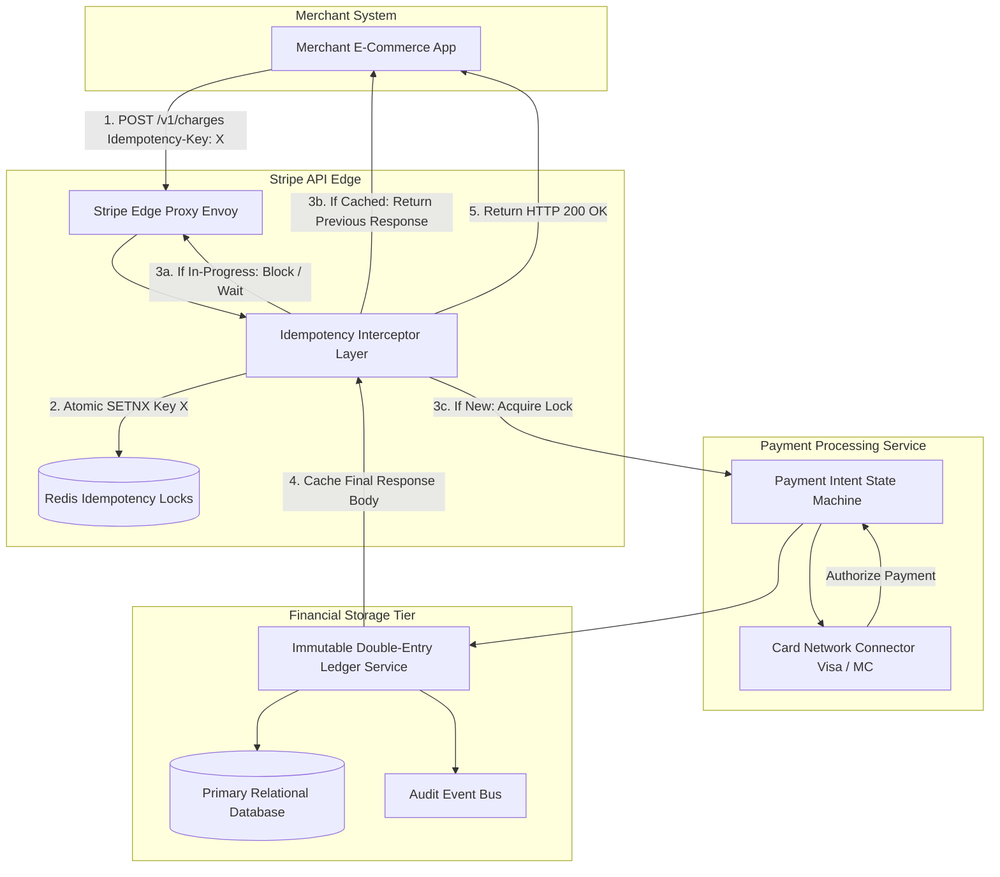

# Case Study: Stripe Payment Infrastructure & Exactly-Once Ledger

## 1. Company & Business Context

Stripe provides financial infrastructure for the internet, processing hundreds of billions of dollars annually for millions of businesses worldwide. Stripe’s core value proposition is absolute financial correctness, extreme API reliability (99.999% uptime), and developer ergonomics.

In financial engineering, double charges, lost settlements, or inconsistent account balances cause regulatory penalties, chargebacks, and direct loss of trust. Payment networks (Visa, Mastercard, ACH) are fundamentally distributed, asynchronous, and prone to timeouts. Stripe must ensure that even under network partitions, client retries, and hardware crashes, **every financial operation is executed exactly once**.

---

## 2. Scale & Workload Profile

```
+------------------------------------+---------------------------------------+
| Metric                             | Production Volume                     |
+------------------------------------+---------------------------------------+
| Annual Payment Volume              | > $1 Trillion USD / Year              |
| API Availability SLA Target        | 99.999% Service Level Target          |
| Peak Charge Requests Per Second    | > 15,000 Financial Transactions / Sec |
| Ledger Entry Integrity             | Mathematical Zero-Imbalance Guarantee |
| Merchant API Retry Tolerance       | Unlimited Safe Idempotent Retries     |
| P99 API End-to-End Latency         | < 450 Milliseconds                    |
+------------------------------------+---------------------------------------+
```

---

## 3. The Core Problem: The Two Generals & Financial Idempotency

When a merchant calls `POST /v1/charges` and their connection times out:
- Did the bank process the payment, and only the network response failed?
- Or did the request fail before reaching Stripe's database?
If the merchant retries blindly, the customer risks being charged twice. If they do not retry, goods may be delivered without payment.

---

## 4. Modern Target Architecture: Idempotency Keys & Double-Entry Ledger

Stripe built an end-to-end payment processing engine governed by **deterministic idempotency locking** and an immutable, distributed **double-entry ledger**.



---

## 5. Architectural Inventions & Mechanics

### A. Idempotency Key Lifecycle & Distributed Mutex
Every write request accepts an `Idempotency-Key` header:
1. **Atomic Lock Acquisition**: Upon receipt, the API gateway attempts to insert the idempotency key into a distributed lock table (Redis/MySQL) with a lease TTL.
2. **In-Flight Handling**: If a secondary request arrives with the same key while the first is still processing, the secondary request blocks and polls until the original completes, or returns a `409 Conflict`.
3. **Response Caching**: Once the transaction completes, the complete HTTP response body, status code, and headers are serialized and stored in durable storage keyed by `(merchant_id, idempotency_key)` with a 24-hour retention period.
4. **Idempotent Replay**: Any subsequent request bearing the same key immediately returns the cached response without touching payment gateways.

### B. State Machine Payment Intent Workflow
Transactions progress through a strictly defined directed acyclic graph (DAG):
`RequiresPaymentMethod` $\rightarrow$ `RequiresConfirmation` $\rightarrow$ `Processing` $\rightarrow$ `Succeeded` / `Canceled`.
- Transitions are committed via database compare-and-swap (`CAS`) operations.
- Out-of-order webhooks from card networks cannot advance a transaction to an invalid state.

### C. Immutable Double-Entry Ledger
Stripe’s ledger adheres strictly to standard accounting principles:
- **Balance Invariant**: Every financial movement consists of at least two ledger entries: a **Debit** and a **Credit**.
- The fundamental invariant:
  $$\sum \text{Debits} - \sum \text{Credits} = 0$$
- Entries are append-only. To reverse a transaction, an offsetting reversal entry is appended; existing rows are never modified or deleted.

---

## 6. Distributed Trade-Offs & Decisions

```
+-----------------------------------+----------------------------------------+
| Dimension                         | Stripe Architectural Choice            |
+-----------------------------------+----------------------------------------+
| CAP Classification                | CP (Consistency & Partition Tolerance) |
| Transaction Model                 | Serialized ACID via Sharded RDBMS      |
| Mutex Implementation              | Atomic Database Leasing with Retries   |
| Ledger Schema                     | Immutable Append-Only Double Entry     |
+-----------------------------------+----------------------------------------+
```

---

## 7. Engineering Lessons & Enterprise Takeaways

1. **Idempotency Must Be Baked Into the Gateway**: Never rely on individual business services to implement ad-hoc deduplication. Centralize idempotency verification at the API ingress layer.
2. **Immutability Eliminates Reconciliation Nightmare**: Destructive updates (`UPDATE balances SET amount = amount + ?`) make financial auditing impossible. Append-only double-entry records provide verifiable audit trails.
3. **Design for Third-Party Asynchrony**: External banking networks fail unpredictably. Build explicit state machines with persistent leases to handle asynchronous callbacks and timeouts gracefully.
