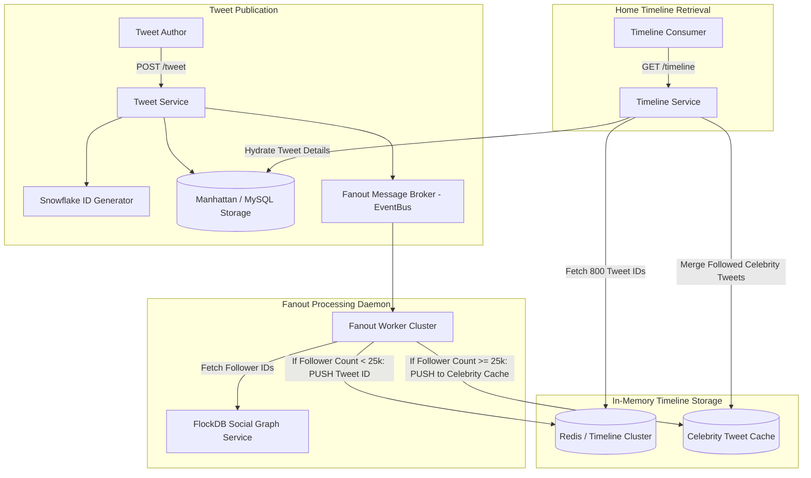

# Case Study: Twitter (X) Timeline & Fanout Architecture

## 1. Company & Business Context

Twitter is a global real-time public microblogging and communications platform. Its core value proposition is delivering immediate visibility into breaking global events as they unfold. The platform experiences extreme asymmetric social network graphs: millions of standard users have fewer than 100 followers, while celebrity and global news accounts have tens of millions of followers.

The technical challenge centers on two distinct timeline views:
1. **User Timeline**: All posts authored by a specific user (high write, read-on-profile).
2. **Home Timeline**: A chronological aggregation of posts authored by all users whom the requesting user follows (extreme read volume: 300k+ QPS, sub-50ms latency target).

---

## 2. Scale & Workload Profile

```
+------------------------------------+---------------------------------------+
| Metric                             | Production Volume                     |
+------------------------------------+---------------------------------------+
| Daily Active Users (DAU)           | 250M+ Active Users                    |
| Tweets Created Per Day             | 500 Million Tweets / Day              |
| Average Tweet Ingestion Rate       | ~6,000 Tweets / Second                |
| Peak Tweet Ingestion Spikes        | > 150,000 Tweets / Second (World Cup) |
| Home Timeline Query Rate           | > 350,000 QPS                         |
| Timeline Read P99 Latency Target   | < 50 Milliseconds                     |
+------------------------------------+---------------------------------------+
```

---

## 3. Original Architecture (Fanout-on-Read Database Joins)

Twitter began as a Ruby on Rails application using MySQL:
- When a user loaded their Home Timeline, the application queried MySQL with a massive relational join:
  $$\text{SELECT} * \text{ FROM tweets WHERE user\_id IN (SELECT followee\_id FROM follows WHERE follower\_id = ?) ORDER BY created\_at DESC LIMIT 20}$$
- **Catastrophic Read Latency**: As user follow counts grew, the database join bottlenecked disk I/O, resulting in the notorious "Fail Whale" error page during global spikes.

---

## 4. Modern Target Architecture: Hybrid Fanout & In-Memory Timelines

Twitter redesigned the platform around **Fanout-on-Write (Push)** for standard users and **Fanout-on-Read (Pull)** for hyper-followed celebrities.



---

## 5. Architectural Inventions & Mechanics

### A. 64-bit Snowflake IDs
To order tweets chronologically across thousands of distributed servers without central database synchronization, Twitter invented Snowflake:
- **Bit Allocation**: 1 bit unused | 41 bits millisecond timestamp | 10 bits worker machine ID | 12 bits sequence number.
- Guarantees $k$-sorted properties: IDs generated later are numerically larger, allowing timeline caches to sort and merge tweets strictly by ID without querying timestamps.

### B. Fanout-on-Write (The Push Model)
For standard users (followers $< 25,000$):
- When User A posts a tweet, the fanout daemon retrieves all follower IDs from the graph database (FlockDB).
- The worker inserts the Tweet ID into each follower’s pre-computed in-memory timeline list in Redis.
- Each Redis timeline is capped at 800 Tweet IDs.
- Result: Home timeline retrieval is an instantaneous $O(1)$ memory range lookup (`LRANGE timeline:12345 0 20`).

### C. The Celebrity Problem (Hybrid Fanout-on-Read)
If a user with 80 million followers (e.g., Elon Musk or Barack Obama) tweets:
- Fanning out on write would require writing to 80 million Redis lists, consuming massive CPU and causing minutes of fanout delay.
- **Architectural Solution**: Accounts with $> 25,000$ followers bypass the write fanout.
- Instead, their tweets are stored in a separate celebrity cache.
- When a follower requests their home timeline, the Timeline Service performs a lightweight read merge: it fetches their pre-computed Redis timeline and merges the latest tweets from the specific followed celebrities before returning the result.

---

## 6. Distributed Trade-Offs & Decisions

```
+-----------------------------------+----------------------------------------+
| Dimension                         | Twitter Architectural Choice           |
+-----------------------------------+----------------------------------------+
| Timeline Materialization          | Hybrid: Push for Standard, Pull for VIP|
| Data Structure                    | Array of 64-bit IDs, Hydrated at Edge  |
| ID Generation Strategy            | Decentralized Snowflake vs Auto-Incr   |
| Persistence Strategy              | In-Memory Cache Primary, NoSQL Backing |
+-----------------------------------+----------------------------------------+
```

---

## 7. Engineering Lessons & Enterprise Takeaways

1. **Pre-Compute Read Heavy Workloads**: When read volume outnumbers write volume by orders of magnitude ($350\text{k reads/s}$ vs $6\text{k writes/s}$), push the computational burden to write time through materialized views.
2. **Account for Asymmetric Graph Distributions**: Homogeneous architecture fails when power-law distributions exist (Zipf's law). Specialized routing rules must exist for hyper-connected entities.
3. **Store Only Pointers in Cache**: Timeline caches do not store full tweet JSON strings; they store lightweight 64-bit IDs. Tweet content hydration occurs in a parallel batch query immediately before response serialization.
