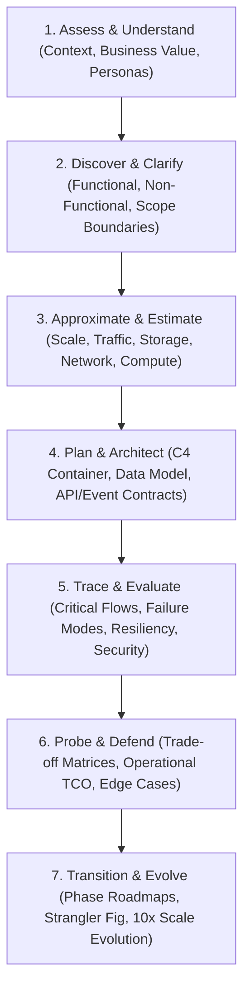
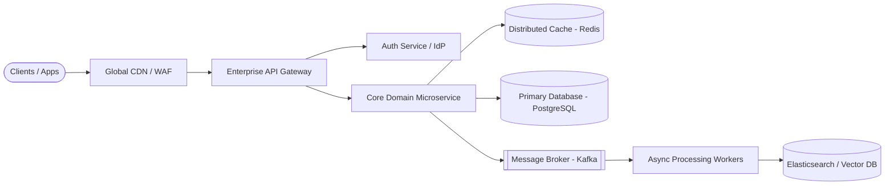

# The Universal Architect Interview Framework: A-D-A-P-T

> A repeatable, battle-tested decision methodology for navigating complex, ambiguous system design and enterprise architecture interviews.

---

## 1. Overview & Core Philosophy

In a high-level architectural interview (Solution Architect, Technical Architect, Principal Engineer, or Enterprise Architect), the interviewer rarely cares about a "single correct answer." Instead, they are evaluating:

1. **How you structure ambiguity into structured engineering constraints.**
2. **Whether you reason from business outcomes down to bits, bytes, and failure modes.**
3. **How well you defend decisions against trade-offs without dogmatism.**
4. **Whether you understand the operational, organizational, and economic realities of running software at scale.**

The **A-D-A-P-T** framework provides a continuous 7-stage mental model that prevents premature design and demonstrates complete end-to-end architectural mastery.

---

## 2. The 7 Stages of A-D-A-P-T

### Stage 1: Assess & Understand (Business Context)
* **Goal**: Understand *why* this system exists and who benefits.
* **Core Questions**:
  * What is the core business problem this system solves?
  * Who are the primary personas (B2C consumers, B2B enterprise tenants, internal operators)?
  * What business metrics measure success (conversion rate, p99 latency, zero financial discrepancies, time-to-market)?
  * What is the budget envelope and time horizon (immediate MVP vs. 5-year enterprise platform)?

### Stage 2: Discover & Clarify (Requirements & Boundaries)
* **Goal**: Establish concrete functional requirements, explicit non-functional targets (NFRs), and out-of-scope boundaries.
* **Functional Scope**:
  * Identify the 3 to 4 core user journeys (e.g., in a Ride-Sharing system: Driver location update, Rider ride request, Real-time matching, Ride completion).
  * Explicitly call out what is **out of scope** (e.g., driver background checks, detailed accounting/tax invoicing, customer support chat).
* **NFR Targets**:
  * Availability (e.g., 99.99% = 52.6 minutes downtime/year).
  * Latency (e.g., p95 < 100ms, p99 < 250ms for read requests).
  * Consistency model (Strong consistency for financial ledger vs. Eventual consistency for feed generation).
  * Regulatory / Compliance constraints (GDPR, HIPAA, PCI-DSS, SOC 2).

### Stage 3: Approximate & Estimate (Back-of-the-Envelope)
* **Goal**: Translate user numbers into engineering capacity to validate architectural feasibility.
* **Formulas & Conversions**:
  * **Daily Active Users (DAU)** $\rightarrow$ **Average Requests/sec (RPS)**:
    $$\text{Average RPS} = \frac{\text{DAU} \times \text{Requests per User per Day}}{86,400\text{ seconds}}$$
  * **Peak RPS**: Typically $2\times$ to $5\times$ Average RPS.
  * **Storage Growth**: $\text{Daily Writes} \times \text{Average Payload Size} \times 365 \times \text{Replication Factor}$.
  * **Ingress / Egress Bandwidth**: $\text{Peak RPS} \times \text{Average Payload Size}$.
* **Key Realization**: Never present false precision. Round up to easy powers of 10 or 2 to quickly determine if you are designing for a single PostgreSQL instance or a multi-region partitioned Cassandra/Spanner cluster.

### Stage 4: Plan & Architect (High-Level & Detailed Design)
* **Goal**: Establish the structural blueprint using standard abstractions (C4 model).
* **Execution Flow**:
  1. **System Context**: Users $\rightarrow$ Edge / CDN / API Gateway $\rightarrow$ Application Services.
  2. **Storage Strategy**: Relational vs. Document vs. Key-Value vs. Time-Series vs. Vector Store.
  3. **Communication Contracts**: Synchronous (gRPC / REST) for user-facing reads vs. Asynchronous (Kafka / RabbitMQ / SQS) for write decoupling.
  4. **Data Modeling**: Primary entity schemas, partition keys, index strategies, and ownership boundaries.

### Stage 5: Trace & Evaluate (Failure Modes & Cross-Cutting Concerns)
* **Goal**: Validate how the architecture behaves under stress, failure, and attack.
* **Deep Dives**:
  * **Trace a Critical Flow**: Step through the life of a write request from client click to persistence and event broadcast.
  * **Resilience Patterns**: Circuit breakers, bulkheads, exponential backoff with jitter, retry budgets, dead-letter queues (DLQs), and graceful degradation.
  * **Security & Trust Boundaries**: Zero Trust architecture, OAuth2 token exchange, mutual TLS (mTLS) between microservices, encryption-at-rest (KMS), and field-level encryption for PII.
  * **Observability (Three Pillars + SLOs)**: Structured JSON logging with trace context (W3C TraceContext), Prometheus metrics, distributed tracing (OpenTelemetry), and alerting burn rates.

### Stage 6: Probe & Defend (Trade-offs & Financial Economics)
* **Goal**: Defend architectural choices against viable alternatives.
* **The "Why Not" Test**:
  * Why relational over NoSQL? (e.g., ACID transactions across order and payment tables vs. schema flexibility).
  * Why Kafka over RabbitMQ? (e.g., event replayability, partitioned ordering at 500k msg/sec vs. complex AMQP routing).
* **Cost Modeling**:
  * Compute costs (EC2 / EKS node counts).
  * Storage and IOPS costs (Provisioned IOPS vs. General Purpose SSD).
  * Network egress costs (Cross-AZ traffic, cross-region replication, CDN bandwidth).

### Stage 7: Transition & Evolve (Migration & Scale Horizons)
* **Goal**: Show organizational and evolutionary pragmatism.
* **Evolution Horizons**:
  * **Horizon 1 (MVP / Day 1)**: Single region, modular monolith or core microservices, managed database, basic cache.
  * **Horizon 2 (Scale 10x / Month 6–12)**: Read replicas, database sharding, asynchronous event bus, global CDN caching.
  * **Horizon 3 (Scale 100x / Enterprise Target)**: Multi-region active-active deployment, cell-based architecture, event mesh, automated cross-region disaster recovery.
* **Migration Strategy**: If modernizing a legacy system, articulate the **Strangler Fig Application pattern**, Change Data Capture (CDC), and dual-writing verification with shadow traffic.

---

## 3. Applying A-D-A-P-T to Any Interview Question

| Interview Prompt Type | Stage Focus | Primary Danger to Avoid |
| :--- | :--- | :--- |
| **B2C High-Scale System Design** (e.g., Chat, Social Feed, Video) | Stages 3, 4, 5 (Scale estimation, partitioning, caching, latency optimization) | Over-focusing on enterprise governance while failing to solve 10M concurrent WebSocket connections. |
| **Enterprise B2B / SaaS Platform** (e.g., Multi-tenant CRM, Billing) | Stages 1, 2, 4, 6 (Tenant isolation, data privacy, audit logging, consistency, cost per tenant) | Jumping straight to NoSQL without addressing strict ACID accounting requirements. |
| **Legacy Modernization / Transformation** | Stages 1, 6, 7 (Strangler Fig, CDC, organizational change, risk containment) | Proposing a "big-bang rewrite" that guarantees failure in real-world enterprises. |
| **Cloud-Native / Global Scale** | Stages 4, 5, 6 (Multi-region active-active, latency routing, split-brain, egress costs) | Assuming instantaneous cross-region network synchronization without network partition trade-offs. |

---

## 4. Cross-References

* **Time Management & Whiteboarding**: [`system-design-framework.md`](file:///d:/company/products/enterprise-architecture-handbook/20-interview-system-design/system-design-framework.md)
* **22-Step Answering Sequence**: [`architecture-answer-framework.md`](file:///d:/company/products/enterprise-architecture-handbook/20-interview-system-design/architecture-answer-framework.md)
* **Common Interview Mistakes & Anti-Patterns**: [`interview-mistakes.md`](file:///d:/company/products/enterprise-architecture-handbook/20-interview-system-design/interview-mistakes.md)
* **Trade-Off Decision Matrices**: [`tradeoffs/README.md`](file:///d:/company/products/enterprise-architecture-handbook/20-interview-system-design/tradeoffs/README.md)
