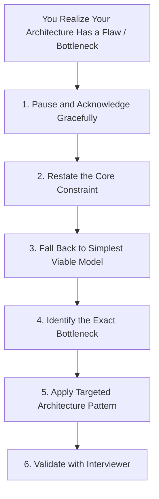

# Architecture Communication: Executive Presence, Whiteboarding & Recovery

> How to drive the whiteboard, communicate complex technical decisions with executive clarity, recover gracefully when stuck, and answer professionally when you don't know.

---

## 1. Executive Communication & Presence

A common failure mode for senior engineers stepping into Architect and Principal roles is communicating like an **individual implementer** rather than a **technical leader**.

```
Implementer Talk:
"I would write a loop in Java that queries Postgres, and if it fails, I'll catch the Exception and retry 3 times."

Architect Talk:
"For downstream calls, we'll implement an exponential backoff retry policy with jitter, backed by a circuit breaker to prevent thread starvation under cascading downstream failure."
```

### The Top-Down Communication Model (Minto Pyramid)
Always state the **conclusion and architectural decision first**, followed by the supporting arguments and trade-offs:

1. **Recommendation / Decision**: *"I recommend adopting an event-driven architecture using Kafka as our central event mesh."*
2. **Core Justification (Top 2–3 reasons)**: *"First, this completely decouples the high-throughput ingestion tier from slower backend analytical consumers. Second, it gives us partitioned horizontal scaling up to 250,000 events per second."*
3. **Trade-offs & Mitigations**: *"The trade-off is eventual consistency and managing partition skew, which we mitigate by salting hot partition keys."*

---

## 2. Whiteboard Execution Rules

1. **Structure Your Real Estate**:
   * **Top Left**: Requirements & Scope (Bullet points).
   * **Top Right**: Scale Numbers & NFR targets (Numbers).
   * **Center**: Architecture Diagram (C4 Container level).
   * **Bottom Left**: Core Data Model / Schemas.
   * **Bottom Right**: Deep Dive Notes / Bottlenecks / Future Evolution.
2. **Never Go Silent for More Than 15 Seconds**:
   * If you need to think or calculate, narrate your thought process:
     * *"I'm just calculating the write bandwidth here... with 10,000 writes per second at 1 KB each, that comes out to about 10 megabytes per second ingress, which easily fits within standard network interfaces."*
3. **Collaborative Check-Ins (The Driving Rule)**:
   * Do not monologue for 10 minutes straight. Check in every 3 to 5 minutes:
     * *"Does this high-level topology align with your expectations, or would you like to explore the storage partitioning strategy first?"*

---

## 3. The "When Stuck" Recovery Framework

When an interviewer challenges a design or when you find yourself backed into an architectural corner:



### Scripted 5-Step Recovery Workflow
1. **Acknowledge without panic**:
   * *"That is an excellent point. Under this high write-concurrency scenario, our current relational schema would experience severe row-lock contention."*
2. **Isolate the single failing factor**:
   * *"The fundamental bottleneck here is that all 50,000 concurrent updates are trying to mutate the exact same inventory record."*
3. **Propose the architectural pattern to resolve it**:
   * *"To eliminate this lock contention, we have two options: either we introduce in-memory atomic decrementing via Redis with distributed Lua scripts, or we turn the update into an append-only event stream using a queue and batch process the decrements."*
4. **Choose and defend the trade-off**:
   * *"Given that we need sub-50ms latency for the checkout flow, I recommend the Redis atomic decrement approach, with an asynchronous write-back to PostgreSQL for durability."*

---

## 4. The "I Don't Know" Framework

Never bluff or guess in a senior architecture interview. An experienced interviewer will immediately spot superficial jargon. Use these professional alternatives that demonstrate first-principles reasoning:

### Scenario 1: Unfamiliar with a Specific Vendor or Proprietary Tool
* **Bad**: *"Oh, I think DynamoDB handles multi-region active-active automatically without any configuration."*
* **Strong**: *"I haven't deployed that specific vendor tool in production, but from an architectural perspective, any multi-region active-active datastore must handle conflict resolution—typically through last-write-wins (LWW), vector clocks, or CRDTs. If I were designing this, I would approach it by..."*

### Scenario 2: Unsure of an Exact Performance or Latency Number
* **Bad**: *"PostgreSQL can handle 2 million writes per second easily."*
* **Strong**: *"The exact throughput will depend heavily on row width, indexing overhead, and disk IOPS. However, as a rule of thumb, a well-tuned single PostgreSQL instance typically caps out between 5,000 and 15,000 transactional writes per second before requiring horizontal sharding or read offloading."*

### Scenario 3: Missing Domain-Specific Knowledge
* **Bad**: Making up fake healthcare or financial protocols.
* **Strong**: *"I haven't worked with the HL7/FHIR healthcare protocol directly, but I assume it behaves like a standard semi-structured message payload. The primary architectural considerations would be data validation, encryption of PHI at rest, and audit trail immutability. Let me know if there are specific protocol nuances I should account for."*

---

## 5. Cross-References

* **Universal Methodology**: [`architect-interview-framework.md`](file:///d:/company/products/enterprise-architecture-handbook/20-interview-system-design/architect-interview-framework.md)
* **Interview Anti-Patterns**: [`interview-mistakes.md`](file:///d:/company/products/enterprise-architecture-handbook/20-interview-system-design/interview-mistakes.md)
* **Scoring Rubric**: [`interview-scoring-rubric.md`](file:///d:/company/products/enterprise-architecture-handbook/20-interview-system-design/interview-scoring-rubric.md)
* **Leadership Alignment**: [`leadership/README.md`](file:///d:/company/products/enterprise-architecture-handbook/20-interview-system-design/leadership/README.md)
