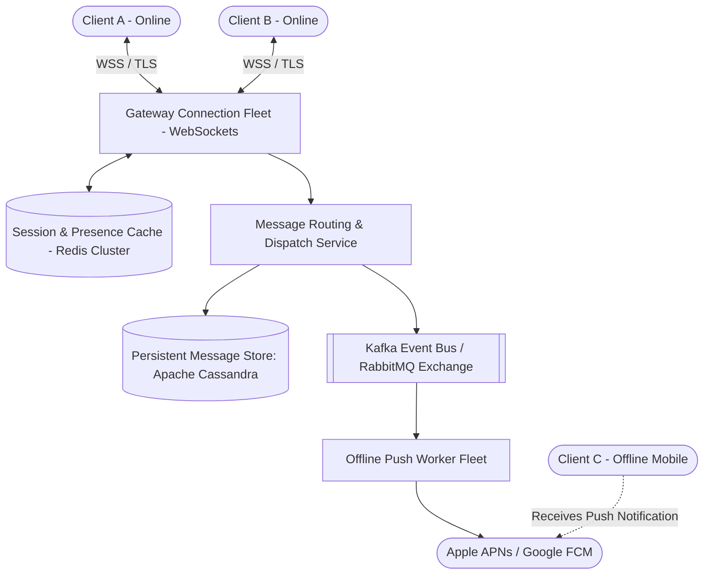
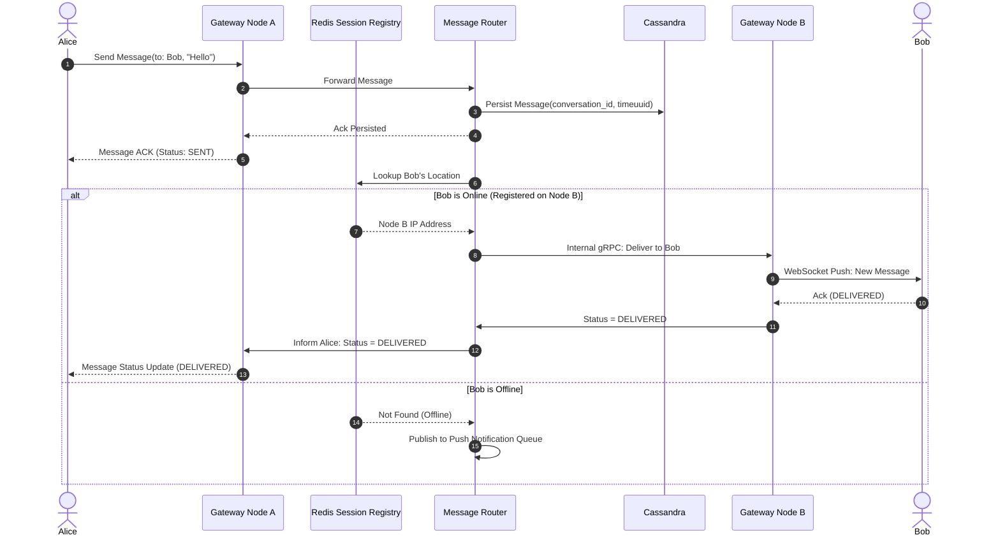

# System Design Case: Scalable Distributed Real-Time Chat Platform

> A comprehensive, 20-part senior architectural design for a globally distributed, real-time messaging system (e.g., WhatsApp / Slack / Discord) supporting 10 Million concurrent WebSocket connections, 1-on-1 and group chat, presence, and offline push.

---

## 1. Business Context & Problem Statement
Real-time messaging platforms require bi-directional, persistent network connections to deliver messages with sub-second latency across mobile and web clients. The system must seamlessly handle 1-on-1 conversations, large group chats, ephemeral online/offline presence tracking, media sharing, and durable offline message delivery.

---

## 2. Candidate Prompt & Executive Premise
> *"Design a real-time messaging platform supporting 50 Million Daily Active Users, 10 Million concurrent open WebSocket connections, 1-on-1 direct messages, group chats of up to 1,000 members, online presence status, and offline notifications."*

---

## 3. Clarifying Questions to Ask the Interviewer
1. *What is the message delivery guarantee?* (At-least-once delivery with client-side deduplication; strict message ordering per conversation).
2. *What is the maximum group chat size?* (Up to 1,000 members; celebrity channels of 100k+ out of scope for MVP).
3. *How is message history retained?* (Permanent message history stored in cloud; mobile clients sync on connect).
4. *Is end-to-end encryption (E2EE) required?* (Transport layer TLS and encryption-at-rest required; client-side Signal protocol E2EE out of scope for this architecture interview).

---

## 4. Expected Functional Scope & Boundaries
* **In Scope**:
  * 1-on-1 direct messaging with real-time delivery.
  * Group messaging (up to 1,000 participants per group).
  * Real-time online/offline user presence tracking.
  * Read receipts (Sent, Delivered, Read).
  * Offline push notifications when recipient is disconnected.
* **Out of Scope**:
  * Video/voice WebRTC streaming.
  * Rich message search across 5-year history.

---

## 5. Non-Functional Requirements (NFRs) & Concrete Targets
* **Latency**: Message delivery latency $< 100\text{ms}$ (p95) between online users.
* **Availability**: 99.99% uptime for core messaging gateway.
* **Concurrency**: 10 Million concurrent long-lived TCP/WebSocket connections.
* **Durability**: Zero message loss once acknowledged by the ingestion gateway.

---

## 6. Back-of-the-Envelope Scale & Capacity Estimation
* **Traffic**:
  * 50M DAU $\times$ 40 messages/day $\approx \mathbf{2\text{ Billion messages/day}}$.
  * Average Message RPS: $\frac{2,000,000,000}{86,400} \approx \mathbf{23,000\text{ RPS}}$.
  * Peak Message RPS ($3\times$ factor): $\approx \mathbf{70,000\text{ Peak RPS}}$.
* **WebSocket Connection Sizing (Memory)**:
  * 10 Million concurrent open connections.
  * Each TCP socket in Linux kernel with TLS buffer $\approx 20\text{ KB RAM}$.
  * Total Connection RAM: $10\text{M} \times 20\text{ KB} = \mathbf{200\text{ GB RAM}}$.
  * Using high-concurrency Go/Netty connection servers ($500,000\text{ connections per 64 GB node}$):
    $$\frac{10,000,000}{500,000} = \mathbf{20\text{ Gateway Connection Nodes (+ 10 redundant = 30 nodes)}}$$
* **Storage Sizing (5 Years)**:
  * Average text message: 200 bytes + metadata (100 bytes) = 300 bytes.
  * Daily Storage: $2\text{B} \times 300\text{B} = \mathbf{600\text{ GB/day}} \rightarrow \approx \mathbf{220\text{ TB/year}}$.
  * 5-Year Storage (with 3x replication): $220\text{ TB} \times 5 \times 3 \approx \mathbf{3.3\text{ Petabytes}}$. (Demands horizontally partitioned NoSQL: Cassandra/ScyllaDB).

---

## 7. High-Level Architecture (C4 Container Diagram)



---

## 8. Key Architectural Components
1. **Gateway Connection Fleet**: Stateless connection terminators that hold persistent WebSocket connections and map each `user_id` to its active `server_id`.
2. **Session & Presence Service (Redis Cluster)**: Fast in-memory registry mapping `user_id -> server_ip` with heartbeats for presence.
3. **Message Routing Service**: Evaluates recipient presence. If recipient is online, routes directly to their connection server; if offline, dispatches to offline push worker.
4. **Persistent Message Store (Cassandra / ScyllaDB)**: Append-only, wide-column store optimized for sequential read-by-conversation queries.

---

## 9. Core Data Models & Schema Design

### Cassandra Message Storage
```cql
CREATE KEYSPACE chat_system WITH replication = {
    'class': 'NetworkTopologyStrategy', 
    'us-east': 3, 
    'eu-central': 3
};

CREATE TABLE chat_system.messages (
    conversation_id uuid,
    message_id timeuuid,  -- Embedded timestamp guarantees total chronological order
    sender_id uuid,
    content text,
    media_url text,
    status text,          -- SENT, DELIVERED, READ
    PRIMARY KEY (conversation_id, message_id)
) WITH CLUSTERING ORDER BY (message_id ASC);
```
* **Why this schema is optimal**: Queries fetch the latest 50 messages for a conversation via `WHERE conversation_id = ? AND message_id > ? LIMIT 50`. Sequential disk reads on SSDs execute in $< 3\text{ms}$.

---

## 10. APIs & WebSocket Contracts

### WebSocket Frame Contract (Client to Gateway)
```json
{
  "type": "MESSAGE_SEND",
  "client_msg_id": "c-9918234-uuid",
  "conversation_id": "conv_88412",
  "recipient_id": "usr_4410",
  "content": "Hey, are you free for a call?",
  "timestamp": 1788739200100
}
```

### Gateway Acknowledgement Frame
```json
{
  "type": "MESSAGE_ACK",
  "client_msg_id": "c-9918234-uuid",
  "message_id": "timeuuid-12345",
  "server_timestamp": 1788739200110,
  "status": "SENT"
}
```

---

## 11. Critical Request & Data Flows (1-on-1 Message Delivery)



---

## 12. Security Architecture & Trust Boundaries
* **Authentication**: WSS connection established with JWT token in initial handshake query parameter; token validated and session bound to user ID.
* **Per-Connection Rate Limiting**: Limit individual client to max 20 messages/second to prevent socket flooding.
* **Data at Rest**: Messages encrypted at rest via AES-256 with envelope keys managed by AWS KMS.

---

## 13. Observability, Metrics & Telemetry (SLOs)
* **SLO 1**: 99% of messages delivered to online recipients within $100\text{ms}$.
* **SLO 2**: Connection fleet CPU utilization maintained under $60\%$ to prevent socket dropouts during regional failovers.
* **Key Metric**: `active_websocket_connections` across all nodes.

---

## 14. Failure Modes & Graceful Degradation Strategies
* **Failure Mode: Gateway Node B Crashes Abruptly**:
  * 300,000 connected clients suddenly drop TCP sockets.
  * *Degradation*: Clients execute exponential backoff with full jitter to reconnect across remaining 29 Gateway nodes. Upon reconnect, clients query `GET /sync?last_message_id=xxx` to fetch any missed messages from Cassandra.
* **Failure Mode: Redis Session Cache Fails**:
  * Fallback to internal consistent-hashing ring across connection nodes or broadcast to local connection pools.

---

## 15. Group Chat Fanout: Small Groups vs. Celebrity Channels
* **Small Groups (< 100 members)**: **Fanout on Write**. When Alice sends a message to Group 1, the router queries the 50 member IDs from the membership cache and pushes 50 individual delivery payloads. Simple, fast, and maintains ordering.
* **Large Channels (1,000+ members)**: **Fanout on Read**. Messages are written once to the group channel topic. Members pull new messages as they actively view the channel.

---

## 16. Trade-Off Analysis & Rejected Alternatives
* **Relational Database (PostgreSQL) vs. Wide-Column (Cassandra)**:
  * *PostgreSQL*: Excellent for ACID transactions, but 2 Billion daily writes will require aggressive manual sharding, table partitioning maintenance, and write vacuum lock contention.
  * *Cassandra*: Linear write scaling with append-only LSM trees; built-in clustering keys by `TimeUUID` provide optimal chronological message retrieval.

---

## 17. Cost Modeling & Unit Economics
* **Compute**: 30 Gateway Pods (c6i.2xlarge: 8 vCPU, 16 GB) $\approx \$4,500/\text{mo}$.
* **Storage**: Cassandra Cluster (20 nodes with 4 TB NVMe each) $\approx \$12,000/\text{mo}$.
* **In-Memory Cache**: 6-node Redis Cluster $\approx \$1,200/\text{mo}$.
* **Total Run Rate**: $\approx \mathbf{\$18,000/\text{month}}$ for 50M DAU $\rightarrow \mathbf{\$0.00036\text{ per active user/month}}$.

---

## 18. Multi-Year Evolution & 10x Scale Roadmap
* **Scale 10x (500M DAU / 100M Concurrency)**:
  * Adopt an **Anycast Edge Mesh** with regional connection points in 20 global data centers, terminating TLS locally at the edge and backhauling WebSocket data over private cloud fiber interconnects.

---

## 19. Interviewer Follow-Up Probes & Curveballs
* *Probe*: *"How do you handle presence heartbeats without melting Redis with 10 Million users?"*
  * *Response*: *"Clients emit a heartbeat every 30 seconds. Instead of a discrete write per ping, we use a Redis Sorted Set or atomic bitfield with an expiring key. Furthermore, we don't broadcast presence changes to all friends in real time; presence is fetched lazily only when a user opens an active chat window with a friend."*

---

## 20. Interviewer Evaluation Rubric: Weak vs. Strong Answers
* **Weak**: Proposes HTTP polling instead of WebSockets; suggests MySQL for 2 Billion daily chat messages; broadcasts group messages to 10,000 users synchronously without batching.
* **Strong**: Calculates TCP connection RAM requirements accurately; designs Cassandra TimeUUID clustering schemas; separates small-group write fanout from large-group read fanout; handles connection server crashes with client sync tokens.
