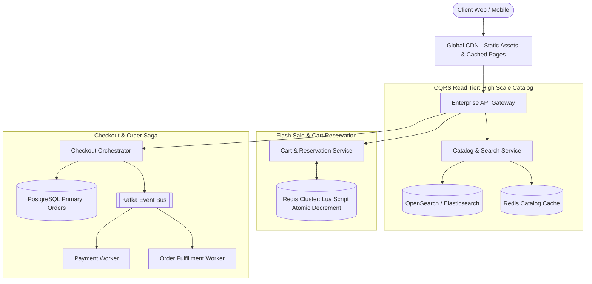
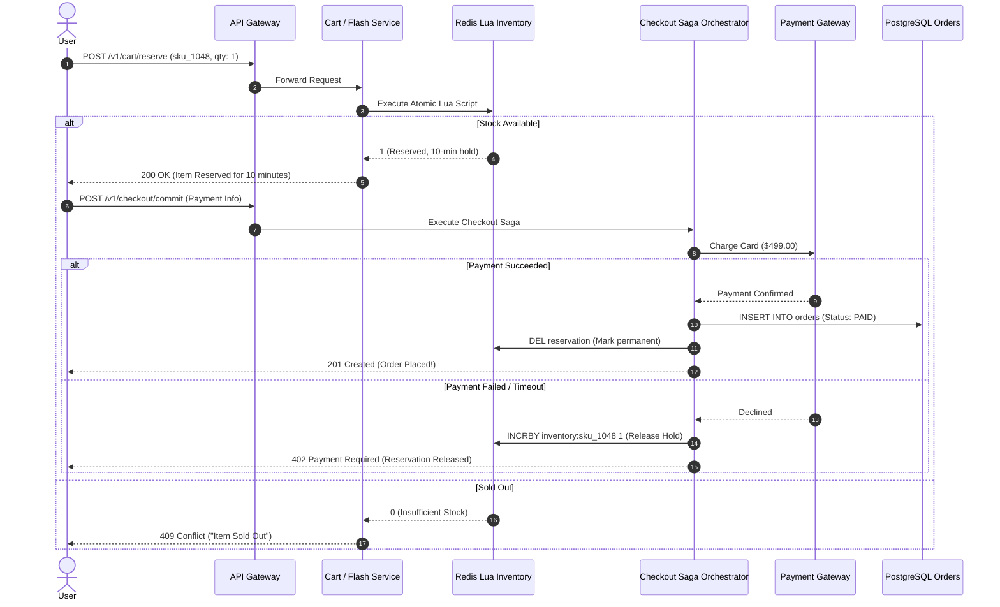

# System Design Case: Scalable E-Commerce & Flash-Sale Platform

> A comprehensive, 20-part senior architectural design for a high-concurrency e-commerce platform supporting viral flash sales, zero overselling, CQRS product catalog, and distributed checkout sagas.

---

## 1. Business Context & Problem Statement
E-commerce platforms experience extreme traffic skew: normal baseline traffic consists of browsing and catalog searches, but during viral marketing campaigns or Black Friday flash sales, hundreds of thousands of buyers attempt to purchase limited inventory (e.g., 5,000 units of a discounted gaming console) within the first 60 seconds. The platform must guarantee zero inventory overselling, deliver sub-100ms catalog search, and process checkouts without database deadlock crashes.

---

## 2. Candidate Prompt & Executive Premise
> *"Design an e-commerce platform capable of handling 50 Million catalog products, 100,000 read queries/sec, and sustaining a flash sale where 50,000 concurrent checkout attempts hit the exact same product SKU in under 10 seconds without overselling or crashing the database."*

---

## 3. Clarifying Questions to Ask the Interviewer
1. *Is overselling acceptable under high concurrency?* (Absolute zero overselling. Cancelling customer orders post-purchase damages brand trust).
2. *How long does an inventory hold last during checkout?* (10 minutes reserved in user's cart; if payment is not completed, hold is automatically released).
3. *What is the read-to-write ratio?* (99:1 under normal operations; heavy write bursts on specific SKUs during flash drops).
4. *Are product search queries faceted?* (Yes: filter by category, brand, price range, and customer review rating).

---

## 4. Expected Functional Scope & Boundaries
* **In Scope**:
  * Product Catalog browsing and faceted full-text search.
  * Cart management and 10-minute temporary inventory reservation.
  * Checkout & Payment Orchestration via distributed Saga.
  * Flash-sale concurrency control (Zero overselling).
* **Out of Scope**:
  * Warehouse logistics routing, warehouse robotics integration, and return shipping label generation.

---

## 5. Non-Functional Requirements (NFRs) & Concrete Targets
* **Availability**: 99.99% for checkout path.
* **Latency**:
  * Catalog Search: p95 $< 80\text{ms}$.
  * Flash Sale Reservation: p95 $< 150\text{ms}$.
* **Consistency**: Strong consistency for inventory decrement; Eventual consistency for catalog reviews and search indexes.
* **Concurrency**: Sustain 50,000 concurrent purchase attempts on a single SKU.

---

## 6. Back-of-the-Envelope Scale & Capacity Estimation
* **Throughput**:
  * Catalog Browse/Search: $100,000\text{ Read QPS}$.
  * Normal Order Writes: $500\text{ Orders/sec}$.
  * Flash-Sale Peak Checkout Attempts: $\mathbf{50,000\text{ writes/sec on 1 SKU}}$.
* **Database Contention Reality**:
  * A single row in PostgreSQL cannot sustain 50,000 concurrent `UPDATE inventory SET count = count - 1 WHERE sku_id = 'XYZ'`. Row-level lock contention will cause massive lock queues, connection starvation, and total database collapse.
  * **Solution**: In-memory atomic decrements in Redis via Lua scripts before touching the relational database!
* **Storage Sizing (5 Years)**:
  * 50M Products: $50\text{M} \times 2\text{ KB} = 100\text{ GB}$ (Compact).
  * Orders (10M orders/month $\times$ 5 years = 600M orders $\times$ 1 KB): $\approx \mathbf{600\text{ GB}}$ (Easily fits in partitioned PostgreSQL).

---

## 7. High-Level Architecture (CQRS & Event-Driven)



---

## 8. Key Architectural Components
1. **CQRS Catalog Model**: Writes go to primary PostgreSQL database; updates are streamed via Debezium CDC into OpenSearch for sub-80ms faceted full-text search.
2. **Flash-Sale Atomic Inventory Gate (Redis + Lua)**: Inventory counts are loaded into Redis prior to the sale. Decrements execute in memory in $< 1\text{ms}$ using atomic Lua scripts, shielding the database from lock contention.
3. **Checkout Saga Orchestrator**: Coordinates temporary stock hold, credit card charge, and final order confirmation.

---

## 9. Core Data Models & Schema Design

### Relational Order Schema (PostgreSQL)
```sql
CREATE TABLE orders (
    order_id UUID PRIMARY KEY,
    user_id UUID NOT NULL,
    total_amount_cents BIGINT NOT NULL,
    status VARCHAR(32) NOT NULL, -- PENDING, PAID, CANCELLED, FULFILLED
    created_at TIMESTAMPTZ NOT NULL DEFAULT NOW()
);

CREATE TABLE order_items (
    item_id UUID PRIMARY KEY,
    order_id UUID NOT NULL REFERENCES orders(order_id),
    sku_id VARCHAR(64) NOT NULL,
    quantity INT NOT NULL,
    unit_price_cents BIGINT NOT NULL
);

CREATE TABLE inventory (
    sku_id VARCHAR(64) PRIMARY KEY,
    available_stock INT NOT NULL CHECK (available_stock >= 0),
    reserved_stock INT NOT NULL DEFAULT 0,
    updated_at TIMESTAMPTZ NOT NULL DEFAULT NOW()
);
```

---

## 10. Flash-Sale Atomic Concurrency: The Redis Lua Script

To guarantee zero overselling with 50,000 concurrent requests without hitting database row locks:

```lua
-- KEYS[1]: inventory:sku_1048
-- ARGV[1]: requested_quantity (e.g., 1)
-- ARGV[2]: user_id

local stock = tonumber(redis.call('get', KEYS[1]) or 0)
local requested = tonumber(ARGV[1])

if stock >= requested then
    redis.call('decrby', KEYS[1], requested)
    -- Record reservation with 10-minute TTL
    redis.call('setex', 'reservation:' .. KEYS[1] .. ':' .. ARGV[2], 600, requested)
    return 1 -- SUCCESS: Stock reserved!
else
    return 0 -- SOLD OUT: Reject immediately with 0 DB queries!
end
```
* **Performance**: Redis executes Lua scripts atomically in a single thread at $100,000+\text{ ops/sec}$. Requests 1 to 5,000 succeed and return in $1\text{ms}$; requests 5,001 to 50,000 immediately receive a "Sold Out" response without touching disk!

---

## 11. Critical Checkout Saga Flow (Sequence)



---

## 12. Security Architecture & Anti-Bot Defense
* **Bot & Scalper Mitigation**:
  * Edge Proof-of-Work / Cloudflare Turnstile CAPTCHA injected during checkout submission.
  * IP & Device Fingerprint Rate Limiting: Max 1 checkout attempt per user account / credit card PAN per flash sale.

---

## 13. Observability & SLOs
* **SLO 1**: Catalog search p95 latency $< 80\text{ms}$.
* **SLO 2**: Zero database connection pool exhaustion alerts during flash drops.
* **Telemetry**: Prometheus metric tracking `inventory_stock_level{sku="xyz"}` in real time.

---

## 14. Failure Modes & Degradation
* **Failure Mode: Redis Cluster Node Hosting the Flash SKU Dies**:
  * *Degradation*: Redis Cluster auto-promotes the read replica in $< 5\text{ seconds}$ via sentinel/raft consensus.
* **Failure Mode: User Abandons Cart After Reservation**:
  * *Mitigation*: Background worker listens to Redis key expiration events (`__keyevent@0__:expired`). When the 10-minute TTL expires, the worker increments the available stock count back into the inventory pool.

---

## 15. Trade-Off Analysis & Rejected Alternatives
* **Optimistic Concurrency Control (OCC) in PostgreSQL vs. In-Memory Redis Reservation**:
  * *OCC Approach*: `UPDATE inventory SET stock = stock - 1 WHERE sku_id = 'X' AND version = 5`.
  * *Why Rejected*: Under 50,000 concurrent requests, 49,999 transactions will fail their version check and retry, resulting in catastrophic database CPU saturation. In-memory atomic reservation resolves all 50,000 requests in under 200ms.

---

## 16. Interviewer Evaluation Rubric: Weak vs. Strong Answers
* **Weak**: Suggests `SELECT FOR UPDATE` on a single database row for 50,000 concurrent users; ignores cart expiration hold timeouts; allows overselling; ignores bot scalpers.
* **Strong**: Identifies single-row lock contention immediately; deploys Redis atomic Lua scripts; implements a distributed checkout saga with compensating transactions; implements bot mitigation.
