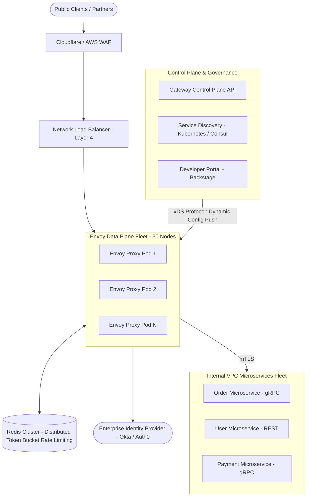
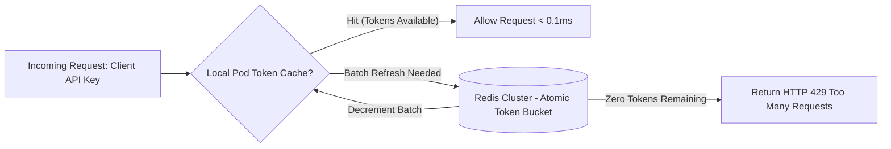

# System Design Case: Enterprise API Gateway & Management Platform

> A comprehensive, 20-part senior architectural design for a centralized enterprise API gateway, developer portal, OAuth2/mTLS token translation, and global rate-limiting platform.

---

## 1. Business Context & Problem Statement
Large enterprises have hundreds of microservices built across different technologies and cloud environments. Without a centralized API Gateway, every team independently builds authentication, rate limiting, logging, and CORS handling—creating security vulnerabilities, fragmented API contracts, and vendor billing sprawl. The platform must provide a single unified entry point for internal and external consumers.

---

## 2. Candidate Prompt & Executive Premise
> *"Design a multi-tenant enterprise API Gateway platform capable of handling 200,000 requests per second across 150 backend microservices with sub-5ms proxy overhead, centralized OAuth2/OIDC validation, distributed rate limiting, and automated developer portal self-service."*

---

## 3. Clarifying Questions to Ask the Interviewer
1. *What protocols must the gateway support?* (HTTP/1.1, HTTP/2, gRPC ingress; gRPC and REST egress to backends).
2. *How is authentication validated?* (OAuth2 / OpenID Connect; gateway validates JWT signatures locally and handles token exchange for legacy services).
3. *What are the rate-limiting requirements?* (Multi-tier: per API key, per IP, and per enterprise tenant).
4. *What is our latency budget?* (Gateway proxy processing overhead must be $< 5\text{ms}$ at p99).

---

## 4. Expected Functional Scope & Boundaries
* **In Scope**:
  * Dynamic routing and protocol translation (e.g., REST JSON to internal gRPC).
  * Centralized authentication & token exchange (OAuth2 / mTLS).
  * Global distributed rate limiting (Token Bucket).
  * Developer Portal (API catalog, key provisioning, interactive OpenAPI docs).
  * Centralized telemetry & audit logging (OpenTelemetry).
* **Out of Scope**:
  * Deep application business logic (gateway must remain strictly a reverse-proxy routing layer).

---

## 5. Non-Functional Requirements (NFRs) & Concrete Targets
* **Availability**: 99.999% (Five Nines—the gateway is the front door to the entire enterprise).
* **Latency**: Gateway internal latency overhead $< 3\text{ms}$ (p95), $< 5\text{ms}$ (p99).
* **Throughput**: 200,000 Peak RPS.
* **Resilience**: Downstream backend failures must not degrade unrelated APIs.

---

## 6. Back-of-the-Envelope Scale & Capacity Estimation
* **Throughput**: $200,000\text{ Peak RPS}$.
* **Bandwidth**:
  * Average Request: $2\text{ KB}$. Average Response: $8\text{ KB}$.
  * Total Egress: $200,000 \times 8\text{ KB} = 1,600\text{ MB/sec} = \mathbf{12.8\text{ Gbps}}$.
* **Compute Sizing**:
  * Using high-performance non-blocking C++/Rust proxies (Envoy / Kong / Traefik), a single modern vCPU handles $\approx 2,500\text{ proxy RPS}$.
  * Total Cores Needed: $\frac{200,000}{2,500} = \mathbf{80\text{ vCPUs}}$.
  * Fleet: 20 nodes with 4 vCPUs each (+ 50% headroom = **30 nodes**).

---

## 7. High-Level Architecture (C4 Container Diagram)

---

## 8. Key Architectural Components
1. **Envoy Data Plane**: High-performance, memory-safe C++ proxy that executes TLS termination, header rewriting, rate-limiting filter evaluation, and connection pooling.
2. **Control Plane (xDS API)**: Pushes routing tables, rate-limit policies, and TLS certificates dynamically to Envoy proxies over gRPC without restarting proxies.
3. **Distributed Rate Limiting (Redis Token Bucket)**: Centralized Redis cluster running atomic token bucket scripts for global rate limiting across all proxy pods.
4. **Developer Portal (Backstage / OpenAPI)**: Enables external partners and internal developers to browse APIs, test endpoints in a sandbox, and self-provision API keys.

---

## 9. Token Validation & Token Exchange Flow

To avoid having 200,000 requests/sec overwhelm the central Identity Provider (Okta/Auth0):
1. **Public Key Caching**: Envoy caches the IdP's JSON Web Key Set (JWKS) in local memory.
2. **Local Cryptographic Verification**: Envoy validates the incoming JWT signature locally in $< 0.5\text{ms}$ using the cached public key—**zero external network calls required!**
3. **Internal Token Translation**: Envoy strips the public client token and generates an internal signed mTLS / SPIFFE assertion containing verified user claims (`user_id`, `roles`, `tenant_id`) passed downstream via HTTP headers (`X-User-Id`, `X-Tenant-Id`).

---

## 10. Distributed Rate-Limiting Strategy: Token Bucket

* **Performance Optimization**: Proxy pods pull tokens in **batches of 100** from Redis. This reduces Redis network roundtrips by 99%, allowing the rate-limiter to sustain 200,000 RPS with a modest 3-node Redis cluster.

---

## 11. Security & Zero Trust Boundaries
* **Edge WAF**: Enforces OWASP Top 10 rules (SQLi, XSS, Path Traversal) and DDoS mitigation.
* **Internal Service Mesh**: Envoy connects to backend microservices over strict mutual TLS (mTLS) with automated certificate rotation via HashiCorp Vault.
* **Header Sanitization**: Strips any untrusted incoming headers (e.g., `X-Internal-Role`) at the gateway edge to prevent header-spoofing privilege escalation.

---

## 12. Observability & OpenTelemetry
* **Distributed Trace Propagation**: Injects `traceparent` (W3C TraceContext) headers into every request, correlating gateway logs with backend microservice execution.
* **Golden Signals**: Real-time Prometheus metrics on Ingress RPS, 4xx/5xx error rates, and p99 latency distributions per API route.

---

## 13. Trade-Off Analysis & Rejected Alternatives
* **API Gateway with Embedded Business Logic vs. Dumb Reverse Proxy**:
  * *Embedded Logic Approach*: Putting data transformation, aggregation, and database calls inside the gateway (e.g., Lua/JavaScript scripts).
  * *Why Rejected*: The gateway quickly becomes a bloated, monolithic single point of failure where a bug in one script crashes all enterprise APIs. The gateway must remain **stateless and strictly protocol-focused**.

---

## 14. Interviewer Evaluation Rubric: Weak vs. Strong Answers
* **Weak**: Proposes verifying JWT tokens with an external HTTP call to Okta on every request (instantly overloading Okta); suggests a single nginx VM; ignores rate-limiting batching.
* **Strong**: Employs Envoy with dynamic xDS control planes; caches JWKS public keys for local sub-millisecond JWT verification; designs batched Redis token-bucket rate limiting; enforces mTLS to backends.
