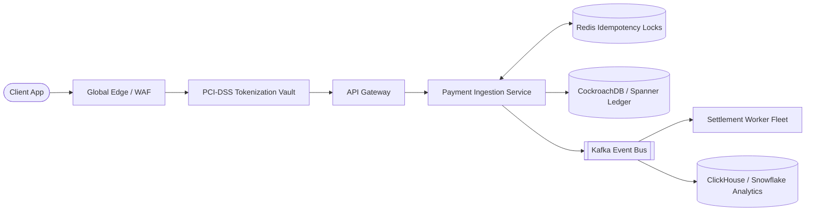

# Complete Mock Architecture Interviews: Scripted Transcripts

> End-to-end, scripted 45-minute mock interview transcripts illustrating real-time dialogue, clarifying discovery, whiteboard pacing, hidden constraint pivots, and hiring committee evaluations.

---

## Mock Interview 1: Principal Architect — Global Payment Ledger

* **Target Role**: Principal Engineer / Chief Architect (Level 5)
* **Interview Time**: 45 Minutes

### Transcript Excerpt

**Interviewer**: *"Welcome. Today I'd like you to design a globally distributed payment ledger platform. The system needs to support millions of merchants, process card transactions, maintain immutable account balances, and ensure zero discrepancies. How would you approach this?"*

**Candidate (Clarify & Scope - Minutes 0–5)**:
*"Thank you. This is a mission-critical financial system where data integrity is paramount. Before diving into architectures, I want to clarify a few core requirements and boundaries:
1. First, what is the transaction scale we are targeting today? (e.g., peak transactions per second?)
2. Second, what is our consistency requirement on balance queries? Specifically, is eventual consistency acceptable on merchant dashboards, while transactional updates must be strictly linearizable?
3. Third, are we acting as the direct merchant acquiring processor with card network connections (Visa/Mastercard), or are we orchestrating payments across third-party gateways like Stripe and Adyen?
4. And finally, what are our regulatory compliance boundaries regarding PCI-DSS and data sovereignty?"*

**Interviewer (Revealing Hidden Constraints)**:
*"Great questions. We are an orchestration platform processing payments through Stripe, Adyen, and local bank rails. At peak, we sustain 5,000 transactions/second globally. For balance updates, we require double-entry bookkeeping with strict ACID guarantees—we cannot afford double-spending. For reporting, eventual consistency with up to 10 seconds of lag is fine. PCI-DSS Level 1 compliance is mandatory, and European customer data must not leave the EU."*

**Candidate (NFRs & Scale - Minutes 5–10)**:
*"Understood. Let's establish our numbers and NFRs:
* **Throughput**: 5,000 Peak TPS. At an average transaction record size of 1 KB, that generates 5 MB/sec ingress, which is modest on bandwidth.
* **Storage**: 5,000 TPS * 86,400s * 30% average daily load ≈ 130 Million transactions/day. Over 1 year, that is ~47 Billion transactions, requiring ~47 TB of raw storage. With 7-year regulatory retention and 3x replication, we are looking at ~1 Petabyte of storage. This tells me we need an immutable append-only ledger with automated historical tiering.
* **NFR Targets**: Availability: 99.999% for authorization; Write Latency: p95 < 200ms; Consistency: PC/EC (Strong consistency for ledger balances); Security: PCI-DSS tokenized vault."*

**Candidate (Architecture & Whiteboard - Minutes 10–25)**:
*"Let's lay out the container architecture.
1. **Edge & Security Perimeter**: Traffic hits Cloudflare / Cloud KMS for TLS 1.3 termination and DDoS mitigation.
2. **PCI-DSS Tokenization Vault**: The raw cardholder PAN never touches our core microservices. A lightweight, isolated, PCI-certified vault service swaps the raw card for an opaque token (UUID).
3. **Payment Ingestion Service**: Stateless Go/Java microservice that accepts `POST /v1/payments`. It immediately enforces idempotency by checking an in-memory Redis cluster with a distributed lock on `Idempotency-Key`.
4. **Saga Orchestrator & Asynchronous Decoupling**: If the idempotency check passes, the Ingestion Service writes a `PaymentIntentCreated` event using the Transactional Outbox pattern into an Apache Kafka event mesh.
5. **The Double-Entry Bookkeeping Ledger**: Every financial transaction must be recorded as two balanced entries: a Debit to the merchant clearing account and a Credit to the merchant available balance. We implement this on a distributed NewSQL datastore—Google Cloud Spanner or CockroachDB—giving us multi-region ACID transactions with Raft consensus."*

**Interviewer (Probe / Challenge - Minute 30)**:
*"What happens if an external payment gateway like Stripe takes 8 seconds to respond during Black Friday?"*

**Candidate (Resilience & Recovery - Minutes 30–38)**:
*"That is a classic downstream cascading failure hazard. If we make synchronous blocking calls to Stripe, our 500 worker threads will exhaust in under 5 seconds, causing our entire ingestion gateway to crash.
To prevent this, I implement three architectural safeguards:
1. **Aggressive Socket Timeouts**: Set client socket timeout to 2,000ms.
2. **Circuit Breaker Pattern (Resilience4j/Envoy)**: If Stripe error rates exceed 5% over a 10-second sliding window, the circuit breaker trips to `OPEN`.
3. **Smart Multi-Gateway Failover**: When the Stripe circuit opens, the orchestrator automatically routes the payment request to our secondary provider (Adyen), preserving high availability without user disruption.
4. **Asynchronous Webhook Settlement**: For gateways that support asynchronous processing, we return an HTTP 202 Accepted to the client and finalize the double-entry ledger state upon receiving the gateway webhook."*

**Interviewer (Evaluation Wrap-Up - Minutes 40–45)**:
*"Excellent recovery. How would you handle European data sovereignty under GDPR?"*

**Candidate**:
*"Under CockroachDB and Cloud Spanner, we utilize **Row-Level Locality / Regional Tables**. We define table partitioning based on `region_code = 'EU'`. European ledger rows are physically stored on storage nodes in Frankfurt and Ireland, with replication restricted within EU borders, while US records remain in North America. The API Gateway uses GeoDNS to route European users to the Frankfurt cluster, guaranteeing compliance by design."*

### Hiring Committee Scorecard

| Dimension | Score (1–5) | Evaluator Notes |
| :--- | :---: | :--- |
| Requirements & Scope | 5 / 5 | Clarified PCI-DSS, consistency, and scale immediately. |
| Scale & Capacity | 5 / 5 | Accurately sized 1 PB 7-year storage and identified NewSQL requirement. |
| Resilience & Security | 5 / 5 | Handled downstream gateway hang with circuit breakers and multi-gateway failover. |
| Executive Presence | 5 / 5 | Driven, structured, collaborative, and confident. |
| **Final Hiring Recommendation** | **STRONG HIRE (L5 Principal Architect)** | |

---

## 2. Cross-References

* **Full Payment Case Study**: [`payment-platform.md`](file:///d:/company/products/enterprise-architecture-handbook/20-interview-system-design/architecture-interviews/payment-platform.md)
* **Scoring Rubric**: [`../interview-scoring-rubric.md`](file:///d:/company/products/enterprise-architecture-handbook/20-interview-system-design/interview-scoring-rubric.md)
* **Progressive Difficulty Levels**: [`progressive-levels.md`](file:///d:/company/products/enterprise-architecture-handbook/20-interview-system-design/architecture-interviews/progressive-levels.md)
