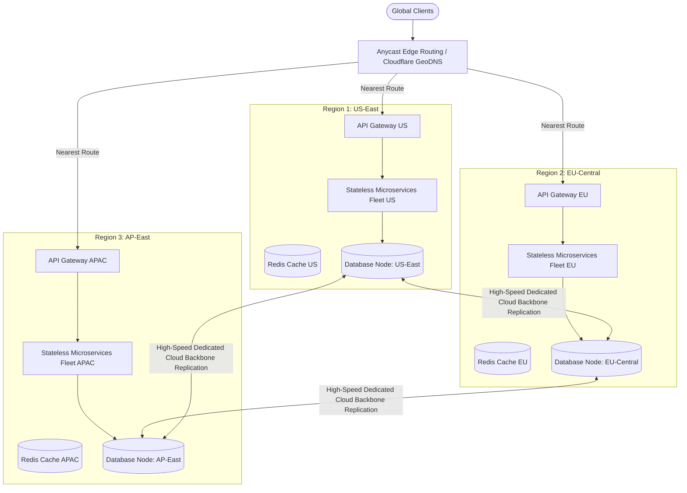
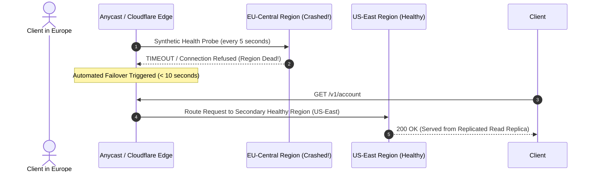

# System Design Case: Multi-Region Active-Active Global Architecture

> A comprehensive, 20-part senior architectural design for a multi-region active-active distributed platform supporting zero-RTO global disaster recovery, sub-100ms international latency, and distributed write conflict resolution.

---

## 1. Business Context & Problem Statement
Global enterprise SaaS platforms cannot tolerate regional cloud outages (e.g., an entire AWS region going dark) without violating strict contractual SLAs. Furthermore, routing European and Asian users across transcontinental fiber to North American data centers adds $150–250\text{ms}$ of inescapable speed-of-light network latency. An Active-Active Multi-Region architecture routes traffic to the nearest geographic region while maintaining global data synchronization.

---

## 2. Candidate Prompt & Executive Premise
> *"Design a multi-region active-active architecture deployed across 3 continents (Americas, Europe, Asia-Pacific) capable of sustaining 50,000 global transactions per second, surviving total loss of any single cloud region with zero downtime and RPO < 1 second, while resolving concurrent multi-region write conflicts."*

---

## 3. Clarifying Questions to Ask the Interviewer
1. *What is the read-to-write ratio?* (80% reads, 20% writes).
2. *Can user accounts be geo-pinned?* (Yes: 95% of users access the system from their primary home region; 5% travel internationally).
3. *What is the write conflict resolution policy?* (Last-Write-Wins (LWW) is acceptable for user profiles, but financial balances require strong serializable consensus).
4. *What are our compliance constraints?* (GDPR mandates that European customer PII cannot be stored in US databases).

---

## 4. Expected Functional Scope & Boundaries
* **In Scope**:
  * GeoDNS and Anycast edge latency routing.
  * Cross-region data synchronization and replication.
  * Multi-region write conflict resolution (CRDTs and distributed consensus).
  * Automated regional failover with zero operator intervention.
  * Data sovereignty compliance (Regional Table Pinning).
* **Out of Scope**:
  * Multi-cloud cross-vendor deployment (all regions hosted on same hyperscaler).

---

## 5. Non-Functional Requirements (NFRs) & Concrete Targets
* **Availability**: 99.999% (Five Nines).
* **RTO (Recovery Time Objective)**: $\approx 0\text{ seconds}$ (automatic traffic diversion via health probes).
* **RPO (Recovery Point Objective)**: $< 1\text{ second}$ (asynchronous cross-region replication lag).
* **Latency**: p95 local read latency $< 30\text{ms}$; p95 regional write latency $< 150\text{ms}$.

---

## 6. High-Level Architecture (C4 Container Diagram)



---

## 7. Data Synchronization & Write Conflict Resolution

```
Three Proven Architectural Approaches:

1. User-Pinned Regional Ownership (Home Region Pattern - 95% of use cases):
   - Tenant / User records have a home region (e.g., `home_region = 'EU'`).
   - Writes for User A ALWAYS route to the EU region primary.
   - If User A travels to Tokyo, the Tokyo API Gateway proxies the write back to Frankfurt over private AWS fiber.
   - Eliminates multi-region write conflicts by design!

2. Conflict-Free Replicated Data Types (CRDTs):
   - For collaborative documents, carts, and counters.
   - Mathematically guarantees that concurrent writes in US and EU converge to the exact same state without locks.

3. Distributed NewSQL Consensus (Google Cloud Spanner / CockroachDB):
   - Uses Multi-Raft consensus across regions for transactions requiring strict serializability.
```

---

## 8. Automated Regional Failover Execution



---

## 9. Data Sovereignty & GDPR Compliance
* Under **CockroachDB / Spanner Regional Table Partitioning**, tables are tagged:
  ```sql
  ALTER TABLE customer_profiles CONFIGURE ZONE USING
      num_replicas = 3,
      constraints = '{+region=eu-central: 3}';
  ```
* This strictly guarantees that European customer data is physically stored and replicated **only** across Frankfurt and Dublin datacenters, with zero records ever replicated to North America, satisfying GDPR legal mandates.

---

## 10. Trade-Off Analysis & Rejected Alternatives
* **Synchronous Cross-Region Replication vs. Asynchronous Replication**:
  * *Synchronous*: Eliminates data loss completely ($\text{RPO} = 0$), but every single write must wait on a transatlantic network round-trip ($70–120\text{ms}$ speed-of-light delay), resulting in unacceptable user write latency.
  * *Approved*: **Asynchronous Replication with Home-Region Pinning**, delivering sub-20ms local writes and sub-second RPO.

---

## 11. Cost Modeling & Network Egress Realities
* Cross-region network replication across 3 continents transferring 50 TB/month costs $\approx \$10,000/\text{mo}$ in cross-region egress.
* Multi-region infrastructure footprint triples baseline compute and storage costs ($3\times$ multiplier).
* *Business Justification*: Acceptable for Tier-1 mission-critical enterprise platforms where a 1-hour outage causes $5M+ in reputational and contractual damage.

---

## 12. Interviewer Evaluation Rubric: Weak vs. Strong Answers
* **Weak**: Proposes synchronous two-phase commit across oceans; ignores the speed-of-light latency limit ($70\text{ms}$ NY to London); ignores GDPR data sovereignty; claims active-active requires zero conflict resolution.
* **Strong**: Employs the Home Region Pinning pattern to eliminate write conflicts; designs automated Anycast health-check failover; sizes cross-region egress costs; enforces GDPR regional table constraints.
