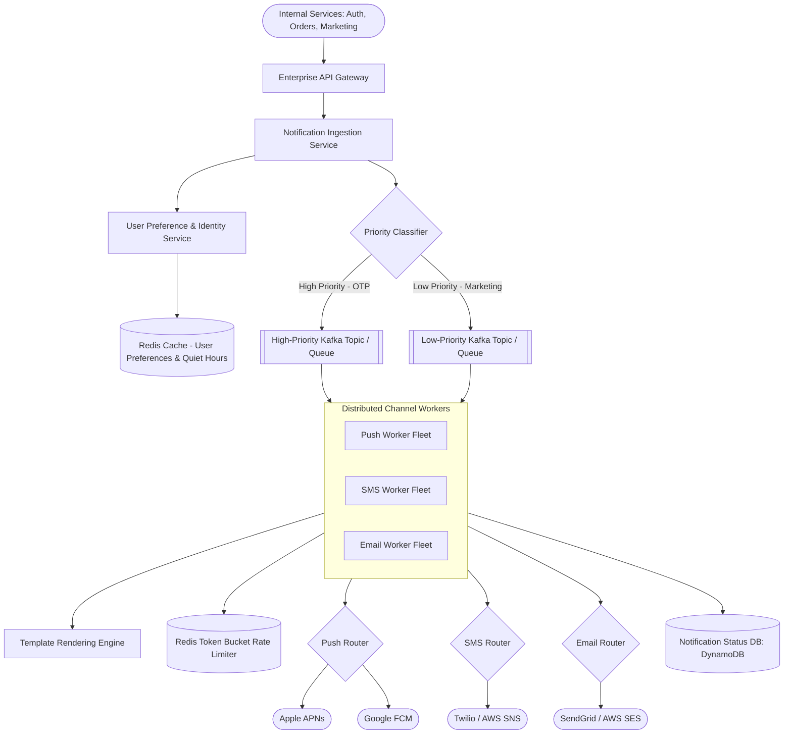
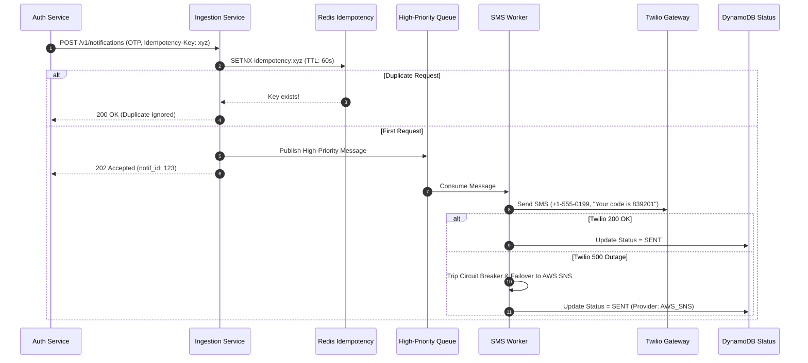

# System Design Case: Multi-Channel Global Notification Platform

> A production-grade, 20-part senior architectural design for a distributed, priority-queued multi-channel notification engine (Push, SMS, Email, In-App).

---

## 1. Business Context & Problem Statement
Modern enterprises require a unified notification platform to deliver mission-critical transactional alerts (OTPs, fraud alerts, password resets) and high-volume marketing campaigns (promotions, product newsletters). Transactional alerts must be delivered within seconds with 99.999% reliability, while marketing broadcasts must be rate-limited to avoid overwhelming downstream third-party gateways (Twilio, SendGrid, Apple APNs, Google FCM) or annoying users.

---

## 2. Candidate Prompt & Executive Premise
> *"Design a multi-tenant, multi-channel notification platform capable of delivering 500 Million notifications daily across iOS/Android Push, SMS, and Email, supporting strict priority tiering, per-user rate limiting, user preference management, and provider failover."*

---

## 3. Clarifying Questions to Ask the Interviewer
1. *Are all notifications equal in priority?* (No: Critical OTPs/security alerts must bypass marketing queues and deliver in $< 3\text{ seconds}$).
2. *How are delivery preferences handled?* (Users can opt-out of channels per notification category: e.g., Email OK for marketing, but no SMS).
3. *What happens if an external provider (e.g., SendGrid) experiences an outage?* (Automatic fallback to secondary provider like AWS SES/Mailgun).
4. *What is our duplicate delivery tolerance?* (At-least-once delivery is acceptable, but duplicate sends within 60 seconds must be suppressed via idempotency).

---

## 4. Expected Functional Scope & Boundaries
* **In Scope**:
  * Unified ingestion API (`POST /v1/notifications`).
  * Multi-channel delivery: Push (APNs, FCM), SMS (Twilio, Sinch), Email (SendGrid, SES), In-App WebSockets.
  * Strict Priority Queuing (Tier 1 High Priority vs. Tier 2 Low Priority).
  * User Preference Engine (Channel opt-in/opt-out, quiet hours).
  * Template rendering engine (Handlebars/Mustache with dynamic variables).
  * Provider failover and delivery receipt webhooks.
* **Out of Scope**:
  * Rich WYSIWYG email marketing campaign designer.
  * Full CRM contact management system.

---

## 5. Non-Functional Requirements (NFRs) & Concrete Targets
* **Availability**: 99.99% for API ingestion.
* **Latency**:
  * High-Priority (OTP / Fraud): End-to-end delivery $< 3\text{ seconds}$ (p99).
  * Low-Priority (Marketing): Delivery within 2 hours.
* **Throughput**: 500 Million daily notifications; sustain peak bursts of $50,000\text{ notifications/sec}$.
* **Security**: Multi-tenant isolation; masking of sensitive OTPs and PII in logs.

---

## 6. Back-of-the-Envelope Scale & Capacity Estimation
* **Throughput**:
  $$\text{Average RPS} = \frac{500,000,000}{86,400\text{ sec}} \approx \mathbf{5,800\text{ RPS}}$$
  $$\text{Peak Burst RPS (Flash Sale / Breaking News)} = \mathbf{50,000\text{ RPS}}$$
* **Storage Sizing (90-Day Retention)**:
  * Notification Record: 1 KB (User ID, Channel, Template ID, Payload, Status, Timestamps).
  * Daily Storage: $500\text{M} \times 1\text{ KB} = \mathbf{500\text{ GB/day}}$.
  * 90-Day Operational DB: $500\text{ GB} \times 90 = \mathbf{45\text{ TB}}$ (Tier cold logs to S3 after 30 days).
* **Downstream Provider Limits**:
  * Apple APNs / Google FCM: Supports 50,000+ pushes/sec.
  * Twilio SMS: Throttled by carrier short-code limits (e.g., 100 SMS/sec per short-code). Rate-limiting is mandatory!

---

## 7. High-Level Architecture (C4 Container Diagram)



---

## 8. Key Architectural Components
1. **Notification Ingestion Service**: Validates requests, verifies tenant authentication, and performs deduplication checks using an idempotency key.
2. **User Preference Service**: Checks whether the recipient has muted this channel or is currently in a "Quiet Hours" window (e.g., no marketing between 10 PM and 8 AM).
3. **Priority-Tiered Event Mesh**: High-priority topics have dedicated worker clusters that are never starved by multi-million marketing broadcast queues.
4. **Channel Provider Routers with Circuit Breakers**: Dispatches messages to third-party vendors and handles automatic fallback if vendor error rates spike.

---

## 9. Core Data Models & Schema Design

### Notification Event Status (DynamoDB / Cassandra)
```text
Table: notification_events
  Partition Key (PK): recipient_id (UUID)
  Sort Key (SK): notification_id (TimeUUID)
  Attributes:
    - tenant_id: String
    - channel: String (PUSH | SMS | EMAIL | IN_APP)
    - priority: String (HIGH | LOW)
    - status: String (PENDING | SENT | DELIVERED | FAILED)
    - provider: String (TWILIO | SENDGRID | APNS)
    - retry_count: Integer
    - idempotency_key: String (Global Secondary Index)
    - created_at: Timestamp
    - expires_at: TTL (Epoch timestamp for auto-deletion after 90 days)
```

---

## 10. APIs & Event Contracts

### Ingest Notification
```http
POST /v1/notifications
Authorization: Bearer <service_token>
Idempotency-Key: b7a1-8942-ef10
Content-Type: application/json

{
  "recipient_id": "usr_998124",
  "category": "AUTHENTICATION_OTP",
  "priority": "HIGH",
  "channels": ["SMS", "PUSH"],
  "template_id": "tpl_otp_login",
  "parameters": {
    "otp_code": "839201",
    "expiry_minutes": "5"
  }
}

RESPONSE 202 Accepted
{
  "notification_id": "notif_1048576",
  "status": "QUEUED"
}
```

---

## 11. Critical Request & Data Flows (Sequence)



---

## 12. Security Architecture & Trust Boundaries
* **PII & Secret Masking**: Never log raw OTP codes, credit card numbers, or email bodies in application logs. Use structured field masking (`[REDACTED]`).
* **Rate Limiting (Anti-Spam)**: Per-user token-bucket rate limiter: max 3 OTP requests per 10 minutes; max 5 marketing emails per day.
* **Internal Mutual TLS (mTLS)**: All internal microservices communicate over encrypted mTLS authenticated via SPIFFE/SPIRE identities.

---

## 13. Observability, Metrics & Telemetry (SLOs)
* **SLO 1 (High-Priority Delivery Latency)**: 99.9% of OTP notifications delivered in $< 3\text{ seconds}$.
* **SLO 2 (Channel Success Rate)**: Overall delivery success rate $\ge 99.5\%$.
* **Key Metric**: `notification_worker_lag_seconds` alerting if high-priority queue lag exceeds 5 seconds.

---

## 14. Failure Modes & Graceful Degradation Strategies
* **Failure Mode: Primary SMS Provider (Twilio) Crashes**:
  * *Degradation*: Worker circuit breaker trips to `OPEN` within 10 failures. SMS worker immediately routes all traffic to backup provider (AWS SNS / MessageBird).
* **Failure Mode: Black Friday Marketing Surge Floods System**:
  * *Mitigation*: Separate queue infrastructure ensures high-priority OTP traffic is completely physically isolated from marketing traffic. Marketing queue depth auto-scales worker pods without stealing CPU from OTP pods.

---

## 15. Horizontal & Vertical Scaling Strategy
* **Worker Pools**: Specialized Kubernetes worker deployments per channel (`push-workers`, `sms-workers`, `email-workers`) configured with Kubernetes KEDA to auto-scale based on Kafka queue lag.
* **Partition Key**: Partition high-priority Kafka topics by `recipient_id` to guarantee in-order delivery of notifications to any individual user.

---

## 16. Trade-Off Analysis & Rejected Alternatives
* **Single Shared Queue vs. Priority-Tiered Queues**:
  * *Shared Queue*: Simple to maintain, but a 10-Million user marketing blast will queue behind 1,000 OTPs, causing login OTPs to take 45 minutes to deliver.
  * *Approved*: **Physically Isolated Multi-Queue Topology** ensuring zero contention for critical alerts.

---

## 17. Cost Modeling & Unit Economics
* **Infrastructure Run Rate**:
  * 30 Worker Pods (EKS m7g.large) $\approx \$1,200/\text{mo}$.
  * Managed Kafka (AWS MSK 3-node) $\approx \$750/\text{mo}$.
  * DynamoDB Status Store $\approx \$800/\text{mo}$.
  * Total Infrastructure: $\approx \$2,750/\text{month}$.
* **Third-Party Provider Costs (The Real Cost Driver)**:
  * SMS: 50M SMS * $0.0075 = $375,000/mo.
  * Email: 300M Emails * $0.0001 = $30,000/mo.
  * Push: 150M Pushes = Free (APNs/FCM).
  * *Architectural Takeaway*: Pushing users from SMS to Push Notifications saves the company hundreds of thousands of dollars per month!

---

## 18. Multi-Year Evolution & 10x Scale Roadmap
* **Scale 10x (5 Billion daily notifications)**:
  * Implement edge smart batching: Group non-urgent social notifications into a single periodic digest (e.g., *"You have 5 new updates"*).
  * Deploy regional worker hubs in Europe, Asia-Pacific, and Americas to reduce network RTT to regional carrier SMS aggregators.

---

## 19. Interviewer Follow-Up Probes & Curveballs
* *Probe*: *"How do you handle 'Quiet Hours' across multiple time zones?"*
  * *Response*: *"The User Preference Service maintains the recipient's IANA timezone (e.g., `America/New_York`). For low-priority marketing events, the worker calculates local recipient time. If between 10 PM and 8 AM, the worker delays the message by inserting it into a scheduled delay queue (e.g., SQS delay message or Redis ZSet scored by wake-up epoch timestamp)."*

---

## 20. Interviewer Evaluation Rubric: Weak vs. Strong Answers
* **Weak**: Uses a single SQS queue for both marketing and OTPs; forgets rate limiting; hardcodes a single third-party provider with no failover; calculates only infrastructure costs while ignoring provider SMS charges.
* **Strong**: Explicitly isolates priority queues; designs Redis token-bucket rate limiting; implements automated provider circuit-breaker failover; models SMS vs. Push unit economics.
