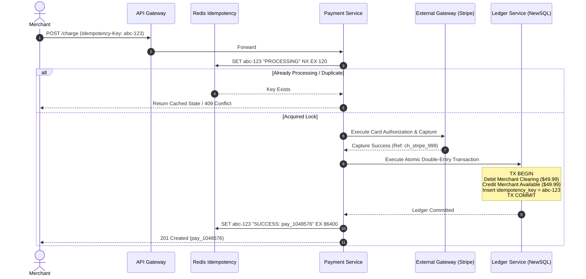

# System Design Case: Mission-Critical Payment Platform & Distributed Ledger

> A comprehensive, 20-part senior architectural design for an enterprise payment orchestration engine, double-entry bookkeeping ledger, and PCI-DSS Level 1 compliant card processing platform.

---

## 1. Business Context & Problem Statement
Payment platforms orchestrate customer billing, merchant payouts, and currency conversions across multiple third-party banking networks (Visa/Mastercard, Stripe, Adyen). The system must guarantee zero double-charging, maintain mathematical balance integrity through double-entry bookkeeping, isolate raw cardholder data from core microservices, and ensure audit compliance under PCI-DSS Level 1.

---

## 2. Candidate Prompt & Executive Premise
> *"Design a global payment processing and ledger platform sustaining 5,000 peak transactions per second with 99.999% authorization availability, absolute zero double-charging guarantees, strict double-entry ledger consistency, and automated reconciliation."*

---

## 3. Clarifying Questions to Ask the Interviewer
1. *What is our role in the payment ecosystem?* (Payment Orchestrator & Ledger; we tokenize cards and route to acquiring gateways like Stripe/Adyen).
2. *Can merchant balances be eventually consistent?* (No. The financial ledger requires strict ACID linearizability. Reporting dashboards can have a 10-second lag).
3. *What is our regulatory retention requirement?* (All raw transaction ledgers must be retained immutably for 7 years for financial audits).
4. *How do we handle currency conversion?* (FX rates locked at time of authorization).

---

## 4. Expected Functional Scope & Boundaries
* **In Scope**:
  * Card tokenization via an isolated PCI-DSS vault.
  * Payment authorization and capture flow.
  * Strict double-entry financial ledger (Debits = Credits).
  * Distributed idempotency handling.
  * Multi-gateway routing & automated failover.
  * Daily settlement and automated reconciliation.
* **Out of Scope**:
  * Issuing physical credit cards.
  * Complex real-time fraud machine learning training (assumed an external scoring microservice).

---

## 5. Non-Functional Requirements (NFRs) & Concrete Targets
* **Availability**: 99.999% (Five Nines = $< 5.26\text{ minutes downtime/year}$) for authorization.
* **Latency**: Authorization response $< 350\text{ms}$ (p95) including downstream gateway round-trip.
* **Consistency**: Strong consistency (PC/EC under PACELC) for ledger balances.
* **Durability & RPO**: Zero financial transaction loss ($\text{RPO} = 0$).

---

## 6. Back-of-the-Envelope Scale & Capacity Estimation
* **Throughput**:
  * Peak Authorization TPS: $\mathbf{5,000\text{ TPS}}$.
  * Daily Transactions: $\approx 100\text{ Million transactions/day}$.
* **Ledger Storage Sizing (7-Year Horizon)**:
  * Double-entry bookkeeping creates at least **2 ledger entries per transaction** (Debit + Credit).
  * Daily Ledger Entries: $100\text{M} \times 2 = 200\text{ Million entries/day}$.
  * Entry size: 500 bytes (UUID, Account ID, Currency, Amount Cents, Sign, Timestamp).
  * Daily Volume: $200\text{M} \times 500\text{B} = \mathbf{100\text{ GB/day}}$.
  * 7-Year Storage: $100\text{ GB} \times 365 \times 7 \approx \mathbf{255\text{ TB}}$ (with 3x replication: $\approx \mathbf{765\text{ TB}}$).
* **Network Throughput**:
  * $5,000\text{ TPS} \times 2\text{ KB} = 10\text{ MB/sec} = \mathbf{80\text{ Mbps}}$ (Easily handled by 1 Gbps cloud interconnects).

---

## 7. High-Level Architecture (C4 Container Diagram)

```mermaid
flowchart TD
    Client([Client App / Checkout]) --> Edge[Global Edge / WAF / TLS 1.3]
    
    subgraph CardVault [PCI-DSS Level 1 Isolated Vault]
        VaultSvc[Card Tokenizer Service]
        HSM[Hardware Security Module - HSM]
        VaultDB[(Tokenized Card Store)]
    end
    
    Edge -->|Raw Card Data| VaultSvc
    VaultSvc --> HSM
    VaultSvc --> VaultDB
    VaultSvc -->>|Returns Opaque Token| Client
    
    Client -->|POST /v1/payments Tokenized| APIGW[Enterprise API Gateway]
    
    subgraph PaymentPlatform [Core Microservices Fleet]
        PaymentSvc[Payment Orchestration Service]
        LedgerSvc[Double-Entry Ledger Service]
        RouterSvc[Gateway Routing Engine]
    end
    
    APIGW --> PaymentSvc
    PaymentSvc <--> Redis[(Redis Distributed Idempotency Locks)]
    
    PaymentSvc --> RouterSvc
    RouterSvc --> Stripe([Stripe API])
    RouterSvc --> Adyen([Adyen API])
    
    PaymentSvc --> LedgerSvc
    LedgerSvc --> LedgerDB[(Distributed NewSQL: CockroachDB / Spanner)]
    
    PaymentSvc --> Kafka[[Kafka Financial Event Mesh]]
    Kafka --> SettleWorker[Settlement & Reconciliation Worker]
    SettleWorker --> BankNetwork([ACH / Fedwire Clearing])
```

---

## 8. Key Architectural Components
1. **PCI-DSS Tokenization Vault**: Isolated, air-gapped environment that swaps raw PANs for opaque tokens. The core microservice fleet never sees or stores plaintext credit cards, dramatically reducing PCI compliance audit scope.
2. **Idempotency Gate**: Redis atomic lock backed by a unique database constraint on `Idempotency-Key` preventing concurrent double charges.
3. **Gateway Smart Router**: Directs traffic across Stripe, Adyen, and Chase based on transaction cost, regional currency, and real-time gateway health telemetry.
4. **Distributed Double-Entry Ledger**: Implemented on CockroachDB / Cloud Spanner ensuring multi-region transactional serialization.

---

## 9. Core Data Models & Schema Design

### Double-Entry Ledger Schema (Distributed NewSQL)
```sql
CREATE TABLE accounts (
    account_id UUID PRIMARY KEY,
    owner_id UUID NOT NULL,
    account_type VARCHAR(32) NOT NULL, -- ASSET, LIABILITY, EQUITY, REVENUE, EXPENSE
    currency CHAR(3) NOT NULL,
    created_at TIMESTAMPTZ NOT NULL DEFAULT NOW()
);

CREATE TABLE ledger_transactions (
    transaction_id UUID PRIMARY KEY,
    idempotency_key VARCHAR(128) UNIQUE NOT NULL,
    description TEXT NOT NULL,
    created_at TIMESTAMPTZ NOT NULL DEFAULT NOW()
);

CREATE TABLE ledger_entries (
    entry_id UUID PRIMARY KEY,
    transaction_id UUID NOT NULL REFERENCES ledger_transactions(transaction_id),
    account_id UUID NOT NULL REFERENCES accounts(account_id),
    amount_cents BIGINT NOT NULL, -- Always integer! Never use floats for money
    direction VARCHAR(6) NOT NULL CHECK (direction IN ('DEBIT', 'CREDIT')),
    created_at TIMESTAMPTZ NOT NULL DEFAULT NOW()
);

-- Invariant: SUM(amount_cents WHERE direction = 'DEBIT') == SUM(amount_cents WHERE direction = 'CREDIT')
```

---

## 10. APIs & Event Contracts

### Authorize & Charge Payment
```http
POST /v1/payments/charge
Authorization: Bearer <merchant_jwt>
Idempotency-Key: idemp_9981-a74c-8821
Content-Type: application/json

{
  "amount_cents": 4999,
  "currency": "USD",
  "payment_method_token": "tok_visa_4242_vault_uuid",
  "merchant_account_id": "acc_merch_0012",
  "customer_id": "cust_8812"
}

RESPONSE 201 Created
{
  "payment_id": "pay_1048576",
  "status": "CAPTURED",
  "amount_cents": 4999,
  "currency": "USD",
  "ledger_tx_id": "tx_8891234",
  "created_at": "2026-09-06T11:43:00Z"
}
```

---

## 11. Critical Request & Data Flows (Two-Phase Ledger Charge)



---

## 12. Security Architecture & PCI-DSS Isolation
* **PCI-DSS Level 1 Scope Reduction**:
  * Raw credit card numbers (PANs) and CVVs are sent directly from customer browsers to the **Tokenization Vault** via an isolated iframe.
  * The internal network only handles opaque tokens (`tok_xxx`).
  * As a result, 95% of internal microservices are removed from the strict PCI audit scope.
* **Encryption**:
  * Field-level encryption using AES-256-GCM for tokens.
  * Master keys rotated annually within dedicated Hardware Security Modules (AWS CloudHSM).

---

## 13. Observability, Metrics & Telemetry (SLOs)
* **SLO 1**: 99.999% Authorization API availability.
* **SLO 2**: Gateway timeout rate $< 0.1\%$.
* **SLO 3**: Zero balance discrepancy between Ledger and Banking Settlement files during automated nightly reconciliation.

---

## 14. Failure Modes & Graceful Degradation Strategies
* **Failure Mode: Primary Gateway (Stripe) Latency Hang**:
  * *Degradation*: Client socket timeout trips at 1,500ms; circuit breaker immediately re-routes the pending authorization to secondary provider (Adyen).
* **Failure Mode: Network Drops After Gateway Success but Before Ledger Write**:
  * *Mitigation*: The external gateway charged the customer, but our ledger did not commit. Upon recovery, the automated **Nightly Reconciliation Engine** compares gateway capture logs with our ledger transactions, detects the orphan capture, and automatically commits a compensating ledger entry.

---

## 15. Scaling & Concurrency Strategy
* **Avoiding Hot-Account Lock Contention**:
  * If thousands of customers pay the same merchant simultaneously, updating a single `merchant_balance` row creates severe row-lock deadlocks.
  * **Solution: Append-Only Ledger Entries**. We never mutate a `balance` row in place. We only append new rows to `ledger_entries`. The current balance is calculated by aggregating snapshots + delta rows in memory.

---

## 16. Trade-Off Analysis & Rejected Alternatives
* **Traditional Relational DB (PostgreSQL) vs. Distributed NewSQL (CockroachDB)**:
  * *PostgreSQL*: Excellent, but multi-region active-active requires asynchronous replication, risking lost writes during regional disaster.
  * *CockroachDB / Spanner*: Strong serializable ACID transactions across multi-region nodes using Raft consensus, eliminating financial drift at the cost of a 30ms consensus write latency.

---

## 17. Cost Modeling & Unit Economics
* **Infrastructure Run Rate**:
  * 12-Node CockroachDB Cluster $\approx \$8,000/\text{mo}$.
  * Tokenization Vault Fleet + CloudHSM $\approx \$3,500/\text{mo}$.
  * Total Infrastructure: $\approx \mathbf{\$16,000/\text{month}}$.
* **Unit Economics**:
  * For 100 Million monthly transactions, infrastructure cost is **$\$0.00016\text{ per transaction}$**, which is negligible compared to the $1.5\%\text{ to }2.9\%$ interchange fee revenue.

---

## 18. Multi-Year Evolution & 10x Scale Roadmap
* **Scale 10x (50,000 TPS)**:
  * Implement **Cell-Based Architecture**: Shard independent payment processing cells by Merchant Organization ID. A catastrophic outage in Cell A cannot affect merchants in Cell B.

---

## 19. Interviewer Follow-Up Probes & Curveballs
* *Probe*: *"How do you handle currency rounding errors (e.g., fractional cents in FX rates)?"*
  * *Response*: *"All monetary math is performed in integer micro-cents (1/10,000th of a cent) or using arbitrary-precision decimals (`BigDecimal`). Rounding remainders are explicitly credited or debited to an internal corporate Rounding Error Clearing Account, guaranteeing total ledger balance balance invariance."*

---

## 20. Interviewer Evaluation Rubric: Weak vs. Strong Answers
* **Weak**: Uses floating-point numbers (`float` / `double`) for money; updates balances using `UPDATE accounts SET balance = balance + x`; forgets idempotency; ignores PCI-DSS vault isolation.
* **Strong**: Employs double-entry append-only ledger entries; sizes 7-year audit retention; uses integer amounts in cents; designs Redis idempotency locks; isolates PCI-DSS cardholder data environment.
