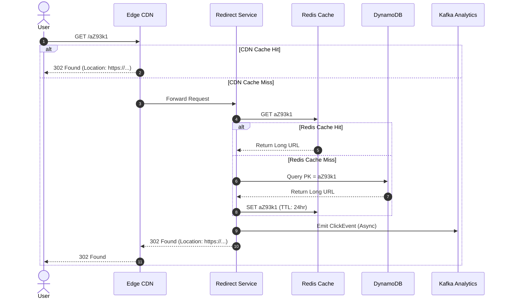

# System Design Case: High-Throughput Distributed URL Shortener

> A comprehensive, 20-part senior architectural design for a globally distributed, low-latency URL shortening and analytics platform (e.g., TinyURL / Bitly).

---

## 1. Business Context & Problem Statement
URL shorteners convert long URLs into compact aliases for SMS character limits, social media sharing, and marketing campaign attribution. The platform must provide sub-millisecond redirect resolution, capture real-time click analytics, and maintain 100% link durability over multi-year retention horizons.

---

## 2. Candidate Prompt & Executive Premise
> *"Design a high-scale distributed URL shortening service capable of handling 100 Million new URL creations per month, serving 10 Billion redirects per month with p95 latency under 20ms, and collecting real-time click analytics."*

---

## 3. Clarifying Questions to Ask the Interviewer
1. *What is the expected read-to-write ratio?* (Expected: 100:1 read-heavy).
2. *Can users define custom vanity aliases (e.g., `bit.ly/my-campaign`)?* (Yes, but must check uniqueness).
3. *What is the default retention period of a shortened link?* (5 years default, configurable expiration).
4. *Do analytics require real-time streaming queries or is batch aggregations sufficient?* (Real-time count, 24-hour detailed geo-breakdown).

---

## 4. Expected Functional Scope & Boundaries
* **In Scope**:
  * Generate a unique 7-character short URL from a long URL.
  * HTTP 301 / 302 redirection to the original destination.
  * Real-time click counter and geolocation analytics.
  * High availability and low latency globally.
* **Explicitly Out of Scope**:
  * Complex anti-abuse machine learning and phishing site crawlers (assumed handled by edge WAF/partner).
  * Multi-tier enterprise billing and team workspace management.

---

## 5. Non-Functional Requirements (NFRs) & Concrete Targets
* **Availability**: 99.99% for redirection (Tier-1 path).
* **Latency**: p95 redirect latency $< 20\text{ms}$; p99 $< 50\text{ms}$.
* **Consistency**: Eventual consistency for analytics; Read-after-write consistency for URL creation.
* **Durability**: 100% persistence; zero lost shortened links over 5 years.

---

## 6. Back-of-the-Envelope Scale & Capacity Estimation
* **Write Traffic**:
  $$100\text{M new URLs / month} \approx \frac{100,000,000}{2.59 \times 10^6\text{ sec}} \approx \mathbf{40\text{ writes/sec (Peak: 120 writes/sec)}}$$
* **Read Traffic (Redirects)**:
  $$10\text{ Billion redirects / month} \approx \frac{10,000,000,000}{2.59 \times 10^6\text{ sec}} \approx \mathbf{3,860\text{ Average RPS (Peak: 10,000 RPS)}}$$
* **Storage Sizing (5 Years)**:
  * Each record: Short Hash (7B) + Long URL (100B) + CreatedAt (8B) + ExpiresAt (8B) + UserID (16B) $\approx 200\text{ bytes}$.
  * With index and metadata overhead: $300\text{ bytes per record}$.
  * Total 5-Year Records: $100\text{M} \times 12 \times 5 = 6\text{ Billion URLs}$.
  * Total 5-Year Storage: $6\text{ Billion} \times 300\text{ bytes} \approx \mathbf{1.8\text{ TB}}$ (with 3x replication: $\approx \mathbf{5.4\text{ TB}}$).
* **Cache Working Set (RAM)**:
  * 20% of daily redirects account for 80% of traffic.
  * Daily Redirects: $\approx 330\text{ Million}$.
  * 20% working set: $66\text{M} \times 300\text{ bytes} \approx \mathbf{20\text{ GB RAM}}$ (Easily fits in a single Redis cluster).

---

## 7. High-Level Architecture (C4 Container Diagram)

```mermaid
flowchart TD
    Client([Global Clients / Mobile / Browsers]) --> CDN[Cloudflare CDN & Edge Caching]
    CDN --> APIGW[Kong API Gateway]
    
    subgraph CorePlatform [Core Shortener Fleet]
        ShortenerSvc[Shortener Service - Write Path]
        RedirectSvc[Redirect Service - Read Path]
        KGS[Key Generation Service - KGS]
    end
    
    APIGW -->|POST /urls| ShortenerSvc
    APIGW -->|GET /{short_hash}| RedirectSvc
    
    ShortenerSvc --> KGS
    ShortenerSvc --> DB[(Primary Datastore: DynamoDB / PostgreSQL)]
    ShortenerSvc --> Redis[(Redis Cache Cluster)]
    
    RedirectSvc --> Redis
    RedirectSvc -.->|Cache Miss| DB
    RedirectSvc -->|Publish Click Event| Kafka[[Kafka Event Bus]]
    
    Kafka --> AnalyticsWorker[Analytics Processing Workers]
    AnalyticsWorker --> AnalyticsDB[(ClickHouse OLAP)]
```

---

## 8. Key Architectural Components
1. **Key Generation Service (KGS)**: Pre-generates unique 7-character Base62 hashes offline, storing them in memory/DB, eliminating hash collision checks at runtime.
2. **Shortener Write Service**: Stateless microservice that claims a pre-generated key, binds it to the long URL, persists to DB, and primes the Redis cache.
3. **Redirect Read Service**: Ultra-lightweight non-blocking Go/Netty service that resolves hashes against Redis.
4. **Asynchronous Analytics Pipeline**: Emits click events directly to Kafka to ensure user redirects are never blocked by analytical logging.

---

## 9. Core Data Models & Schema Design

### Primary Key-Value Store (DynamoDB / Cassandra)
```text
Table: urls
  Partition Key (PK): short_hash (String, 7 chars)
  Attributes:
    - long_url: String (up to 2048 chars)
    - user_id: UUID
    - created_at: Timestamp (Epoch ms)
    - expires_at: Timestamp (Epoch ms)
    - click_count: Atomic Counter
```

### Analytical Clickhouse Schema (OLAP)
```sql
CREATE TABLE url_clicks (
    short_hash LowCardinality(String),
    click_timestamp DateTime64(3),
    ip_address IPv4,
    country_code LowCardinality(FixedString(2)),
    referrer String,
    user_agent String
) ENGINE = MergeTree()
PARTITION BY toYYYYMM(click_timestamp)
ORDER BY (short_hash, click_timestamp);
```

---

## 10. APIs & Event Contracts

### Create Short URL
```http
POST /v1/urls
Authorization: Bearer <jwt_token>
Content-Type: application/json

{
  "long_url": "https://company.com/products/deals/summer?ref=ad",
  "custom_alias": "summer-deal",  // optional
  "ttl_days": 365
}

RESPONSE 201 Created
{
  "short_url": "https://sho.rt/summer-deal",
  "short_hash": "summer-deal",
  "expires_at": 1788739200000
}
```

### Resolve Redirect
```http
GET /{short_hash}

RESPONSE 302 Found
Location: https://company.com/products/deals/summer?ref=ad
Cache-Control: private, max-age=90
```
> [!TIP]
> **HTTP 301 vs. 302 Trade-Off**: HTTP 301 (Permanent Redirect) instructs browsers to cache the destination indefinitely, reducing our server load but **completely blinding us to click analytics**. HTTP 302 (Found / Temporary Redirect) forces the browser to query our servers every time, enabling 100% analytics capture at the cost of higher server traffic. Choose **302** when analytics matter!

---

## 11. Critical Request & Data Flows (Sequence)



---

## 12. Security Architecture & Trust Boundaries
* **Rate Limiting**: Token bucket rate limiter at API Gateway (max 10 URL creations/min per IP/Account) to prevent database exhaustion.
* **Malware & Phishing Screening**: Google Safe Browsing API check run asynchronously upon URL creation; flagged URLs immediately marked `is_blocked = true`.
* **Input Sanitization**: Validate URL schemas (allow only `http://` and `https://`; reject `javascript:` or `file://` injection).

---

## 13. Observability, Metrics & Telemetry (SLOs)
* **SLO 1 (Latency)**: 99% of redirect requests served in $< 20\text{ms}$ at the edge.
* **SLO 2 (Availability)**: 99.99% successful redirect responses.
* **RED Metrics**: Redis Cache Hit Ratio alert if it drops below $90\%$.

---

## 14. Failure Modes & Graceful Degradation Strategies
* **Failure Mode: Redis Cache Dies Completely**:
  * *Degradation*: Shortener service automatically fails over to reading directly from DynamoDB with provisioned capacity. In-memory local LRU caches (Ristretto/Guava) on redirect pods activate to absorb the hot 1,000 keys, preventing database collapse.
* **Failure Mode: Key Generation Service (KGS) Exhausts Keys**:
  * *Mitigation*: KGS instances maintain a pre-loaded local buffer of 100,000 keys in memory, replenishing asynchronously when buffer drops below 20%.

---

## 15. Horizontal & Vertical Scaling Strategy
* **Redirect Tier**: Stateless pods auto-scale on Kubernetes based on target RPS (e.g., target 2,000 RPS per 2-vCPU pod).
* **Storage Partitioning**: DynamoDB automatically partitions data based on hash of `short_hash`. Because Base62 hashes are uniformly distributed, partition hot-spotting on write is mathematically avoided.

---

## 16. Trade-Off Analysis & Rejected Alternatives
* **MD5 / SHA-256 Hashing vs. Pre-Generated KGS**:
  * *Hashing Approach*: Hash long URL and take first 7 characters. Requires checking database for collision (different long URLs producing same 7 characters). At billions of URLs, collision resolution creates multi-hop DB roundtrips.
  * *Rejected in favor of*: **Pre-generated Key Generation Service (KGS)**, which guarantees zero runtime collisions and $O(1)$ constant write latency.

---

## 17. Cost Modeling & Unit Economics
* **Compute**: 8 Redirect Pods (c7g.large) $\approx \$400/\text{mo}$.
* **Storage**: 2 TB DynamoDB Standard $\approx \$500/\text{mo}$.
* **Cache**: 20 GB Redis Cluster (AWS ElastiCache) $\approx \$250/\text{mo}$.
* **Total Run Rate**: $\approx \mathbf{\$1,150/\text{month}}$ for 10 Billion monthly redirects $\rightarrow \mathbf{\$0.000115\text{ per 1,000 redirects}}$.

---

## 18. Multi-Year Evolution & 10x Scale Roadmap
* **Scale 10x (100 Billion redirects/mo)**:
  * Deploy **Cloudflare Workers / AWS Lambda@Edge** to execute redirect resolution entirely at 300+ Edge Points of Presence (PoPs) using Global Key-Value storage (Cloudflare KV / DynamoDB Global Tables), achieving global p95 latency $< 10\text{ms}$.

---

## 19. Interviewer Follow-Up Probes & Curveballs
* *Probe*: *"How do you prevent a single viral link from causing a hot partition in Redis?"*
  * *Response*: *"We implement local in-process cache (L1 cache) inside each redirect pod with a 60-second TTL. The viral key is served directly from pod memory with zero Redis network roundtrips."*

---

## 20. Interviewer Evaluation Rubric: Weak vs. Strong Answers
* **Weak**: Uses MD5 hash without handling collision; calculates storage for 1 month only; uses HTTP 301 without realizing it destroys analytics; writes analytics synchronously to MySQL.
* **Strong**: Pre-generates Base62 keys; calculates 5-year storage; justifies HTTP 302 for analytics capture; decouples analytics via Kafka; models Edge CDN caching.
