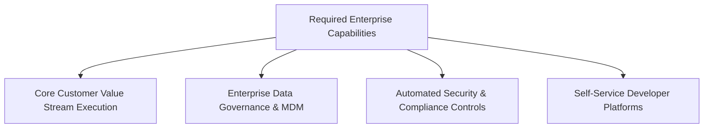
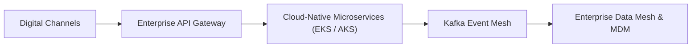

# Enterprise Architecture Scenario: Create an Enterprise Data Strategy

---

## 1. Business Context
You are interviewing for a Chief Architect / Lead Enterprise Architect role at a Fortune 500 company. The executive panel presents the following challenge:
> "Designing an enterprise-wide Data Mesh, Master Data Management (MDM) hub, and real-time Kafka event streaming architecture."

---

## 2. Clarifying Questions to Ask the Interviewer
1. *What are the primary business outcomes driving this initiative?* (e.g., revenue growth, market expansion, 30% cost reduction, regulatory deadline?)
2. *What is the organization's current delivery culture and team topology?* (Centralized IT, agile squads, outsource-heavy?)
3. *What are the strict regulatory or compliance boundaries?* (GDPR, PCI-DSS, Basel III, DORA?)
4. *What is the available capital budget envelope and multi-year time horizon?*

---

## 3. Business Capabilities

---

## 4. Current State Architecture
* Sprawling legacy systems, unmanaged technical debt, point-to-point batch couplings, siloed data stores, and high operational fragility.

---

## 5. Architectural Constraints
* Zero tolerance for downtime on Tier-1 core transactional flows; hard regulatory compliance deadlines; fixed capital budget.

---

## 6. Non-Functional Requirements (NFRs)
* **Availability**: 99.99% for Tier-1 customer-facing workflows.
* **Latency**: p95 < 200ms; p99 < 50ms.
* **Disaster Recovery**: RTO < 15 minutes; RPO = 0.
* **Scalability**: Auto-scale to 5x peak volume.

---

## 7. Architecture Options Evaluated
* **Option A: Big-Bang Greenfield Rewrite**: Discard legacy systems and build from scratch. (*Rejected: catastrophic delivery risk*).
* **Option B: Tactical Band-Aid / Point Solutions**: Patch existing systems. (*Rejected: does not eliminate compounding debt*).
* **Option C: Governed Evolutionary Modernization (Approved)**: Paved roads, strangler-fig migration, and API/event abstraction.

---

## 8. Trade-Off Analysis
* Accepted the temporary operational complexity of dual-running legacy and cloud systems in exchange for zero downtime and risk containment.

---

## 9. Architectural Decision
Adopt **Option C: Governed Evolutionary Modernization**, establishing an API Gateway and Kafka CDC layer to decouple legacy systems while building cloud-native microservices on Kubernetes.

---

## 10. Target State Architecture

---

## 11. Phased Transition Roadmap
* **Horizon 1 (Months 1–6)**: Establish cloud landing zone, IAM federation, and API gateway façade.
* **Horizon 2 (Months 7–18)**: Migrate 80% read traffic via CDC; extract top 3 differentiating domain capabilities.
* **Horizon 3 (Months 19–24)**: Shift write mastership; decommission legacy hardware; celebrate wins.

---

## 12. Governance & Operating Model
* Architecture Review Board (ARB) evaluates major milestones; automated CI/CD fitness functions enforce paved road standards.

---

## 13. Enterprise Risks & Mitigations
* **Risk**: Dual-running data divergence.
* **Mitigation**: Deployed automated hourly data reconciliation jobs with automated alerting.

---

## 14. Key Performance Metrics (Success Verification)
* 40% reduction in annual infrastructure TCO.
* 65% reduction in new feature release cycle time.
* Zero critical compliance findings during annual regulatory audit.
