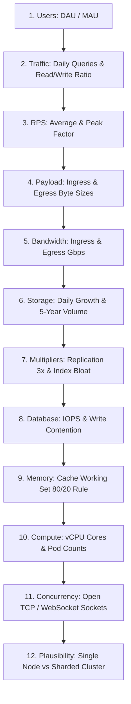
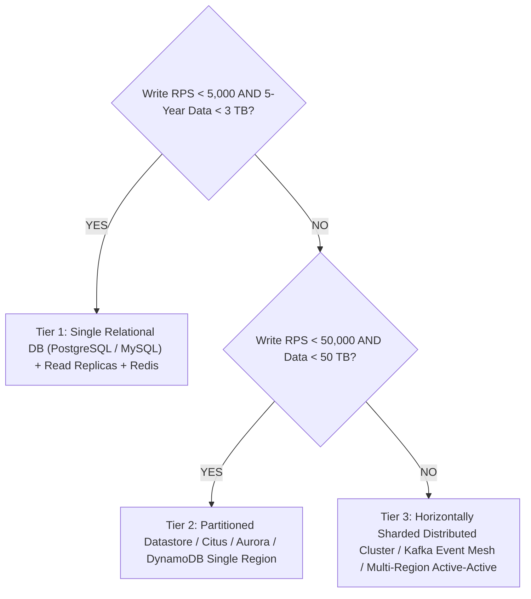

# Capacity Planning: The Unified Back-of-the-Envelope Synthesis

> The complete, step-by-step master checklist for synthesizing all capacity dimensions—Traffic, Storage, Network, Compute, and Database—into a cohesive architecture proof.

---

## 1. The 5-Minute Master Capacity Synthesis Checklist

When solving or presenting any system design problem, execute this standardized 12-step capacity progression:



---

## 2. Universal Capacity Worksheet Template

Use this structured template during practice and live interviews:

```text
========================================================================
SYSTEM CAPACITY PLANNING WORKSHEET
========================================================================
1. USER BASE & ACTIVITY
   - Daily Active Users (DAU)         : [ e.g., 50 Million ]
   - Monthly Active Users (MAU)       : [ e.g., 200 Million ]
   - Actions per User per Day         : [ e.g., 20 reads, 2 writes ]

2. THROUGHPUT & CONCURRENCY
   - Total Requests / Day             : [ e.g., 1.1 Billion ]
   - Average RPS (Divide by 100k)     : [ e.g., 11,000 RPS ]
   - Peak Multiplier (e.g., 3x)       : [ e.g., 33,000 Peak RPS ]
   - Read RPS (90%)                   : [ e.g., 30,000 Read RPS ]
   - Write RPS (10%)                  : [ e.g., 3,000 Write RPS ]
   - Peak Concurrent Open Sockets     : [ e.g., 2.5 Million WebSockets ]

3. NETWORK & BANDWIDTH
   - Average Ingress Payload          : [ e.g., 1 KB ]
   - Average Egress Payload           : [ e.g., 5 KB ]
   - Ingress Throughput               : [ 3,000 * 1 KB = 3 MB/sec = 24 Mbps ]
   - Egress Throughput                : [ 30,000 * 5 KB = 150 MB/sec = 1.2 Gbps ]

4. STORAGE CAPACITY (5 YEARS)
   - Daily Raw Ingestion              : [ 3,000 writes * 86.4k * 1 KB = ~260 GB/day ]
   - 1-Year Raw Data                  : [ 260 GB * 365 = ~95 TB ]
   - Index & Metadata Bloat (+50%)    : [ 95 TB * 1.5 = ~142 TB ]
   - 5-Year Storage                   : [ 142 TB * 5 = ~710 TB ]
   - 3x AZ Replication Total          : [ 710 TB * 3 = ~2.13 Petabytes ]

5. CACHE & WORKING SET (RAM)
   - 20% Daily Active Working Set     : [ 260 GB * 0.20 = 52 GB ]
   - Cache Provisioned with Headroom  : [ 52 GB * 2 = ~100 GB RAM (Redis Cluster) ]

6. DATABASE SIZING & IOPS
   - Write IOPS (WAL + 3 Indexes)     : [ 3,000 * 5 = 15,000 IOPS ]
   - Architecture Implication         : [ Requires Provisioned IOPS SSD or Distributed Sharding ]

7. COMPUTE FLEET SIZING
   - Core Processing Capacity         : [ Assume 400 RPS per vCPU ]
   - Total vCPUs Needed               : [ 33,000 / 400 = 82.5 vCPUs ]
   - Kubernetes Pods (2 vCPU / 4 GB)  : [ ~42 Pods + 50% Headroom = 63 Pods ]
========================================================================
```

---

## 3. The "Plausibility Check" Decision Tree

Once your worksheet is completed, determine your architectural tier immediately:



---

## 4. Cross-References

* **Traffic Conversions**: [`traffic.md`](file:///d:/company/products/enterprise-architecture-handbook/20-interview-system-design/estimation/traffic.md)
* **Storage Formulas**: [`storage.md`](file:///d:/company/products/enterprise-architecture-handbook/20-interview-system-design/estimation/storage.md)
* **Compute Sizing**: [`compute.md`](file:///d:/company/products/enterprise-architecture-handbook/20-interview-system-design/estimation/compute.md)
* **TCO & Financial Modeling**: [`cost.md`](file:///d:/company/products/enterprise-architecture-handbook/20-interview-system-design/estimation/cost.md)
