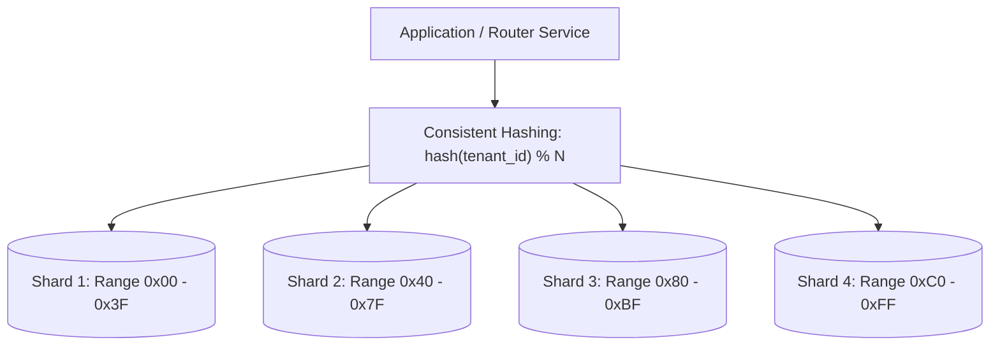

# Database Sizing: IOPS, Connection Pools & Sharding

> How to calculate database Input/Output Operations Per Second (IOPS), connection pool boundaries, RAM buffer pools, and sharding cluster topologies.

---

## 1. The Real Bottlenecks of Database Scaling

In relational (OLTP) and distributed datastores, the system almost never breaks on raw disk volume first. It breaks on one of three constraints:
1. **Disk IOPS Saturation**: Random read/write operations exceeding the SSD or cloud block storage IOPS ceiling.
2. **Connection Starvation**: Too many concurrent application worker threads opening backend database connections.
3. **Buffer Pool Cache Misses**: The active index and working set exceeding available RAM, forcing every query to fetch from physical disk.

---

## 2. Calculating Disk IOPS

### The IOPS Formula for Relational OLTP
$$\text{Write IOPS} = \text{Write RPS} \times (1 + \text{WAL Write} + \text{Secondary Index Count})$$

* *Why?* Every relational write triggers:
  1. An append to the Write-Ahead Log (WAL / Redo Log) for crash durability.
  2. An update to the primary table heap page in buffer pool.
  3. Updates to every secondary B-tree index on that table.

### Concrete Example: High-Throughput E-Commerce Orders
* **Write Throughput**: $3,000\text{ write RPS}$ on the `orders` table.
* **Indexes on Table**: Primary Key (`order_id`), Foreign Key (`user_id`), Status Index (`status`), Date Index (`created_at`). (Total: 4 indexes).
* **Estimated Disk IOPS Generated**:
  $$\text{Raw Write IOPS} = 3,000 \times (1 + 1\text{ [WAL]} + 4\text{ [Indexes]}) = \mathbf{18,000\text{ IOPS}}$$
* **Cloud Storage Comparison**:
  * AWS EBS `gp3` baseline: $3,000\text{ IOPS}$ $\rightarrow$ **WILL CRASH / SATURATE**.
  * Provisioned IOPS `io2` or AWS Aurora: Configured for $20,000+\text{ IOPS}$ $\rightarrow$ **Required**.

---

## 3. Database Connection Pool Sizing

One of the most dangerous beginner mistakes is configuring hundreds of microservice pods to each maintain 100 open database connections to a single PostgreSQL primary.

```
PostgreSQL Connection Architecture:
  - Process-per-connection model.
  - Each active connection consumes ~10 MB of RAM.
  - Context-switching degradation occurs beyond 100–300 active connections on a single node.
```

### The PostgreSQL / HikariCP Pool Sizing Formula
$$\text{Optimal Connections} = (\text{CPU Cores} \times 2) + \text{Effective Spindle / NVMe Count}$$

* For a 16-core database server with an NVMe drive:
  $$\text{Max DB Connections} = (16 \times 2) + 1 = \mathbf{33\text{ Connections!}}$$
* *How do 200 microservice pods connect?*
  * **Never connect directly from pods to the primary database**.
  * Deploy a **Connection Pooler (PgBouncer, AWS RDS Proxy, ProxySQL)** in transaction-pooling mode.
  * 1,000 application pods talk to PgBouncer; PgBouncer multiplexes those requests into a stable pool of 50 connections to the database engine.

---

## 4. Sharding Key Sizing & Cluster Partitioning

When data volume or write IOPS exceeds what a single high-end database instance can sustain ($> 15,000\text{ writes/sec}$ or $> 5\text{ TB}$ of hot OLTP data), horizontal sharding becomes mandatory.



### Sharding Sizing Checklist
1. **Total Shards Needed**:
   $$\text{Shard Count} = \max\left(\frac{\text{Total 5-Year Storage}}{\text{Max Safe Storage per Shard (e.g., 2 TB)}}, \frac{\text{Peak Write IOPS}}{\text{Max IOPS per Shard (e.g., 10,000)}}\right)$$
2. **Virtual Shards**: Always allocate virtual shards (e.g., 1,024 virtual buckets mapped to 8 physical nodes) using **Consistent Hashing** so re-balancing requires moving only $\frac{1}{N}$ of the data during cluster expansion.
3. **Partition Key Selection**: Avoid picking low-cardinality keys (e.g., `country_code`) or monotonically increasing keys (e.g., `created_at` timestamp) that channel all writes to a single hot shard.

---

## 5. Cross-References

* **Storage Calculations**: [`storage.md`](file:///d:/company/products/enterprise-architecture-handbook/20-interview-system-design/estimation/storage.md)
* **Compute Sizing**: [`compute.md`](file:///d:/company/products/enterprise-architecture-handbook/20-interview-system-design/estimation/compute.md)
* **Data Trade-Offs (SQL vs NoSQL)**: [`tradeoffs/data.md`](file:///d:/company/products/enterprise-architecture-handbook/20-interview-system-design/tradeoffs/data.md)
