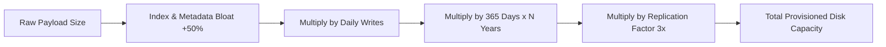

# Storage Estimation: Record Sizes, Replication & Growth

> Practical formulas for calculating disk capacity, database indexing bloat, write amplification, multi-region replication overhead, and multi-year data tiering.

---

## 1. Storage Estimation Formula

$$\text{Total 5-Year Storage} = \text{Daily Writes} \times \text{Row Size} \times (1 + \text{Index Overhead}) \times 365 \times 5 \times \text{Replication Factor}$$



---

## 2. Estimating Entity Record Sizes

Avoid guessing byte sizes blindly. Break down entity fields systematically:

### Example: URL Shortener Entity
```text
Table: urls
--------------------------------------------------------------
Field             Type / Size                   Bytes
--------------------------------------------------------------
short_hash        CHAR(7) (Base62)               7 bytes
long_url          VARCHAR(2048) (Avg 100 bytes)  100 bytes
user_id           UUID / BIGINT                  8–16 bytes
created_at        TIMESTAMP (8 bytes)            8 bytes
expires_at        TIMESTAMP (8 bytes)            8 bytes
is_deleted        BOOLEAN                        1 byte
metadata / tags   JSONB (average)                50 bytes
Row Header / DB internal tuple overhead         24 bytes
--------------------------------------------------------------
Total Raw Record Size                            ≈ 214 bytes
Round up for safety margin:                      ≈ 250 bytes
```

### Example: Payment Transaction Record
```text
Table: payments
--------------------------------------------------------------
Field             Type / Size                   Bytes
--------------------------------------------------------------
payment_id        UUID                          16 bytes
account_id        UUID                          16 bytes
merchant_id       UUID                          16 bytes
amount_cents      BIGINT                        8 bytes
currency          CHAR(3)                       3 bytes
status            VARCHAR(20)                   20 bytes
payment_method_id UUID                          16 bytes
idempotency_key   VARCHAR(64)                   64 bytes
created_at        TIMESTAMP                     8 bytes
updated_at        TIMESTAMP                     8 bytes
audit_payload     JSONB (Avg 200 bytes)         200 bytes
Database tuple overhead                         32 bytes
--------------------------------------------------------------
Total Raw Record Size                            ≈ 407 bytes
Round up for safety margin:                      ≈ 500 bytes
```

---

## 3. The 3 Hidden Storage Multipliers

### 1. Database Index Overhead ($+30\%\text{ to }+100\%$)
* Every B-Tree or Secondary Index on a table duplicates key data and stores page pointers.
* For a table with 3 secondary indexes (e.g., `user_id`, `created_at`, `status`), expect index size to add **$50\%\text{ to }100\%$ on top of the raw data**.
* *Rule of Thumb*: Multiply raw data by **$1.5\times$** for OLTP tables.

### 2. Replication Factor ($3\times$)
* Production distributed databases (Kafka, Cassandra, PostgreSQL Multi-AZ, AWS Aurora) replicate data across at least 3 Availability Zones for durability.
* *Rule of Thumb*: Multiply storage by **$3\times$**.

### 3. Write Amplification & Compaction Overhead (LSM Trees)
* Datastores using Log-Structured Merge (LSM) trees (RocksDB, Cassandra, ScyllaDB) require up to **$50\%\text{ free disk space}$** to perform background SSTable compaction.
* *Rule of Thumb*: Never run a distributed database disk past $70\%$ capacity.

---

## 4. End-to-End 5-Year Storage Calculation Example

* **Given Scenario**: Photo sharing platform storing photo metadata.
  * $50\text{ Million new photo uploads/day}$.
  * Average photo metadata record: $1\text{ KB}$ (includes tags, dimensions, EXIF).
  * Binary photo image itself: $2\text{ MB}$ (stored in Object Storage / S3).

### A. Metadata Database Storage (OLTP):
1. **Daily Raw Writes**: $50,000,000 \times 1\text{ KB} = 50\text{ GB/day}$.
2. **With Index Overhead ($1.5\times$)**: $50\text{ GB} \times 1.5 = 75\text{ GB/day}$.
3. **5-Year Growth**: $75\text{ GB/day} \times 365 \times 5 \approx 75 \times 1,825 \approx \mathbf{137\text{ TB}}$.
4. **With 3x AZ Replication**: $137\text{ TB} \times 3 \approx \mathbf{411\text{ TB}}$.

### B. Binary Object Storage (AWS S3 / GCS):
1. **Daily Raw Media**: $50,000,000 \times 2\text{ MB} = 100,000,000\text{ MB} = \mathbf{100\text{ TB/day}}$.
2. **5-Year Growth**:
   $$100\text{ TB/day} \times 365 \times 5 \approx 100\text{ TB} \times 1,825 \approx \mathbf{182.5\text{ Petabytes (PB)}}$$

### Architectural Takeaway
* Never store the binary photos in the transactional database.
* Store binaries in an object store (S3/GCS) with a CDN in front.
* Implement a **Data Lifecycle Tiering Policy**:
  * Hot Tier (S3 Standard): Days 1–30.
  * Warm Tier (S3 Infrequent Access): Days 31–180 (reduces storage cost by 50%).
  * Cold Tier (S3 Glacier Deep Archive): Day 181+ (reduces storage cost by 90%).

---

## 5. Cross-References

* **Bandwidth Sizing**: [`bandwidth.md`](file:///d:/company/products/enterprise-architecture-handbook/20-interview-system-design/estimation/bandwidth.md)
* **Database IOPS & Sharding**: [`database.md`](file:///d:/company/products/enterprise-architecture-handbook/20-interview-system-design/estimation/database.md)
* **Cloud Storage Financial Modeling**: [`cost.md`](file:///d:/company/products/enterprise-architecture-handbook/20-interview-system-design/estimation/cost.md)
