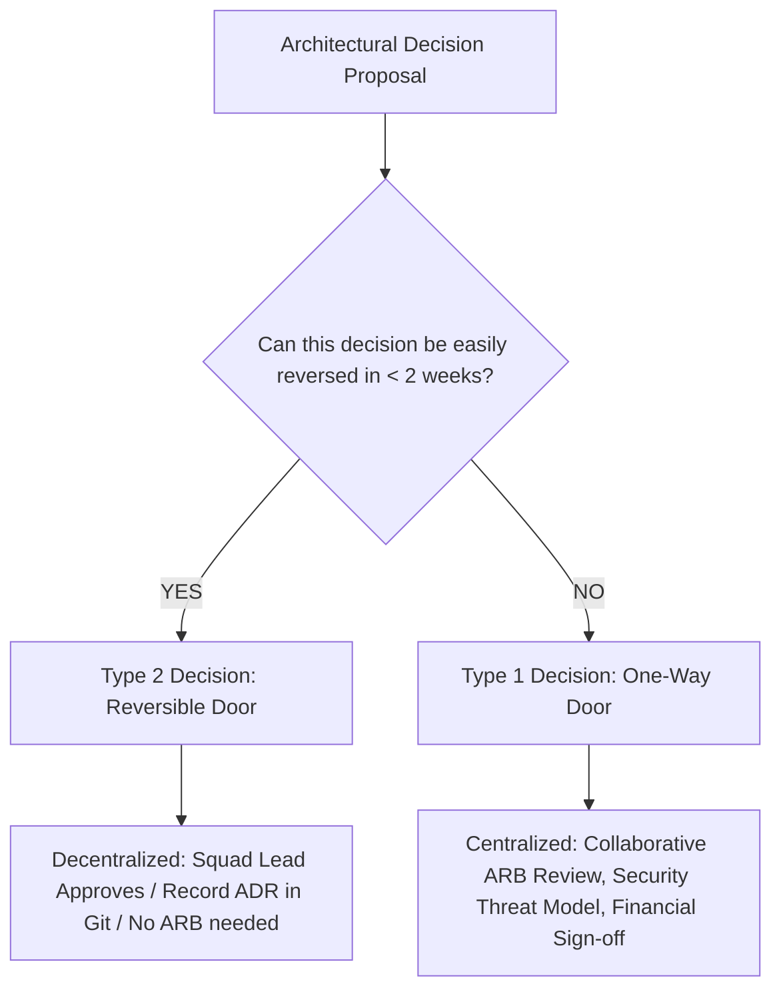

# Architecture Governance: From Bureaucracy to Automated Fitness Functions

> Re-imagining the Architecture Review Board (ARB), modernizing architectural governance, managing technical debt, and automating compliance through architectural fitness functions.

---

## 1. The Death of the "Ivory Tower" ARB

Traditional Architecture Review Boards (ARBs) earned a reputation as bureaucratic bottlenecks where designs were delayed by weeks while architects in ivory towers debated theoretical purism.

```
Traditional Bureaucratic ARB:
  [Design Proposal] ──► [Wait 3 Weeks for Meeting] ──► [Architects Reject Design with 40-page checklist] ──► [Developers Angry / Delay Project]

Modern Enabling Governance:
  [Developer Self-Service Paved Road] ──► [Continuous Automated Fitness Functions in CI/CD] ──► [Architectural Pairing for Complex Domains]
  * ARB only reviews Tier-1 irreversible ("Type 1") decisions, acting as an advisory accelerator rather than a gatekeeper.
```

---

## 2. Type 1 vs. Type 2 Decisions (Jeff Bezos Model)

Senior architects categorize all governance decisions into two categories:



* **Type 2 Examples (Decentralized Squad Ownership)**:
  * Choosing a Redis client library.
  * Adding a new index to a table.
  * Choosing between REST and GraphQL for an internal BFF endpoint.
* **Type 1 Examples (Mandatory ARB Review)**:
  * Adopting a new cloud provider or primary database paradigm (e.g., migrating from PostgreSQL to Cassandra).
  * Breaking a fundamental enterprise data ownership boundary.
  * Introducing a multi-million-dollar third-party SaaS vendor contract.

---

## 3. Automated Architectural Fitness Functions

Instead of relying on human vigilance to enforce standards, modern architects write **code that verifies architectural rules continuously in the CI/CD pipeline**:

```
What Automated Fitness Functions Enforce:
  ├── Layering & Coupling: ArchUnit / ArchJava tests verify that Controllers never bypass Services to talk to Repositories.
  ├── Cyclic Dependencies: Build fails automatically if Service A imports Service B which imports Service A.
  ├── Security & Secret Leakage: Git hooks and CI block any commit containing AWS keys or plaintext passwords (TruffleHog).
  ├── Performance Budgets: Lighthouse and k6 load tests fail the build if bundle size > 250 KB or p95 API latency > 150ms.
  └── API Contract Compatibility: Spectral / OpenAPI linting blocks breaking changes to public schemas without a version bump.
```

---

## 4. Exception Management & Tech Debt Lifecycle

Architectural rules must have a governed **exception process**:
1. **Time-Bound Waivers**: An exception is never granted permanently. Every exception has an expiration date (e.g., 90 days).
2. **Explicit Risk Sign-off**: The business sponsor must formally accept the risk of the exception in writing.
3. **Automated Deprecation Tracking**: Deprecated APIs and patterns are automatically flagged with warning headers and telemetry tracking.

---

## 5. Cross-References

* **Technical Leadership**: [`technical-leadership.md`](file:///d:/company/products/enterprise-architecture-handbook/20-interview-system-design/leadership/technical-leadership.md)
* **Team Topologies**: [`team-topology.md`](file:///d:/company/products/enterprise-architecture-handbook/20-interview-system-design/leadership/team-topology.md)
* **Enterprise Architecture Governance**: [`23-enterprise-architecture/establish-architecture-governance.md`](file:///d:/company/products/enterprise-architecture-handbook/23-enterprise-architecture/establish-architecture-governance.md)
