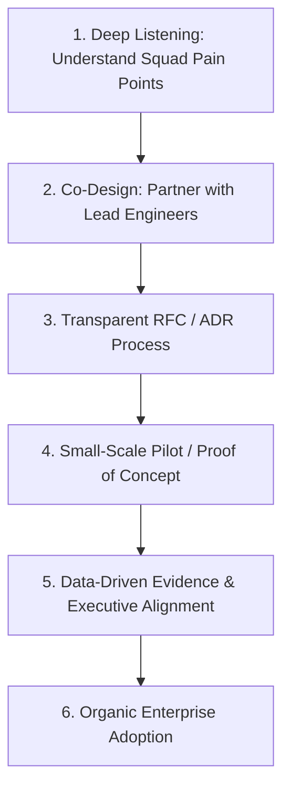

# Influencing Without Authority: The Architect's Persuasion Playbook

> How to build organizational consensus, author decision-forcing RFCs/ADRs, and present compelling architectural narratives to both engineers and executives.

---

## 1. Why Authority-Based Architecture Fails

When an architect says: *"You must do this because I am the Chief Architect,"* they have already lost. 
Engineers comply maliciously—implementing the letter of the mandate while letting it fail in edge cases.

True architectural influence is built upon **trust, empathy, technical credibility, and collaborative co-creation**:



---

## 2. The 5-Step Consensus Building Workflow

### Step 1: Pre-Wire the Decision (The "Nemawashi" Principle)
* **Never present an architectural change for the first time in a formal public meeting.**
* Before sending an RFC to 100 engineers, meet 1-on-1 with the top 3 influential Tech Leads and the Product Manager:
  * *"Here is the problem I'm seeing with our database connection pool. I have a rough concept, but I wanted your feedback on how it would impact your squad's current sprint before I write it up."*
* Incorporate their feedback. When the public review occurs, those key leads are already co-owners of the idea and will publicly advocate for it.

### Step 2: Structure the Decision via RFC / ADR
Every major architectural change must be captured in a lightweight, markdown-formatted **Architecture Decision Record (ADR)**:

```markdown
# ADR-042: Migration from REST to gRPC for Internal Microservice Communication

## Status: Proposed / Accepted / Rejected / Superseded
* **Date**: 2026-09-06
* **Deciders**: Platform Architecture, Core Squad Leads

## Context & Problem Statement
Our internal microservice mesh is generating 45,000 requests/second. JSON serialization and deserialization consumes 32% of total vCPU capacity across our EKS cluster, and untyped REST contracts have caused 3 production incidents this quarter due to breaking field changes.

## Decision Drivers
* Reduce CPU overhead and AWS compute spend by at least 20%.
* Enforce strict, compile-time type safety across polyglot services (Go, Java, Node.js).
* Support bidirectional streaming for real-time telemetry.

## Considered Options
* Option A: Optimize REST with gzip/Brotli compression. (Rejected: CPU overhead actually increases).
* Option B: Adopt GraphQL federation. (Rejected: Solves client-to-backend queries, but too heavy for internal service-to-service mesh).
* Option C: Adopt gRPC with Protocol Buffers. (Approved).

## Consequences & Trade-Offs
* **Positive**: 70% reduction in network payload size; 25% reduction in compute spend; strict `.proto` contracts prevent breaking API changes.
* **Negative / Cost**: Developers must learn Protocol Buffer tooling; debugging requires specialized tools (BloomRPC/grpcurl) rather than curl.
* **Mitigation**: Platform team will provide a shared internal CLI and pre-configured Envoy gRPC-Web ingress proxies.
```

---

## 3. Executive Storytelling: Speaking the Language of Value

When presenting architecture to executives (CTO, VP of Product, CFO), translate technical terms into business outcomes:

| What Engineers Hear | What Executives Care About | How to Reframe for Leadership |
| :--- | :--- | :--- |
| *"We need to refactor to microservices."* | Risk of missed quarterly revenue; project delays. | *"We are restructuring domain boundaries to allow 4 new product squads to ship independently without blocking each other's release cycles."* |
| *"We need to migrate to Kafka."* | Software licensing costs; operational downtime. | *"By adopting an event-driven architecture, customer checkout will succeed even if payment processing goes offline, protecting $1.2M in daily revenue."* |
| *"Our technical debt is too high."* | "Engineers just want to play with new tech." | *"Technical debt in the billing module is currently responsible for 40% of all customer support tickets and delays feature rollouts by 6 weeks."* |

---

## 4. Cross-References

* **Stakeholder Tensions**: [`stakeholder-management.md`](file:///d:/company/products/enterprise-architecture-handbook/20-interview-system-design/leadership/stakeholder-management.md)
* **Conflict De-escalation**: [`conflict-management.md`](file:///d:/company/products/enterprise-architecture-handbook/20-interview-system-design/leadership/conflict-management.md)
* **Architecture Deliverables & RFCs**: [`16-architecture-deliverables/`](file:///d:/company/products/enterprise-architecture-handbook/16-architecture-deliverables/)
