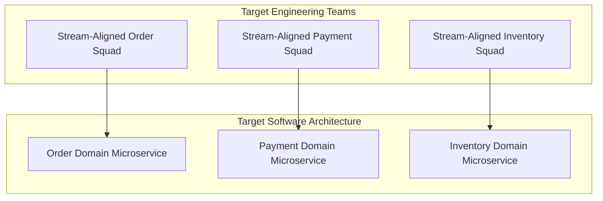

# Team Topologies & Conway's Law: Designing Organizations for Architecture

> How to apply Conway's Law, the Inverse Conway Maneuver, and Team Topologies to align software bounded contexts with engineering team communication structures.

---

## 1. Conway's Law & The Inverse Conway Maneuver

> *"Organizations which design systems are constrained to produce designs which are copies of the communication structures of these organizations."* — Melvin Conway

If an enterprise has four separate database administrator squads, three UI squads, and two backend squads, the resulting software system will inevitably consist of a shared database bottleneck, separate frontend silos, and fragile mid-tier integrations.

### The Inverse Conway Maneuver
Instead of allowing your legacy organizational org chart to dictate your system design, **design the target software architecture first (decoupled bounded contexts), then restructure the engineering teams to match that architecture**.



---

## 2. The 4 Fundamental Team Topologies

Based on Matthew Skelton & Manuel Pais' *Team Topologies*:

```
1. Stream-Aligned Teams (Core Delivery Squads)
   - Cross-functional squad (Product, Frontend, Backend, QA) aligned to a single continuous business value stream.
   - Example: The "Checkout Experience" Squad.

2. Platform Teams (Paved-Road Enablers)
   - Provides internal self-service developer platforms that reduce cognitive load for stream-aligned teams.
   - Example: The "Cloud Infrastructure & Kubernetes Platform" Team.

3. Enabling Teams (Architecture & Specialized Consultancies)
   - Domain experts who embed temporarily with stream-aligned squads to upskill them on new paradigms.
   - Example: The "Distributed Tracing & Event-Driven Architecture" Enabling Team.

4. Complicated-Subsystem Teams (Deep Domain Specialists)
   - Sits around a mathematically or algorithmically complex component where deep specialist knowledge is required.
   - Example: The "Cryptographic Engine & Fraud ML Model" Team.
```

---

## 3. Managing Cognitive Load

When an engineering squad's cognitive load is exceeded, code quality degrades, technical debt compounds, and delivery grinds to a halt.

```
Total Cognitive Load = Intrinsic Load (Language/Syntax) + Germane Load (Business Domain Logic) + Extraneous Load (Infrastructure Boilerplate)
```

* **The Architect's Job**: **Eliminate Extraneous Load** via Platform Teams so that stream-aligned squads can focus 90% of their mental energy on **Germane Load (the business domain)**.

---

## 4. Cross-References

* **Architecture Topologies**: [`tradeoffs/architecture.md`](file:///d:/company/products/enterprise-architecture-handbook/20-interview-system-design/tradeoffs/architecture.md)
* **Governance Models**: [`architecture-governance.md`](file:///d:/company/products/enterprise-architecture-handbook/20-interview-system-design/leadership/architecture-governance.md)
* **Enterprise Architecture Strategy**: [`23-enterprise-architecture/`](file:///d:/company/products/enterprise-architecture-handbook/23-enterprise-architecture/)
