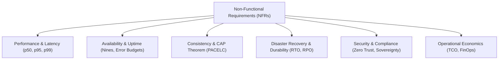

# Non-Functional Requirements (NFR) Discovery & Specification

> The architect's blueprint for quantifying operational qualities: Latency, Throughput, Availability, Consistency, Durability, Disaster Recovery, and Compliance.

---

## 1. Transforming Buzzwords into Engineering Targets

Junior candidates say: *"The system must be fast, scalable, and highly available."*
Senior architects say: *"For the core checkout path, we target a p95 latency under 150ms and 99.99% availability, accepting eventual consistency on reporting with an RTO under 15 minutes."*

Every NFR must be quantified with concrete metrics and explicit operational boundaries.

---

## 2. The 7 Critical NFR Dimensions

### 1. Performance & Latency (The Percentile Rule)
* Never quote an "average" latency (averages hide catastrophic tail latency outliers).
* Always specify **Percentile Latency Targets**:
  * **p50 (Median)**: General user experience baseline (e.g., $< 50\text{ms}$).
  * **p95**: What 95% of requests experience (e.g., $< 120\text{ms}$).
  * **p99 / p99.9**: Worst-case tail latency for concurrent, resource-intensive operations (e.g., $< 350\text{ms}$).
* **Throughput**: Peak requests per second (RPS) or gigabits per second (Gbps) the system must sustain without queue saturation.

### 2. Availability & Uptime (The "Nines" Table)

| Target Availability | Downtime per Year | Downtime per Month | Downtime per Day | Architectural Meaning |
| :--- | :--- | :--- | :--- | :--- |
| **99% (Two Nines)** | 3.65 days | 7.3 hours | 14.4 minutes | Single instance or basic VM with manual failover. |
| **99.9% (Three Nines)** | 8.76 hours | 43.8 minutes | 1.44 minutes | Multi-AZ redundant deployment with automated health check failover. |
| **99.99% (Four Nines)** | 52.6 minutes | 4.38 minutes | 8.64 seconds | Multi-AZ active-active, automated zero-downtime canary deployments. |
| **99.999% (Five Nines)** | 5.26 minutes | 26.3 seconds | 0.86 seconds | Multi-region active-active, carrier-grade, cell-based architecture, zero single points of failure. |

> [!WARNING]
> **Don't over-promise Five Nines**: If an interviewer asks for 99.999% availability, immediately discuss the trade-offs: massive infrastructure duplication, cross-region replication complexity, distributed consensus latency, and an exponential increase in cloud cost.

### 3. Consistency Model (CAP & PACELC)
* **PACELC Formulation**: If there is a **Partition (P)**, trade off **Availability (A)** vs. **Consistency (C)**; **Else (E)**, trade off **Latency (L)** vs. **Consistency (C)**.
* **Strong Consistency (Linearizability)**: Required for financial ledgers, inventory decrementing, and booking seats. (Implementation: Two-Phase Commit, Raft/Paxos, Google Cloud Spanner, synchronous database primary).
* **Eventual Consistency**: Acceptable for social feeds, view counts, comment sections, and analytics. (Implementation: Asynchronous read replicas, Cassandra, DynamoDB eventual reads, Redis caches).
* **Read-After-Write Consistency (Monotonic Reads)**: User sees their own writes immediately, even if other users see eventual updates.

### 4. Durability & Disaster Recovery (RTO & RPO)
* **RTO (Recovery Time Objective)**: The maximum acceptable time the system can remain down after a disaster before service is restored.
  * *Example*: RTO $< 15\text{ minutes}$ via automated DNS failover to a standby region.
* **RPO (Recovery Point Objective)**: The maximum acceptable period of data loss measured in time.
  * *Example*: RPO $= 0$ (zero data loss) via synchronous replication, or RPO $< 5\text{ minutes}$ via continuous WAL streaming.
* **Data Durability**: Storage reliability (e.g., AWS S3 promises $99.999999999\%$ / 11 9s of durability across multiple facilities).

### 5. Scalability & Elasticity
* **Horizontal vs. Vertical**: Stateless tier auto-scales horizontally based on CPU/RAM or ingress queue depth.
* **Elasticity Rate**: How fast can the system absorb a 10x traffic spike? (e.g., Container cold-start $< 5\text{s}$, database read replicas spinning up in $< 3\text{ minutes}$).
* **Hot Spot Partitioning**: Resilience against partition skew (e.g., celebrity accounts or viral SKUs).

### 6. Security, Privacy & Compliance
* **Data at Rest & in Transit**: TLS 1.3 for all ingress and internal service-to-service traffic; AES-256 with envelope encryption (KMS) for data stores.
* **Identity & Access**: OAuth2 / OIDC for user authentication; mTLS and SPIFFE/SPIRE for inter-service zero trust.
* **Regulatory Sovereign Boundaries**:
  * **GDPR**: Right to be forgotten (cryptographic erasure or localized hard deletes).
  * **PCI-DSS**: Never store raw CVV codes; tokenize credit card PANs in a certified isolated vault.
  * **HIPAA**: Immutable audit logs of all access to Protected Health Information (PHI).

### 7. Operability & Maintainability
* Zero-downtime deployment requirements (Blue-Green, Canary).
* Mean Time to Detect (MTTD) $< 2\text{ minutes}$; Mean Time to Recover (MTTR) $< 10\text{ minutes}$.
* Automated rollback triggered when 5xx error rate exceeds $0.5\%$.

---

## 3. NFR Discovery Matrix by Scenario Type

| Scenario | Primary NFR Driver | Secondary NFR Driver | Trade-off Accepted |
| :--- | :--- | :--- | :--- |
| **Financial Payment Gateway** | Strong Consistency (Zero discrepancy) & Durability | High Availability (99.99%) | Higher write latency (p99 ~ 250ms) to ensure distributed consensus. |
| **Global Social Media Feed** | Ultra-Low Latency (p95 < 50ms) & High Availability | Eventual Consistency | Stale feed posts for up to 30 seconds across regions. |
| **Multi-Player Gaming Backend** | Ultra-Low Latency (< 20ms UDP) | Durability | Loss of transient player coordinates between state sync ticks. |
| **Healthcare Records (EHR)** | Security, Data Privacy & Strict Auditability | Cost Optimization | Higher infrastructure spend on hardware security modules and multi-region backups. |

---

## 4. Cross-References

* **Scale Estimation**: [`estimation/README.md`](file:///d:/company/products/enterprise-architecture-handbook/20-interview-system-design/estimation/README.md)
* **High-Level Pacing**: [`system-design-framework.md`](file:///d:/company/products/enterprise-architecture-handbook/20-interview-system-design/system-design-framework.md)
* **Trade-Off Reasoning**: [`tradeoffs/README.md`](file:///d:/company/products/enterprise-architecture-handbook/20-interview-system-design/tradeoffs/README.md)
