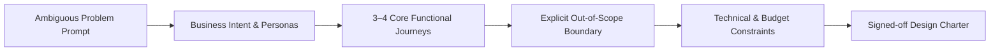

# Requirements Discovery Framework: Scoping & Boundary Definition

> The definitive senior architect guide for extracting business intent, defining functional requirements, and establishing bulletproof scope boundaries under ambiguity.

---

## 1. The 5-Minute Discovery Process

In the first five minutes of any architecture discussion or interview, your primary objective is to transform a vague problem statement into a concrete, bounded specification.

---

## 2. The 6 Dimensions of Requirements Discovery

### 1. Business Context & Personas
* **Who are the users?** (End consumers on mobile, B2B enterprise admins, automated IoT sensors, internal operations staff).
* **What is the primary business outcome?** (Driving conversion, reducing operational churn, regulatory compliance, platform unbundling).
* **What is the core user journey?** (Step through the sequence of events that delivers value).
* **What is the business model?** (Freemium, subscription, usage-based billing, enterprise multi-year license).

### 2. Functional Requirements (The Core 3–4)
Do not attempt to design 20 features in 45 minutes. Ruthlessly prioritize the **top 3 to 4 core capabilities** that define the system:
* *Example (Distributed Video Platform)*:
  1. User can upload a video file.
  2. System transcodes video into multiple resolutions (1080p, 720p, 480p).
  3. User can stream video adaptively based on network bandwidth.
  4. System records video view counts.

### 3. Explicit Out-of-Scope Boundaries (The Senior Signal)
Defining what you will **not** build is just as important as defining what you will build. State this proactively to the interviewer:
* *"To ensure we dive deep into the distributed transcoding pipeline and streaming delivery, I propose we treat the following as out of scope for today: user recommendations, comments/likes, and DRM copyright fingerprinting. Does that align with your expectations?"*
* **Why this works**: It shows leadership, guards against scope creep, and gives the interviewer an opportunity to redirect if they specifically care about one of those topics.

### 4. Enterprise Integrations & Existing Systems
* Is this a greenfield system or an extension of an existing enterprise estate?
* What external third-party systems must we integrate with? (e.g., Stripe for payments, Twilio for SMS, SAP ERP for ledger, Okta for identity).
* What are the integration contracts? (Webhook, synchronous REST, batch SFTP, Kafka topic).

### 5. Multi-Tenancy & Data Isolation
* Is the system single-tenant (separate deployment per customer) or multi-tenant (shared infrastructure)?
* If multi-tenant, what is the required data isolation level? (Logical row-level security with `tenant_id` vs. separate schemas vs. separate physical databases)?

### 6. Time & Budget Constraints
* What is the time-to-market horizon? (6-week proof-of-concept vs. 18-month enterprise rollout).
* Are there strict operational cost limits? (e.g., cloud spend must not exceed $0.005 per active user per month).

---

## 3. Discovery Cheat Sheet by System Domain

| Architecture Domain | Top Clarifying Questions to Ask | High-Risk Assumption to Avoid |
| :--- | :--- | :--- |
| **Messaging / Chat** | Group vs 1-on-1? Online presence required? Message delivery guarantee (at-least-once vs exactly-once)? | Assuming all messages are sent to active online users via persistent WebSockets without offline push fallback. |
| **E-Commerce / Retail** | Flash sale spikes? Inventory overbooking allowed? Cart expiration rules? Payment capture sync or async? | Using optimistic concurrency on inventory without handling hot-key contention on viral products. |
| **Financial / Payment** | Ledgers require double-entry bookkeeping? Currency conversion rules? Compliance (PCI-DSS Level 1, SOX)? | Relying on eventual consistency for financial balances. |
| **Data Platform / Analytics** | Batch vs real-time streaming? Acceptable data latency (5 seconds vs 24 hours)? Query patterns (fixed dashboards vs ad-hoc SQL)? | Building a multi-node Spark streaming cluster when daily batch exports satisfy the business. |
| **AI / GenAI Platform** | Latency tolerance for LLM generation? Data privacy / tenant leakage constraints? Model ownership (hosted vs self-hosted)? | Assuming an LLM API never times out or hallucinates sensitive corporate data. |

---

## 4. Cross-References

* **Non-Functional Discovery**: [`nfr-discovery.md`](file:///d:/company/products/enterprise-architecture-handbook/20-interview-system-design/nfr-discovery.md)
* **Pacing & Whiteboarding**: [`system-design-framework.md`](file:///d:/company/products/enterprise-architecture-handbook/20-interview-system-design/system-design-framework.md)
* **Estimation Grounding**: [`estimation/README.md`](file:///d:/company/products/enterprise-architecture-handbook/20-interview-system-design/estimation/README.md)
