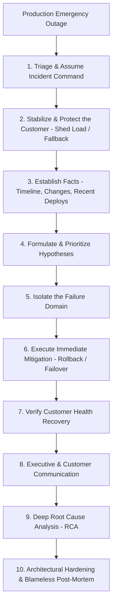

# Architecture Judgment Simulator & Emergency Response

> A structured crisis simulation system for diagnosing, stabilizing, remediating, and post-morteming catastrophic production outages, architectural degradations, and enterprise transformations.

---

## 1. What Scenario-Based Interviews Evaluate

In traditional system design, candidates can prepare clean, idealized architectures. 
In **Scenario-Based Interviews (Architecture Judgment Simulations)**, the interviewer drops the candidate into a **live production disaster or failing architecture**:

```
"It is 2:00 PM on Cyber Monday. API Gateway error rates just spiked to 45%, 
database CPU hit 100%, and customer orders are hanging. You are the Incident Commander. 
What do you do in the first 5 minutes?"
```

Interviewers evaluate:
1. **Composure & Crisis Leadership**: Do you panic or start randomly restarting databases, or do you follow a methodical stabilization protocol?
2. **Customer Protection First**: Do you prioritize finding the root cause while users suffer, or do you apply immediate mitigating triage to restore service?
3. **Hypothesis-Driven Diagnosis**: Do you systematically isolate failure domains using telemetry?
4. **Architectural Root Cause Remediation**: Do you fix the underlying architectural flaw so the incident can never recur?

---

## 2. The 10-Step Emergency Response Protocol



### The Protocol Breakdown
1. **Assume Command**: Establish clear roles (Incident Commander, Tech Lead, Communications Lead). Silence the noise.
2. **Protect the Customer (Triage over Investigation)**: If the system is melting, shed non-critical load immediately (disable recommendations, throttle batch jobs, open circuit breakers). **Never debug in production while customers are failing.**
3. **Check Recent Changes First**: 80% of outages are caused by a recent deployment, configuration change, or database migration. Roll back first, investigate later.
4. **Isolate Failure Domains**: Use distributed traces and RED metrics to identify the slowest or failing downstream dependency.
5. **Execute Mitigation**: Divert traffic via DNS/ALB to a standby region, scale horizontal pods, or terminate rogue long-running queries.
6. **Verify Recovery**: Confirm that p95 latency and 5xx error rates return to baseline.
7. **Post-Mortem & Prevent Recurrence**: Author a blameless post-mortem that results in permanent architectural guardrails (fitness functions, circuit breakers, rate limits).

---

## 3. Submodule Directory

* **[`production.md`](file:///d:/company/products/enterprise-architecture-handbook/20-interview-system-design/scenario-based/production.md)**: Handling cascading outages, split-brain conditions, connection pool starvation, thundering herds, and poison pills.
* **[`architecture.md`](file:///d:/company/products/enterprise-architecture-handbook/20-interview-system-design/scenario-based/architecture.md)**: Solving architectural bottlenecks: monolith degradation, microservice spaghetti, distributed saga deadlocks, and cloud billing explosions.
* **[`modernization.md`](file:///d:/company/products/enterprise-architecture-handbook/20-interview-system-design/scenario-based/modernization.md)**: Strangler fig migration crises, dual-write data drift, and CDC replication lag.
* **[`organizational.md`](file:///d:/company/products/enterprise-architecture-handbook/20-interview-system-design/scenario-based/organizational.md)**: Post-M&A platform consolidation deadlocks, team boundary ambiguity, and regulatory compliance emergencies.
* **[`incident-response.md`](file:///d:/company/products/enterprise-architecture-handbook/20-interview-system-design/scenario-based/incident-response.md)**: The architectural Incident Commander playbook, communication templates, and blameless post-mortem engineering.
* **[`exercises/README.md`](file:///d:/company/products/enterprise-architecture-handbook/20-interview-system-design/scenario-based/exercises/README.md)**: 10 hands-on crisis simulation exercises with step-by-step diagnostic workflows and executive debriefs.

---

## 4. Cross-References

* **Reliability Trade-Offs**: [`tradeoffs/reliability.md`](file:///d:/company/products/enterprise-architecture-handbook/20-interview-system-design/tradeoffs/reliability.md)
* **Performance & Caching Failures**: [`tradeoffs/performance.md`](file:///d:/company/products/enterprise-architecture-handbook/20-interview-system-design/tradeoffs/performance.md)
* **Observability SRE Standards**: [`11-observability/`](file:///d:/company/products/enterprise-architecture-handbook/11-observability/)
