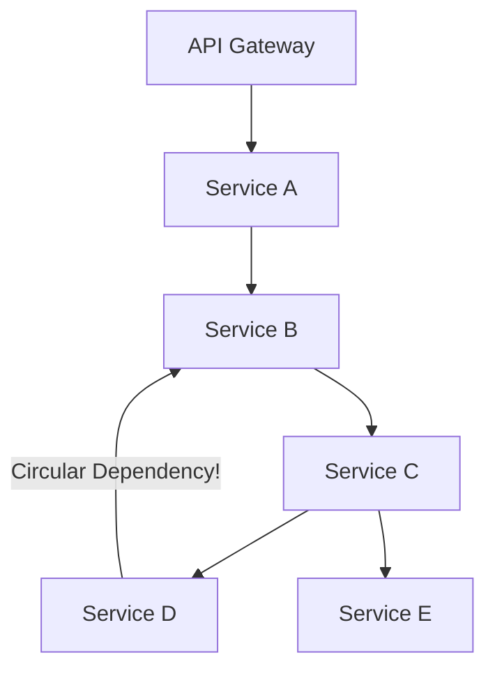

# Architectural Problem Scenarios: Bottlenecks, Sprawl & Debt

> Diagnosing and untangling distributed architecture crises: monolithic bottlenecks, microservice spaghetti, distributed saga deadlocks, data divergence, and runaway cloud costs.

---

## 1. Scenario: The "Microservice Death Star" (Distributed Spaghetti)

### The Crisis
The company decomposed its monolith into 80 microservices over 2 years. Now, a single customer click triggers a cascading chain of 24 synchronous HTTP calls across 15 services. p99 latency has climbed from $80\text{ms}$ to $2,400\text{ms}$, and circular network dependencies regularly deadlock the cluster.

### Architectural Remediation Plan
1. **Coarsen Domain Boundaries (Consolidation)**: Merge fine-grained "nano-services" back into cohesive domain services. If two services share the same database or must always deploy together, they belong in the same bounded context.
2. **Shift Synchronous RPC to Asynchronous Events**:
   * Replace deep synchronous call chains with **Event-Carried State Transfer**. Service C should not synchronously query Service D for customer profile data; Service C should listen to `CustomerUpdatedEvents` on Kafka and maintain a lightweight local read cache.
3. **Deploy Backend-for-Frontend (BFF) / GraphQL Orchestration**: Move fan-out composition to an edge aggregator to parallelize network I/O.

---

## 2. Scenario: Distributed Saga Failure & Inconsistent Balances

### The Crisis
In an e-commerce platform using an asynchronous choreography saga, a customer places an order. The Payment Service successfully charges $250. Next, the Inventory Service attempts to reserve the stock, but discovers the item is sold out. The Inventory Service emits an `InventoryReservationFailed` event, but the Payment Service consumer crashes and never issues the refund. **The customer was charged $250 with no order created.**

### Root Cause Analysis
* Choreographed sagas lack centralized state tracking. When compensating events are lost or consumer offsets fail, distributed transactions get stuck in half-finished states.

### Architectural Remediation
1. **Transition from Choreography to Orchestration**:
   * Implement a state machine orchestrator (e.g., Temporal, AWS Step Functions, or Camunda).
   * The orchestrator durably persists saga state transitions (`ORDER_SUBMITTED`, `PAYMENT_CHARGED`, `INVENTORY_FAILED`, `REFUND_PENDING`, `REFUND_COMPLETED`).
2. **Guaranteed Compensating Transactions**: If any step fails, the orchestrator retries the compensating refund until it receives an idempotent acknowledgment from the payment gateway.

---

## 3. Scenario: Cloud Billing Explosion ($120,000 Surprise Bill)

### The Crisis
A startup's monthly AWS bill jumps from $15,000 to $135,000 in 30 days. The VP of Finance initiates an emergency architectural audit.

### Diagnostic Investigation & Fixes
* **Discovery 1: Unindexed CloudWatch / Datadog Logs**: Microservices in debug mode emit 500 GB of logs daily. SaaS indexing fees alone accounted for $45,000/mo.
  * *Fix*: Drop debug logging in production; implement 1% trace sampling for HTTP 200 responses.
* **Discovery 2: Cross-AZ Network Egress**: Microservices in `us-east-1a` were streaming gigabytes of video to Kafka brokers in `us-east-1b`, incurring $30,000/mo in cross-AZ network fees.
  * *Fix*: Configure **Topology-Aware Routing** in Kubernetes to ensure pods communicate with service replicas in the exact same Availability Zone whenever possible.
* **Discovery 3: Unused EBS Volumes & Idle GPU Nodes**: Leftover test clusters from an aborted ML experiment remained running 24/7.
  * *Fix*: Implement automated lifecycle policies that terminate untagged resources after 72 hours.

---

## 4. Cross-References

* **Saga Trade-Offs**: [`tradeoffs/integration.md`](file:///d:/company/products/enterprise-architecture-handbook/20-interview-system-design/tradeoffs/integration.md)
* **FinOps Cost Modeling**: [`estimation/cost.md`](file:///d:/company/products/enterprise-architecture-handbook/20-interview-system-design/estimation/cost.md)
* **Production Emergency Handling**: [`production.md`](file:///d:/company/products/enterprise-architecture-handbook/20-interview-system-design/scenario-based/production.md)
