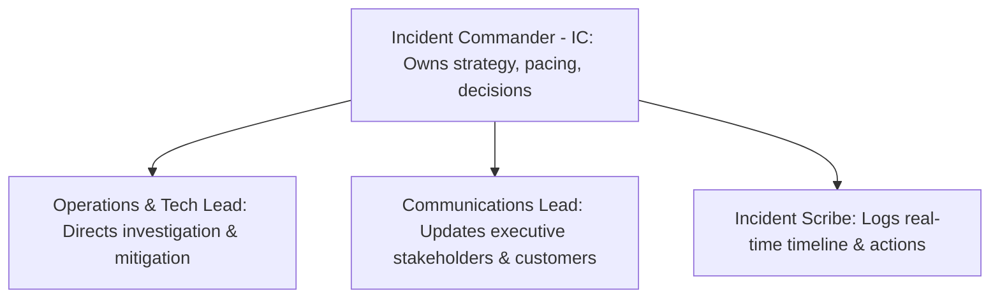

# Architectural Incident Response: The Incident Commander Playbook

> How Principal Architects lead high-severity production incident triage, command communications, isolate root causes, and conduct blameless post-mortems that drive permanent architectural improvements.

---

## 1. The Incident Command Structure

During a Severity-1 production outage, democracy ends. An architectural incident requires crisp, military-style organizational roles to prevent chaotic chatter:



* **The Cardinal Rule of the IC**: The Incident Commander does **not** write code, run terminal queries, or analyze logs during the incident. The IC maintains high-level situational awareness, drives pacing, and makes explicit go/no-go calls on risky rollbacks or database failovers.

---

## 2. Emergency Executive & Customer Communication Templates

### Template 1: Initial Stakeholder Outage Notification (T + 5 Minutes)
```text
SUBJECT: [SEV-1] Investigating: Elevated API Error Rates & Checkout Degradation

Status: INVESTIGATING
Impact: Approximately 25% of checkout requests are failing with 504 Gateway Timeouts. 
        Browse and product search remain operational.
Current Action: Incident Commander [Name] has mobilized triage. Traffic is being shed from 
                recommendation engines, and database connection pools are being analyzed.
Next Update: Within 20 minutes (14:20 UTC) or upon state change.
Incident Bridge: [Link]
```

### Template 2: Outage Mitigated (T + 45 Minutes)
```text
SUBJECT: [SEV-1] MITIGATED: Elevated API Error Rates & Checkout Degradation

Status: MITIGATED
Impact Summary: 38-minute disruption to checkout processing between 13:42 and 14:20 UTC.
Resolution: Rolled back release v2.48.1 which introduced an unindexed query on the orders table. 
            All error rates and latency percentiles (p95 < 120ms) have returned to healthy baselines.
Next Steps: A full blameless post-mortem will be published within 48 hours.
```

---

## 3. The Blameless Post-Mortem & Architecture Action Items

A post-mortem that blames human error (*"Developer forgot to add an index"*) is a failure of leadership. A blameless post-mortem focuses on **why the architectural environment allowed the error to reach production**:

### Standard Post-Mortem Structure
1. **Executive Summary & Impact**: Total customer downtime, financial loss, SLA breach.
2. **Detailed Incident Timeline**: Second-by-second chronological log of alerts, actions, and mitigations.
3. **The 5 Whys (Root Cause Analysis)**:
   * *Why did the database crash?* $\rightarrow$ CPU hit 100% due to full table scans.
   * *Why was a full table scan executed?* $\rightarrow$ A new query lacked an index on `customer_id`.
   * *Why wasn't the index present?* $\rightarrow$ The migration was tested only on a 1,000-row staging database.
   * *Why was staging so small?* $\rightarrow$ Staging does not mirror production data volume.
   * *Why didn't CI catch it?* $\rightarrow$ We lack automated query-plan linting in our build pipeline.
4. **Architectural Corrective Actions (Preventing Recurrence)**:
   * Immediate: Add the missing index to production.
   * Systemic: Deploy automated CI/CD query plan linting that flags queries without index backing.
   * Resilience: Implement an aggressive $500\text{ms}$ query timeout on non-reporting queries.

---

## 4. Cross-References

* **Emergency Response Framework**: [`README.md`](file:///d:/company/products/enterprise-architecture-handbook/20-interview-system-design/scenario-based/README.md)
* **Production Emergency Patterns**: [`production.md`](file:///d:/company/products/enterprise-architecture-handbook/20-interview-system-design/scenario-based/production.md)
* **Hands-on Crisis Exercises**: [`exercises/README.md`](file:///d:/company/products/enterprise-architecture-handbook/20-interview-system-design/scenario-based/exercises/README.md)
