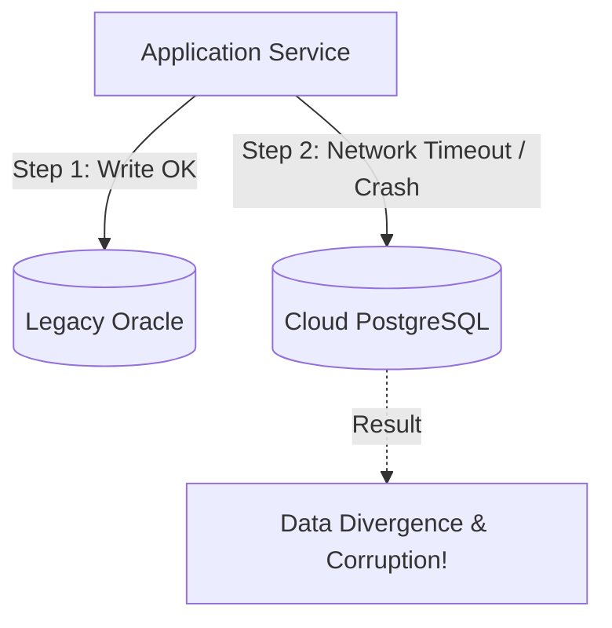

# Modernization Scenarios: Strangler Fig, Dual-Write Drift & CDC Lag

> Diagnosing and resolving high-risk enterprise modernization crises: dual-write state corruption, CDC replication latency, and cutover rollback emergencies.

---

## 1. Scenario: The "Dual-Write" Data Corruption Crisis

### The Crisis
During a migration from an on-premise Oracle monolith to a cloud PostgreSQL microservice, the engineering team wrote application code that performs dual-writes:
```java
// Anti-Pattern: Dual-Write in Application Code
oracleRepo.save(order);      // Step 1: Write to Legacy
postgresRepo.save(order);    // Step 2: Write to Cloud
```
One week into dual-running, audit reports reveal that **12% of customer orders exist in Oracle but are missing in PostgreSQL**, and 3% have conflicting payment totals.

### Root Cause Analysis
* Network calls are fallible. If Step 1 succeeds and Step 2 times out or throws an unhandled exception, state diverges permanently. Without a distributed transaction coordinator, dual-writing in application code guarantees eventual data corruption.



### Architectural Remediation Plan
1. **Stop Application Dual-Writing Immediately**: Establish a single source of truth for writes.
2. **Deploy Change Data Capture (CDC)**:
   * Install Debezium / Kafka Connect directly on Oracle's database redo log (GoldenGate / LogMiner).
   * Reads and persists changes directly from the database engine log with zero application code changes.
3. **Automated Reconciliation Engine**:
   * Deploy an asynchronous background reconciliation worker that compares record hashes between Oracle and PostgreSQL, auto-repairing missing or drifted rows and publishing discrepancies to a dashboard.

---

## 2. Scenario: Change Data Capture (CDC) Lag Disaster

### The Crisis
A retail bank migrates its read traffic to cloud read replicas populated via Kafka CDC from the on-premise mainframe. During a peak holiday traffic surge, the CDC consumer lag spikes from $200\text{ms}$ to **45 minutes**. Customers logging into mobile banking see balances from an hour ago and flood customer service with panic calls.

### Immediate Mitigation Actions
1. **Enable "Read-Your-Own-Writes" Header Routing**:
   * Update the API Gateway: If a user performed a money transfer in the last 15 minutes, route their balance read query directly to the on-premise mainframe primary, bypassing the lagged cloud read model.
2. **Scale CDC Consumers & Kafka Partitions**:
   * Scale out Kafka consumer instances to match topic partition counts.
   * Batch consumer writes to PostgreSQL using `COPY` or multi-row `INSERT ... ON CONFLICT DO UPDATE` instead of single-row updates.

---

## 3. Scenario: The 99% Complete Strangler Cutover Stalling

### The Crisis
An enterprise has migrated 95% of legacy monolithic modules to cloud microservices over 18 months. However, the final 5%—a shared stored procedure calculating legacy interest rates with 40,000 lines of spaghetti SQL—cannot be extracted, blocking decommissioning of the $2M/year legacy mainframe hardware.

### Architectural Solution: The "Black-Box Bubble" Pattern
1. Wrap the legacy stored procedure in a dedicated **Anti-Corruption Layer (ACL)** and expose it via a clean REST/gRPC API.
2. Mirror production traffic to a newly developed cloud-native microservice using **Shadow Traffic (Traffic Mirroring)**.
3. Compare the output of the legacy stored procedure and the new service across 1,000,000 real transactions with an automated diff analyzer.
4. Once output accuracy reaches 100% across 30 consecutive days, flip the feature flag, decommission the stored procedure, and power down the legacy hardware.

---

## 4. Cross-References

* **Legacy Modernization Architecture**: [`architecture-interviews/legacy-modernization.md`](file:///d:/company/products/enterprise-architecture-handbook/20-interview-system-design/architecture-interviews/legacy-modernization.md)
* **Integration Patterns**: [`tradeoffs/integration.md`](file:///d:/company/products/enterprise-architecture-handbook/20-interview-system-design/tradeoffs/integration.md)
* **Enterprise Modernization Strategies**: [`15-modernization/`](file:///d:/company/products/enterprise-architecture-handbook/15-modernization/)
