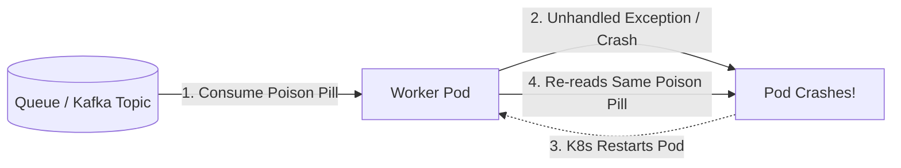

# Production Incident Response: Diagnosing High-Severity Outages

> How senior architects diagnose and mitigate cascading failures, split-brain conditions, connection pool starvation, thundering herds, and poison pills under fire.

---

## 1. Cascading Failures: The Downstream Timeout Trap

```mermaid
flowchart LR
    User([User Traffic]) --> APIGW[API Gateway]
    APIGW --> OrderSvc[Order Service (100 Threads)]
    OrderSvc -->|Latency Spikes to 5s| FraudSvc[Fraud Service (Saturated)]
    
    subgraph Collapse [Cascading System Collapse]
        OrderSvc -.->|All 100 threads blocked waiting on Fraud| ThreadStarve[Order Threads Exhausted!]
        ThreadStarve -.->|Health check fails| PodCrash[Kubernetes Kills Order Pods]
        PodCrash -.->|Traffic shifts to remaining pods| CompleteOutage[100% Platform Outage]
    end
```

### Diagnostic Indicators
* Gateway error rate rises to 504 Gateway Timeout and 503 Service Unavailable.
* Thread pool utilization on upstream services hits 100%.
* CPU on upstream services is surprisingly low (because threads are idle, blocked waiting on I/O).

### Immediate Mitigation Actions
1. **Trip the Circuit Breaker**: Force the circuit breaker between Order Service and Fraud Service to `OPEN`.
2. **Implement Degraded Fallback**: Allow orders under $100 to bypass the real-time fraud check, queuing them for asynchronous post-transaction audit.
3. **Set Strict Client-Side Timeouts**: Enforce aggressive socket timeouts (e.g., $300\text{ms}$) with zero retries on non-idempotent calls.

---

## 2. Database Connection Pool Starvation

### The Problem
Application pods suddenly throw: `TimeoutException: Could not obtain connection from pool within 30000ms`. The database CPU is at 100%, and incoming HTTP requests pile up until pods run out of memory.

### Root Cause Triad
1. **Unindexed Query**: A newly deployed query executes a full table scan on 20 Million rows, holding a database connection open for 12 seconds instead of 5 milliseconds.
2. **Leaked Connections**: An unhandled exception in the application code fails to release the connection back to the pool in a `finally` block.
3. **Too Many Pods**: An auto-scaler scales from 20 pods to 300 pods. Each pod opens a pool of 20 connections ($300 \times 20 = 6,000\text{ connections}$), overwhelming PostgreSQL's connection limit.

### Immediate & Permanent Fixes
* **Immediate**: Kill long-running backend queries via `pg_terminate_backend(pid)` to free locks. Revert the last deployed release.
* **Architectural Fix**: Insert **PgBouncer / RDS Proxy** between the application pods and the database in transaction-pooling mode. Cap maximum primary connections at $50$.

---

## 3. The Poison Pill Message Catastrophe

### The Problem
A malformed event payload arrives on a Kafka topic or SQS queue. Every consumer worker that reads the message throws an unhandled `NullPointerException`, crashes, restarts, re-reads the exact same unacknowledged message from the head of the queue, and crashes again. **The entire worker fleet enters a continuous crash-loop.**



### Mitigation Actions
1. **Immediate Emergency**: Pause the consumer group, manually advance the topic offset past the poison message offset, or purge the single malformed message to a dead-letter queue.
2. **Permanent Architectural Safeguard**:
   * Implement a **Dead-Letter Queue (DLQ)** with a `maxReceiveCount = 3`.
   * If a message fails processing 3 times, the broker automatically strips it from the main queue and routes it to the DLQ for offline analysis, allowing normal messages to continue processing.

---

## 4. Cross-References

* **Circuit Breakers & Retries**: [`tradeoffs/reliability.md`](file:///d:/company/products/enterprise-architecture-handbook/20-interview-system-design/tradeoffs/reliability.md)
* **Incident Commander Playbook**: [`incident-response.md`](file:///d:/company/products/enterprise-architecture-handbook/20-interview-system-design/scenario-based/incident-response.md)
* **Hands-on Exercises**: [`exercises/README.md`](file:///d:/company/products/enterprise-architecture-handbook/20-interview-system-design/scenario-based/exercises/README.md)
