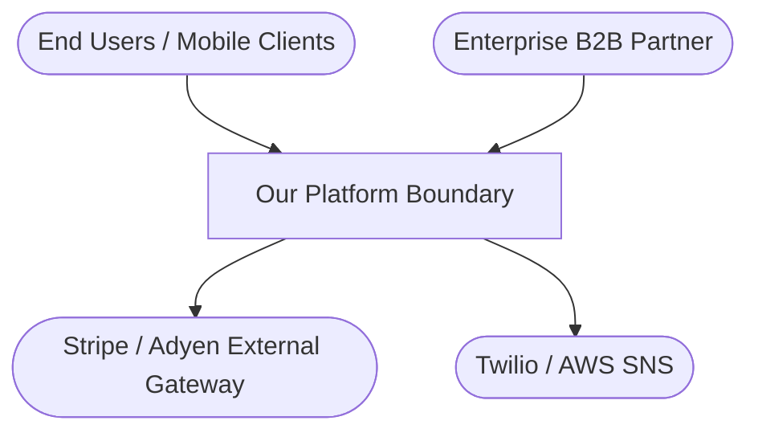
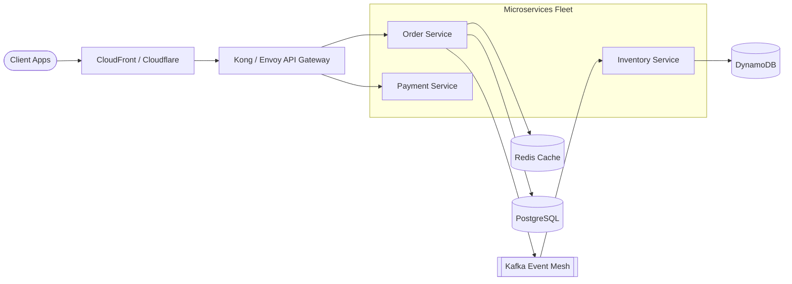
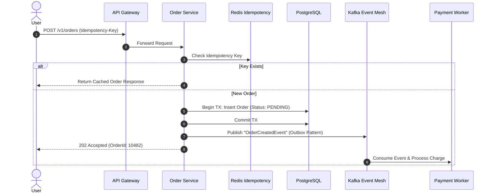
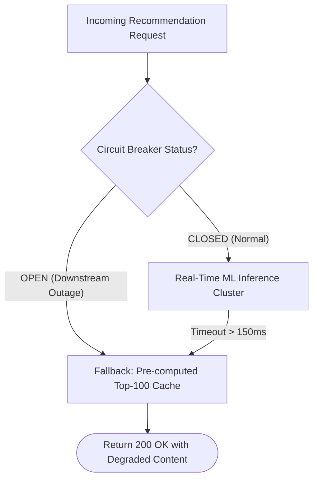

# System Design Interview Execution & Whiteboard Framework

> A disciplined tactical guide to pacing, time management, visual diagramming, and collaborative communication in a 45–60 minute architecture interview.

---

## 1. Interview Pacing & Time Allocation

In a typical 45 to 60-minute technical interview, running out of time before reaching critical components (data models, failure handling, or scaling) is the #1 cause of rejection. 

Use this time allocation as a proven operational guide:

```
Total Time: 45–60 Minutes
├── 00:00 – 05:00 (5 min)  : Clarification, Business Intent & Out-of-Scope Boundaries
├── 05:00 – 10:00 (5 min)  : Requirements, NFRs & Numerical Targets (SLAs)
├── 10:00 – 15:00 (5 min)  : Back-of-the-Envelope Estimation & Plausibility Check
├── 15:00 – 30:00 (15 min) : High-Level Architecture, Core Request/Data Flows & Data Model
├── 30:00 – 42:00 (12 min) : Deep Dive into Bottlenecks & Edge Cases (Interviewer Driven)
├── 42:00 – 50:00 (8 min)  : Failure Modes, Resiliency, Security & Observability
└── 50:00 – 55:00 (5 min)  : Trade-offs, Cost Economics, Evolution & Questions for Interviewer
```



```mermaid
gantt
    title 55-Minute System Design Interview Execution
    dateFormat  m
    axisFormat %M min
    section Clarify & Scope
    Clarification & Scope Boundary       :0, 5m
    section Define Targets
    Requirements & NFR Targets           :5, 5m
    section Estimate
    Back-of-the-Envelope Capacity        :10, 5m
    section Architecture
    High-Level Architecture & Data Model :15, 15m
    section Deep Dive
    Bottlenecks, Edge Cases & Storage    :30, 12m
    section Resilience & Ops
    Failure Modes, Security & Ops        :42, 8m
    section Defense & Wrap-Up
    Trade-offs, Cost & Wrap-Up           :50, 5m
```

> [!TIP]
> **Check in with the interviewer at the 15-minute mark**:
> *"We have our requirements, scale numbers, and high-level structure. Before I draw out the detailed storage strategy and async event flows, is there any specific area you'd like me to emphasize first?"*
> This demonstrates senior collaboration and prevents you from deep-diving into the wrong component.

---

## 2. Whiteboard & Diagramming Standards

Unclear, unstructured whiteboard diagrams create cognitive confusion. Senior architects draw using structured abstraction layers based on the **C4 Model** and explicit flow annotations.

### Standard Diagram Types in Architecture Interviews

#### 1. System Context Diagram (Level 1)
Identifies external personas, external third-party systems, and the system boundary.


#### 2. Container / Service Architecture Diagram (Level 2)
The most common diagram drawn during minutes 15–30. Depicts Gateways, Microservices, Databases, Caches, and Message Brokers.


#### 3. Critical Flow / Sequence Diagram
Used when tracing a complex state transition or distributed transaction.


#### 4. Failure & Degradation Flow Diagram
Demonstrates how the system survives downstream outages without crashing upstream users.


---

## 3. Ground Rules of Visual Whiteboarding

1. **Label Every Connection**: Never draw an unadorned arrow. Always indicate the protocol and payload type:
   * `HTTPS / REST (JSON)`
   * `gRPC (Protobuf)`
   * `Kafka Pub/Sub (Avro)`
   * `TCP / WebSocket`
2. **Distinguish Synchronous vs. Asynchronous**: Use solid lines for synchronous blocking calls and dashed lines for asynchronous background events.
3. **Show Data Stores with Tech Category First, Product Second**:
   * Label: `Primary Relational DB (PostgreSQL)` rather than just `Postgres`.
   * Label: `Distributed Key-Value Cache (Redis Cluster)` rather than just `Redis`.
   * Label: `Append-Only Distributed Event Log (Apache Kafka)` rather than just `Kafka`.
4. **Mark Trust Boundaries**: Draw bounding boxes around internal networks, VPCs, DMZs, and third-party integrations to signal security awareness.

---

## 4. Cross-References

* **Universal Method**: [`architect-interview-framework.md`](file:///d:/company/products/enterprise-architecture-handbook/20-interview-system-design/architect-interview-framework.md)
* **Step-by-Step Sequence**: [`architecture-answer-framework.md`](file:///d:/company/products/enterprise-architecture-handbook/20-interview-system-design/architecture-answer-framework.md)
* **Estimation Checklist**: [`estimation/README.md`](file:///d:/company/products/enterprise-architecture-handbook/20-interview-system-design/estimation/README.md)
* **Common Visual & Structural Anti-Patterns**: [`interview-mistakes.md`](file:///d:/company/products/enterprise-architecture-handbook/20-interview-system-design/interview-mistakes.md)
