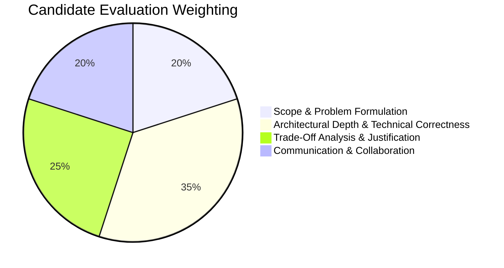

# Evaluation Criteria for System Design Interviews

## 1. The 4 Scoring Pillars



---

## 2. Grading Rubric Matrix

```
+---------------------------+-----------------------------------+------------------------------------+
| Level                     | Technical Expectations            | Leadership Signals                 |
+---------------------------+-----------------------------------+------------------------------------+
| Mid-Level (L4)            | Designs working basic system;     | Follows interviewer lead;          |
|                           | knows SQL vs NoSQL basics         | needs prompting on scale           |
| Senior (L5)               | Confidently sizes capacity;       | Drives discussion;                 |
|                           | designs solid HLD and deep-dives  | articulates trade-offs clearly     |
| Staff / Principal (L6+)   | Identifies subtle distributed edge| Sets technical vision; handles     |
|                           | cases (split-brain, clock drift); | extreme ambiguity; balances cost,  |
|                           | proposes elegant simplicity       | operations, and business SLA       |
+---------------------------+-----------------------------------+------------------------------------+
```
