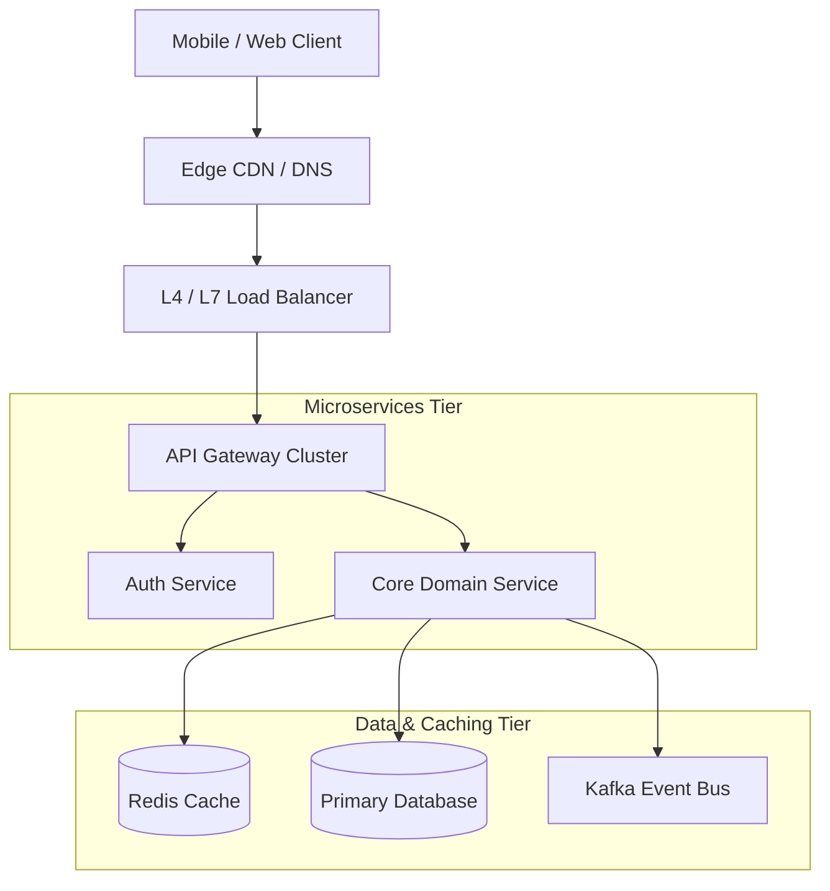

# System Design Interview: High-Level Architecture (HLD)

## 1. Constructing the Architectural Topology

Draw a clean, layered architectural diagram with clear separation of responsibilities:

---

## 2. Walking Through the Data Flow

Always narrate the data flow step-by-step:
1. Client resolves DNS and sends HTTPS request to edge load balancer.
2. Load balancer terminates TLS and forwards to API Gateway.
3. Gateway authenticates JWT token and rate-limits request.
4. Gateway routes request to Core Service.
5. Core Service checks cache (cache-aside); on miss, queries database, populates cache, and returns response.
