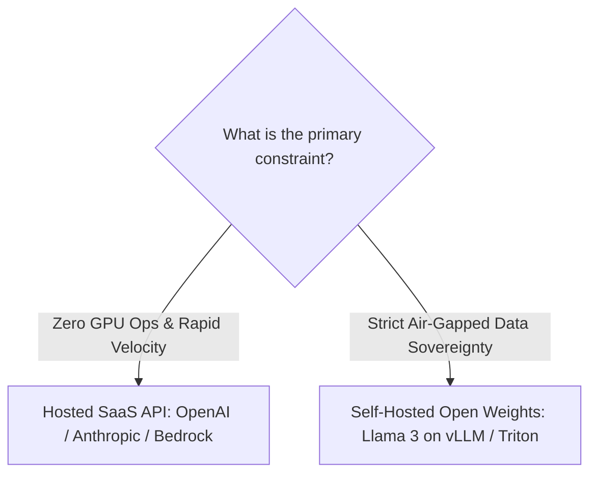

# AI & GenAI Architecture Trade-Offs: Hosted SaaS vs. Self-Hosted & RAG vs. Fine-Tuning

> Practical evaluation of LLM inference hosting, Retrieval-Augmented Generation vs. fine-tuning, deterministic workflows vs. autonomous multi-agent loops, and token economics.

---

## 1. Hosted SaaS LLM vs. Self-Hosted Open Weights



### Trade-Off Matrix

| Dimension | Hosted SaaS LLM (OpenAI, Anthropic, Bedrock) | Self-Hosted Open Weights (Llama, Mistral on vLLM) |
| :--- | :--- | :--- |
| **Time-to-Market** | **Immediate** (REST API call via SDK) | Weeks/Months (GPU provisioning, CUDA drivers, vLLM tuning) |
| **Operational Complexity**| **Zero** (no GPU infrastructure to maintain) | **Extremely High** (GPU cluster management, node failures, scaling) |
| **Data Sovereignty & Privacy**| Data leaves perimeter (unless Zero Data Retention enterprise tier signed) | **Total Control** (runs completely inside private enterprise VPC) |
| **Unit Cost at Low Volume**| **Lowest** (pay only per token consumed) | **High** (idle GPU instances cost $3,000–$10,000/mo) |
| **Unit Cost at Ultra-High Scale**| Expensive ($20–$100 per million tokens adds up) | **Lowest** (amortized GPU cost drops below API pricing at > 500k req/day) |
| **Latency Predictability**| Subject to public cloud multi-tenant throttling & rate limits | **Predictable** (dedicated inference hardware and custom quantization) |

---

## 2. RAG (Retrieval-Augmented Generation) vs. Fine-Tuning

```
RAG (Retrieval-Augmented Generation)
  - Dynamically injects fresh private enterprise documents into the prompt context window via vector search.
Fine-Tuning (Model Weight Adaptation)
  - Updates the internal weights of the neural network on specialized training corpora.
```

### Comparative Decision Matrix

| Dimension | RAG (Retrieval-Augmented Generation) | Fine-Tuning (PEFT / LoRA / Full) |
| :--- | :--- | :--- |
| **Purpose** | **Factual Grounding & Dynamic Knowledge Retrieval** | **Domain Tone, Style, Formatting & Syntax Adherence** |
| **Knowledge Freshness** | **Real-Time** (instant updates as documents are embedded) | **Static Snapshot** (requires continuous re-training to update facts) |
| **Hallucination Risk** | **Low** (grounded in retrieved context with exact source citations) | **Moderate to High** (model still generates probabilities) |
| **Data Access Control (RBAC)**| **Trivial** (filter vector queries by user tenant / department ID) | **Impossible** (weights cannot forget specific sensitive facts) |
| **Inference Cost** | Higher per query (longer prompt token context) | **Lower per query** (shorter prompt; knowledge baked into weights) |
| **Upfront Effort** | Low to Medium (Chroma/Pinecone + Embeddings) | High (dataset curation, GPU training runs, evaluation pipelines) |

> [!IMPORTANT]
> **The Senior Architect Rule of GenAI**: **Fine-tuning is NOT a replacement for RAG.** Fine-tuning teaches an LLM *how to act* (style, specialized terminology, code generation syntax); RAG teaches an LLM *what to know* (factual enterprise data). In enterprise interviews, always propose RAG for knowledge retrieval first.

---

## 3. Deterministic Workflows vs. Autonomous Multi-Agent Loops

| Paradigm | Architecture | Predictability | Latency & Cost | Best Fit |
| :--- | :--- | :--- | :--- | :--- |
| **Deterministic Graph Workflow** (LangGraph / Temporal) | Hard-coded state machine with LLM nodes for extraction / classification. | **Very High** (state transitions are strictly bounded) | **Low & Bounded** (fixed number of LLM invocations) | Core banking transactions, enterprise claim processing, compliance workflows. |
| **Autonomous Multi-Agent System** (CrewAI / AutoGen) | LLMs dynamically choose tools, iterate in feedback loops, and delegate tasks. | **Low** (risk of infinite loops, tool misuse, and unpredictable paths) | **High & Unbounded** (single query can trigger 15 LLM calls) | Open-ended research, automated code refactoring, exploratory data analysis. |

---

## 4. Cross-References

* **Token Economics**: [`estimation/exercises/README.md#exercise-7-enterprise-genai--llm-assistant-platform`](file:///d:/company/products/enterprise-architecture-handbook/20-interview-system-design/estimation/exercises/README.md#exercise-7-enterprise-genai--llm-assistant-platform)
* **Enterprise AI Assistant System Design**: [`architecture-interviews/enterprise-ai-assistant.md`](file:///d:/company/products/enterprise-architecture-handbook/20-interview-system-design/architecture-interviews/enterprise-ai-assistant.md)
* **Deep AI Architecture**: [`12-ai/`](file:///d:/company/products/enterprise-architecture-handbook/12-ai/)
