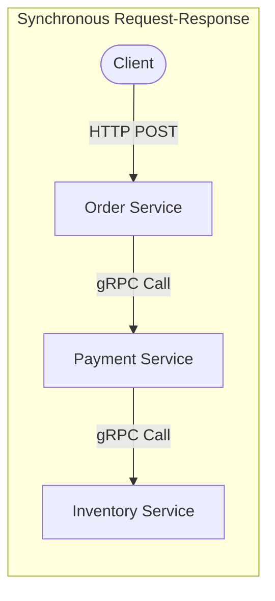
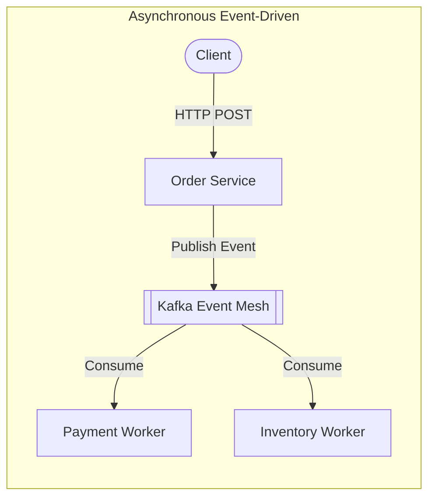

# Architectural Trade-Offs: Monolith vs. Modular Monolith vs. Microservices vs. Serverless

> Deep comparative analysis of application topology, coupling paradigms, communication synchronousness, and organizational alignment.

---

## 1. Monolith vs. Modular Monolith vs. Microservices vs. Serverless

```
Monolithic (Single Binary) ──► Modular Monolith (Strict In-Process Boundaries) ──► Microservices (Network Decoupled) ──► Serverless (Event-Driven FaaS)
    [Zero Network Latency]                  [Zero Network Latency]                   [High Network Overhead]               [Cold Starts & Ephemeral]
    [Single Database]                       [Logical Schema Boundaries]              [Database-per-Service]                [Stateless Handlers]
    [Shared Deployment Fate]                [Shared Deployment Fate]                 [Independent Deployment]              [Event-Driven Autoscaling]
```

### Comprehensive Comparison Matrix

| Dimension | Classic Monolith | Modular Monolith | Microservices Architecture | Serverless (FaaS) |
| :--- | :--- | :--- | :--- | :--- |
| **Network Latency** | **Zero** (in-memory function calls) | **Zero** (in-memory interface calls) | High ($2–20\text{ms}$ per hop across services) | High ($10–50\text{ms}$ API Gateway + network hops) |
| **Data Consistency** | **Strong ACID** (single DB transactions) | **Strong ACID** (cross-module DB transactions) | **Eventual Consistency** (Sagas, 2PC, Outbox) | **Eventual Consistency** (distributed event streams) |
| **Deployment Independence**| None (1 commit rebuilds entire app) | None (single artifact, but modular build caching) | **High** (each service has independent CI/CD) | **Highest** (individual functions deployed independently) |
| **Operational Overhead** | Low (single process, simple monitoring) | Low (single process, modular logging) | **Very High** (Service mesh, K8s, tracing, distributed logging) | Medium (managed platform, but observability is complex) |
| **Failure Blast Radius** | High (memory leak or panic crashes app) | Medium (unhandled panic crashes process) | **Low** (isolated to crashing service; circuit breakers protect others) | **Lowest** (isolated to single invocation container) |
| **Team Scaling (Conway's Law)**| Poor (> 50 engineers step on each other) | Moderate (clear package boundaries, 50–100 engineers) | **Excellent** (independent autonomous teams, 100–1,000+ engineers) | Good (small function ownership, but platform governance needed) |
| **Infrastructure Cost** | Low (maximum resource packing) | Low (maximum resource packing) | High (idle container overhead, duplicate buffers) | Variable (cheap for low/bursty; expensive for continuous high-load) |
| **Cold Start Latency** | N/A (long-running process) | N/A (long-running process) | N/A (pre-warmed pods) | **$100\text{ms}–3,000\text{ms}$** upon scaling from zero |

---

## 2. Decision Triggers: When to Choose What

### Choose a Modular Monolith When:
* The engineering team has $< 30$ engineers.
* Domain boundaries are still evolving or rapidly changing (refactoring across microservices requires expensive multi-repo migrations and distributed schema changes).
* Latency budgets are strict ($< 20\text{ms}$ total request budget).
* You want the code isolation benefits of microservices without the distributed networking, distributed transaction, and operational K8s penalties.

### Choose Microservices When:
* The engineering organization exceeds $100+$ engineers across $10+$ independent stream-aligned teams.
* Individual sub-domains have radically divergent scaling or hardware requirements (e.g., Video Transcoding requires GPU nodes, while User Profile requires lightweight memory caching).
* Regulatory or compliance mandates require strict deployment and data isolation (e.g., PCI-DSS cardholder vault must be isolated from the marketing website).

### Choose Serverless (FaaS) When:
* Workloads are event-driven, unpredictable, or highly bursty (e.g., webhook ingestion, nightly batch report generation, asynchronous thumbnail processing).
* Rapid time-to-market with zero infrastructure maintenance is prioritized over raw compute cost at scale.
* *When NOT to choose FaaS*: High-frequency, steady-state, ultra-low-latency OLTP traffic ($> 10,000\text{ continuous RPS}$)—serverless cost and cold starts will penalize you.

---

## 3. Synchronous (RPC / REST) vs. Asynchronous (Event-Driven)


* **Failure Compounding**: If each service has $99.9\%$ availability, a chain of 4 synchronous calls has:
  $$\text{Total Availability} = 0.999^4 = \mathbf{99.6\%} \text{ (Downtime multiplies!)}$$


* **Temporal Decoupling**: If the Inventory Service is down for maintenance, the Order Service still accepts the customer order and publishes the event. Inventory processes the backlog immediately upon recovery.

---

## 4. Cross-References

* **Data Storage Trade-Offs**: [`data.md`](file:///d:/company/products/enterprise-architecture-handbook/20-interview-system-design/tradeoffs/data.md)
* **Integration Patterns**: [`integration.md`](file:///d:/company/products/enterprise-architecture-handbook/20-interview-system-design/tradeoffs/integration.md)
* **Team Topologies & Conway's Law**: [`leadership/team-topology.md`](file:///d:/company/products/enterprise-architecture-handbook/20-interview-system-design/leadership/team-topology.md)
