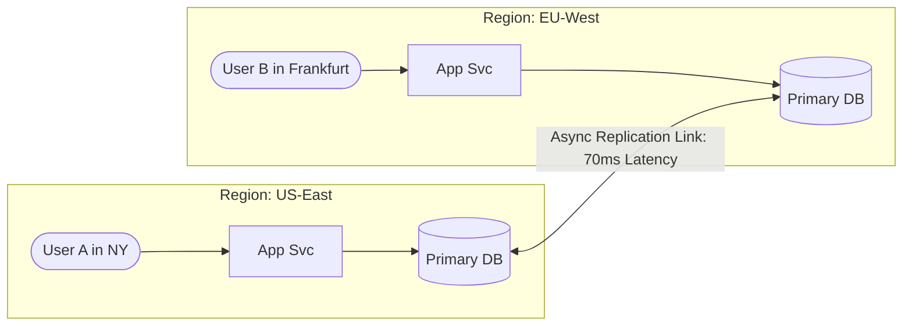

# Cloud Strategy Trade-Offs: Single-Region vs. Multi-Region & Multi-Cloud

> Analysis of disaster recovery topologies, Active-Active vs. Active-Passive, latency routing, split-brain resolution, and the multi-cloud paradox.

---

## 1. Cloud Resilience Topologies

```
Single-AZ ──► Multi-AZ (Single Region) ──► Multi-Region Active-Passive ──► Multi-Region Active-Active
 [Fragile]      [Standard Cloud Default]      [Disaster Recovery / Warm]    [Continuous Global Routing]
 [RTO: Hours]   [RTO: < 1 minute]             [RTO: 5–30 minutes]           [RTO: ~0 seconds]
 [RPO: Days]    [RPO: ~0 seconds]             [RPO: Minutes]                [RPO: Complex Conflict Res]
 [Cost: 1x]     [Cost: 1.5x - 2x]             [Cost: 2.2x]                  [Cost: 3x - 4x]
```

### Comparative Architecture Matrix

| Dimension | Multi-AZ (Single Region) | Multi-Region Active-Passive | Multi-Region Active-Active |
| :--- | :--- | :--- | :--- |
| **Availability Target** | 99.9% to 99.99% | 99.99% | **99.999% (Five Nines)** |
| **RTO (Recovery Time)** | $< 1\text{ minute}$ (automated failover) | $5\text{ to }30\text{ minutes}$ (DNS failover + DB promotion) | **$\approx 0\text{ seconds}$** (traffic automatically sheds) |
| **RPO (Data Loss)** | **Zero** (synchronous cross-AZ replication) | Dependent on async replication lag ($1–60\text{s}$) | Zero for CRDTs/consensus; write conflict risk for LWW |
| **Network Latency** | Intramural regional ($< 2\text{ms}$) | Local in primary; failover absorbs remote lag | **Lowest Global Latency** (routed to nearest PoP/region) |
| **Data Conflict Hazard** | **None** (single primary DB writer) | **None** (standby is strictly read-only until promoted) | **High** (requires CRDTs, Vector Clocks, or Paxos/Spanner) |
| **Cost Multiplier** | $1.5\times$ to $2\times$ | $\approx 2.2\times$ | **$3\times$ to $4\times$** (infrastructure + cross-region egress) |

---

## 2. Active-Active Write Conflict Resolution Strategies

When writes occur simultaneously in `us-east-1` and `eu-central-1` before cross-region replication completes:



### Resolution Options
1. **Last-Write-Wins (LWW)**: Uses wall-clock NTP timestamps to overwrite the older write.
   * *Hazard*: Clock skew across cloud servers can silently overwrite valid transactions.
2. **Conflict-Free Replicated Data Types (CRDTs)**: Mathematically provable convergence for append-only sets, counters, and registers (used in DynamoDB, Riak).
3. **Partition by Region / Tenant Affinity**: Ensure that European users *always* write exclusively to Europe; US users *always* write to the US. Cross-region writes are eliminated by design.
4. **Global Distributed Consensus (Google Cloud Spanner)**: Uses hardware atomic clocks and GPS receivers (TrueTime API) to guarantee external consistency across continents.

---

## 3. The Multi-Cloud Fallacy vs. Multi-Cloud Reality

Many junior candidates propose: *"We will build a multi-cloud architecture deploying across AWS and Azure simultaneously to avoid vendor lock-in."*

### Why Naive Multi-Cloud is an Anti-Pattern:
1. **Lowest Common Denominator Syndrome**: You are forced to avoid proprietary cloud advantages (e.g., AWS Aurora, BigQuery, DynamoDB) and deploy primitive self-hosted VMs or raw vanilla Kubernetes, increasing operational headcount.
2. **Exorbitant Egress Bills**: Continuous data synchronization across two competing cloud providers incurs maximum public internet egress rates.
3. **Double Cognitive Load**: Engineering teams must master two IAM systems, two networking VPC models, two compliance architectures, and two security postures.

### When Multi-Cloud IS Justified (The Senior View):
* **Regulatory Compliance**: Central banks or financial authorities legally mandate that an institution cannot be 100% reliant on a single cloud vendor.
* **M&A Technology Integration**: The enterprise acquired another company running on a different cloud provider.
* **Best-of-Breed Domain Specialization**: Hosting core compute on AWS, while running machine learning and enterprise analytics on Google Cloud (BigQuery/Vertex AI).

---

## 4. Cross-References

* **Bandwidth & Egress Costs**: [`estimation/bandwidth.md`](file:///d:/company/products/enterprise-architecture-handbook/20-interview-system-design/estimation/bandwidth.md)
* **Data Consistency Models**: [`data.md`](file:///d:/company/products/enterprise-architecture-handbook/20-interview-system-design/tradeoffs/data.md)
* **Multi-Region Interview Case Study**: [`architecture-interviews/multi-region-active-active.md`](file:///d:/company/products/enterprise-architecture-handbook/20-interview-system-design/architecture-interviews/multi-region-active-active.md)
