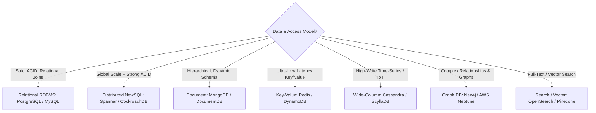
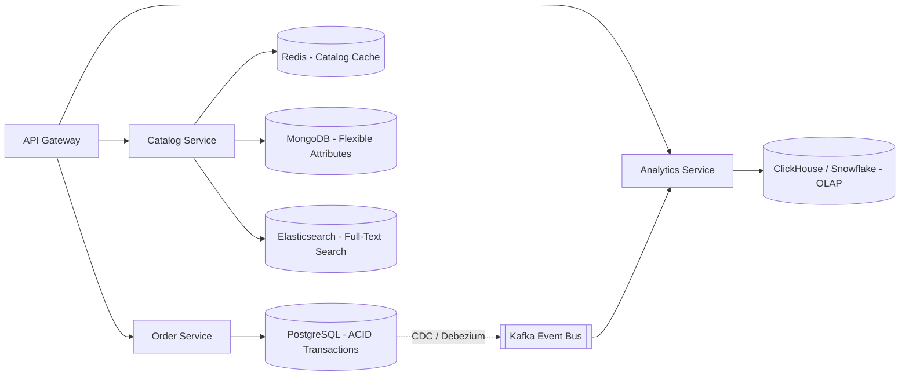

# Data Storage Trade-Offs: SQL vs. NoSQL vs. NewSQL & Consistency Models

> A deep architectural guide to datastore selection, ACID vs. BASE, PACELC theorem, partitioning keys, and polyglot persistence.

---

## 1. Datastore Categorization & Trade-Off Matrix



| Category | Typical Products | Primary Strengths | Fatal Failure Modes / Weaknesses | Best Fit Use Case |
| :--- | :--- | :--- | :--- | :--- |
| **Relational (RDBMS)** | PostgreSQL, MySQL, Oracle | Strict ACID transactions; arbitrary complex SQL JOINs; mature ecosystem. | Write scaling bottleneck ($> 15\text{k writes/sec}$ requires manual sharding); rigid schema migrations. | Core transactional banking, e-commerce checkout, billing, order management. |
| **Distributed NewSQL** | Google Cloud Spanner, CockroachDB, YugabyteDB | Strong ACID across distributed nodes; horizontal scaling; automated multi-region consensus. | High write latency ($20–100\text{ms}$ due to Raft/Paxos consensus across regions); higher infrastructure cost. | Global financial ledgers, international inventory requiring multi-region consistency. |
| **Document Store** | MongoDB, AWS DocumentDB | Flexible dynamic JSON schema; embedded documents; easy developer velocity. | No multi-document cross-collection ACID (historically/operationally costly); risk of massive document bloat. | Content management systems, user profiles, product catalogs with varying attributes. |
| **Wide-Column / Partitioned** | Apache Cassandra, ScyllaDB | Blazing fast append-only write throughput ($100\text{k}+ \text{writes/sec}$); linear horizontal scale. | No arbitrary querying (queries must strictly match partition key); no JOINs; eventual consistency read repair lag. | High-volume IoT telemetry, activity feeds, financial audit logs, time-series data. |
| **Distributed Cache / In-Memory** | Redis, AWS ElastiCache | Sub-millisecond latency (RAM); atomic data structures (Sets, Sorted Sets, Hashes). | Data volatility on sudden cluster death; memory is $5\times$ to $10\times$ more expensive than NVMe SSD storage. | Session caching, leaderboards, distributed locks, rate-limiting tokens. |

---

## 2. Strong vs. Eventual Consistency: PACELC Deep Dive

The CAP Theorem is incomplete because it only addresses what happens during a network partition. Daniel Abadi formulated **PACELC**:
$$\text{If } \mathbf{P} \text{ (Partition): Choose } \mathbf{A} \text{ (Availability) vs. } \mathbf{C} \text{ (Consistency)}$$
$$\mathbf{E} \text{lse (Normal State): Choose } \mathbf{L} \text{ (Latency) vs. } \mathbf{C} \text{ (Consistency)}$$

### Real-World System Mapping

```
                 PC/EC (Consistent always, High Latency)
                   - Google Cloud Spanner
                   - CockroachDB
                   - Traditional RDBMS with sync replication
                               │
                               │
PA/EL (High Avail during partition,        PC/EL (Consistent during partition,
       Low Latency always)                        Low Latency normal)
   - DynamoDB (eventual)                      - MongoDB (primary-write)
   - Cassandra (ONE / QUORUM tuning)          - Redis Enterprise
```

### PACELC Decision Matrix

| Scenario | Choice | Justification |
| :--- | :--- | :--- |
| **Payment Ledger Balance** | **PC/EC** | A customer balance must never be double-spent. Latency penalty ($100\text{ms}$) is fully acceptable to guarantee consistency. |
| **Social Media Feed Post** | **PA/EL** | Showing a post 5 seconds late to friends in another region is unnoticeable. The service must never reject a post due to network lag. |
| **Flash Sale Inventory Counter**| **PC/EC** | Overselling physical inventory creates expensive fulfillment cancellations and brand reputation damage. |

---

## 3. Polyglot Persistence Architecture

Never attempt to force an entire enterprise onto a single datastore. Implement **Domain-Driven Polyglot Persistence**:



---

## 4. Cross-References

* **Database Estimation & IOPS**: [`estimation/database.md`](file:///d:/company/products/enterprise-architecture-handbook/20-interview-system-design/estimation/database.md)
* **Architecture Trade-Offs**: [`architecture.md`](file:///d:/company/products/enterprise-architecture-handbook/20-interview-system-design/tradeoffs/architecture.md)
* **Decision Matrices**: [`decision-matrices/README.md`](file:///d:/company/products/enterprise-architecture-handbook/20-interview-system-design/tradeoffs/decision-matrices/README.md)
