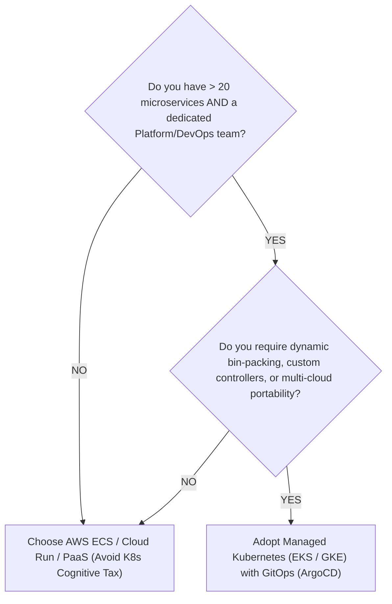

# Infrastructure Trade-Offs: VMs vs. Containers vs. Kubernetes vs. Serverless

> Practical evaluation of compute runtimes, orchestration complexity, cold starts, resource packing, and self-hosted vs. managed cloud PaaS.

---

## 1. Compute Runtime Evolution & Trade-Off Spectrum

```
Virtual Machines (IaaS: EC2 / GCE)
  ↓ [Higher Packing Density & Fast Boot]
Containers (Docker on VMs / ECS)
  ↓ [Declarative Scheduling, Service Mesh & Auto-Healing]
Kubernetes Orchestration (EKS / GKE / Self-Managed)
  ↓ [Zero Infrastructure Management & Event-Driven Scaling]
Managed Serverless (AWS Lambda / Google Cloud Run)
```

### Comparative Runtime Matrix

| Dimension | Virtual Machines (VMs) | Container Instances (AWS ECS / Fargate) | Kubernetes (EKS / GKE) | Managed Serverless (Lambda / Cloud Run) |
| :--- | :--- | :--- | :--- | :--- |
| **Startup / Scaling Latency** | Minutes ($2–5\text{ min}$) | Seconds ($15–45\text{ sec}$) | Seconds ($5–20\text{ sec}$) | **Milliseconds** ($50–500\text{ms}$) |
| **Resource Efficiency** | Low (hypervisor overhead) | High | **Highest** (bin-packing across nodes) | Dynamic (pay only per execution millisecond) |
| **Operational Complexity** | Low to Medium | Low | **Very High** (CRDs, ingress, CNI, storage) | **Lowest** (fully managed by cloud provider) |
| **Portability** | Low (vendor AMIs / images) | High (OCI containers) | **Universal** (runs on any cloud or on-prem) | Low (vendor-specific handler APIs & triggers) |
| **Execution Duration** | Unlimited | Unlimited | Unlimited | **Limited** (typically 15-minute execution cap) |
| **Stateful Workload Fit** | **Excellent** | Moderate | Good (StatefulSets, CSI plugins) | **Poor** (stateless ephemeral containers only) |
| **Cost at High Sustained Load**| Low (Reserved / Spot) | Medium | **Lowest per unit compute** | **Very High** (serverless premium accumulates) |

---

## 2. Kubernetes: When is it Justified vs. Overengineering?

Kubernetes is the default recommendation of junior candidates, but senior architects recognize its heavy operational burden:



### The Kubernetes "Hidden Tax" Checklist
* Ingress Controllers (Nginx / Envoy / Traefik) and TLS cert rotation (cert-manager).
* Container Network Interface (CNI: Cilium, AWS VPC CNI) IP address exhaustion.
* Node auto-scaling (Karpenter / Cluster Autoscaler) and Pod Disruption Budgets (PDBs).
* Prometheus / OpenTelemetry operator configuration and persistent storage (EBS CSI).
* **If your team has 8 engineers and 3 services, adopting Kubernetes is an architectural anti-pattern.**

---

## 3. Self-Hosted (DIY) vs. Managed Cloud PaaS

| Criterion | Self-Hosted Open Source (e.g., Kafka on EC2, Postgres on VMs) | Managed Cloud PaaS (e.g., AWS MSK, AWS Aurora) |
| :--- | :--- | :--- |
| **Upfront Financial Cost** | Low raw infrastructure license cost | Higher monthly margin (30–60% cloud markup) |
| **Operational Labor** | **High** (requires 24/7 dedicated DBAs/SREs for patching, backups, failovers) | **Low** (cloud provider handles automated patching, storage expansion, and failover) |
| **Customizability** | Complete access to OS kernels, extensions, and configs | Restricted to cloud vendor's supported configuration flags |
| **SLA & Blast Radius** | Your team owns the SLA; catastrophic mistakes fall on you | Cloud vendor provides contractual 99.99% uptime SLA |

> [!TIP]
> **The Senior Architect Rule of Core Competency**: Unless database/broker infrastructure is your company's core differentiating intellectual property, **always choose managed PaaS** over self-hosting in an interview. Explain that trading infrastructure margin for engineering velocity and reliability is the commercially sound decision.

---

## 4. Cross-References

* **Compute Capacity Sizing**: [`estimation/compute.md`](file:///d:/company/products/enterprise-architecture-handbook/20-interview-system-design/estimation/compute.md)
* **Cloud Strategy Trade-Offs**: [`cloud.md`](file:///d:/company/products/enterprise-architecture-handbook/20-interview-system-design/tradeoffs/cloud.md)
* **Cost & Financial Modeling**: [`estimation/cost.md`](file:///d:/company/products/enterprise-architecture-handbook/20-interview-system-design/estimation/cost.md)
