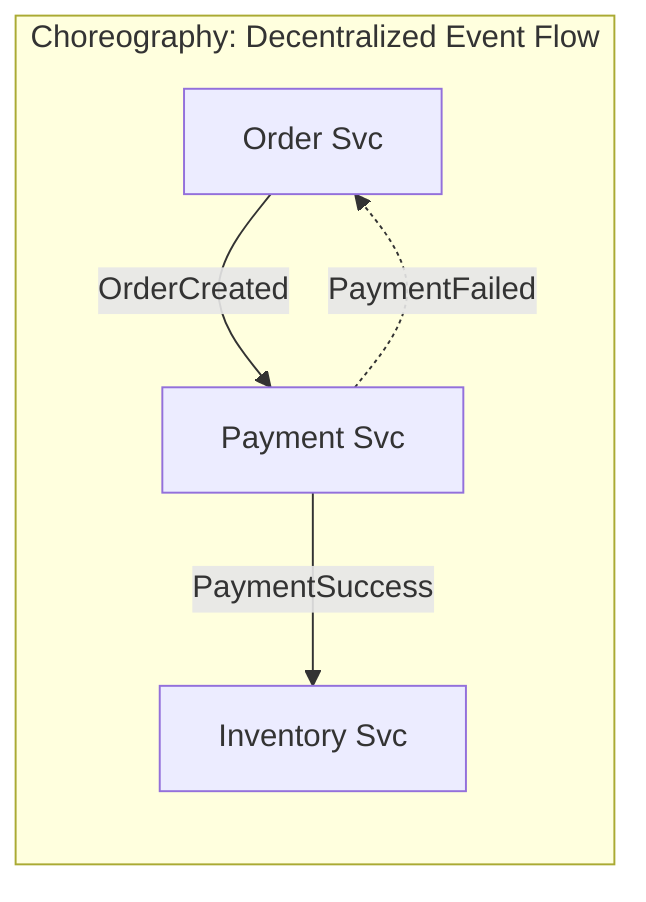
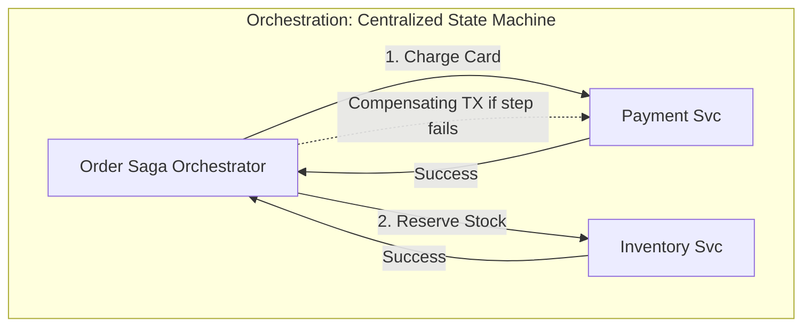

# Integration Trade-Offs: REST vs. gRPC vs. GraphQL & Queues vs. Streams

> Architectural analysis of communication protocols, message distribution semantics, API gateways, and distributed saga coordination.

---

## 1. Synchronous API Protocols: REST vs. gRPC vs. GraphQL

```
REST (JSON over HTTP/1.1 or HTTP/2)
  - Universal client compatibility, human-readable, browser native, high serialization overhead.
gRPC (Protobuf over HTTP/2)
  - High-performance binary multiplexing, streaming, strict schema contracts, low developer visibility.
GraphQL (Single Endpoint Query Language over HTTP)
  - Client-specified fetching, zero over/under-fetching, complex server caching, N+1 query vulnerability.
```

### Comparison Matrix

| Criteria | REST (OpenAPI) | gRPC (Protocol Buffers) | GraphQL |
| :--- | :--- | :--- | :--- |
| **Payload Size** | Large (JSON keys repeated) | **Minimal** (packed binary) | Medium (JSON response tailored to query) |
| **Throughput & Latency**| Moderate | **Highest** ($5\times$ to $10\times$ faster than REST) | Moderate (query parsing and AST overhead) |
| **Browser Support** | **Native** | Limited (requires gRPC-Web proxy) | **Native** |
| **Contract Strictness** | Loose / Documentation-driven | **Strict compile-time code gen** | **Strict schema definition (SDL)** |
| **Streaming Support** | Server-Sent Events (SSE) only | **Bidirectional streaming** | Subscriptions (via WebSockets) |
| **Caching Simplicity** | **Trivial** (standard HTTP headers / CDN) | Complex (application-level caching) | Complex (POST requests bypass standard HTTP caches) |
| **Ideal Placement** | Public APIs, Partner integrations | **Internal microservice-to-microservice** | Mobile & Single-Page Apps (BFF pattern) |

---

## 2. Asynchronous Messaging: Task Queues vs. Event Streams

```mermaid
flowchart LR
    subgraph Queue [Task Queue: RabbitMQ / AWS SQS]
        Producer1[Producer] --> Q[(Queue)]
        Q --> Worker1[Worker A (Deletes message on ACK)]
        Q --> Worker2[Worker B]
    end
```
* **Semantics**: Competing consumers; individual message acknowledgment; message deleted upon completion. Best for discrete job execution (e.g., send email, render thumbnail).

```mermaid
flowchart LR
    subgraph Stream [Distributed Event Log: Apache Kafka]
        Producer2[Producer] --> P1[(Partition 0: Append-Only Log)]
        P1 --> G1[Consumer Group 1: Fraud (Offset: 104)]
        P1 --> G2[Consumer Group 2: Search (Offset: 98)]
    end
```
* **Semantics**: Immutable append-only log; persistent retention; consumers track their own offsets; events replayable from history. Best for event streaming, telemetry, and CDC.

### Queue vs. Stream Decision Matrix

| Dimension | Message Queue (RabbitMQ, SQS) | Event Stream (Apache Kafka, AWS Kinesis) |
| :--- | :--- | :--- |
| **Retention Policy** | Transient (deleted upon consumer ACK) | **Persistent** (retained by time/size: days, months) |
| **Replayability** | None (once acked, it's gone) | **Full Event Replay** from any historical offset |
| **Ordering** | FIFO queues exist, but scale is limited | **Strict Total Ordering per Partition** at 100k+ msg/s |
| **Consumer Model** | Competing consumers on single queue | Multiple independent consumer groups read same topic |
| **Routing Flexibility** | **High** (topic exchanges, direct, headers) | Fixed partition hashing by key |
| **Operational Weight** | Low / Medium | **High** (ZooKeeper/KRaft, partition rebalancing) |

---

## 3. Distributed Transactions: Orchestration vs. Choreography (Sagas)

When a business transaction spans multiple microservices (e.g., Place Order $\rightarrow$ Charge Card $\rightarrow$ Reserve Inventory $\rightarrow$ Dispatch), distributed 2-Phase Commit (2PC) creates lock contention and availability hazards. Architects use the **Saga Pattern**.


* **Pros**: Simple for 2–3 services; loose coupling.
* **Cons**: "Spaghetti events" at scale; difficult to trace end-to-end status; circular dependency risk.


* **Pros**: Explicit centralized workflow state; easy auditing; clear compensating transactions.
* **Cons**: Orchestrator can become a god-object or single point of failure if not designed statelessly.

---

## 4. Cross-References

* **Architecture Topologies**: [`architecture.md`](file:///d:/company/products/enterprise-architecture-handbook/20-interview-system-design/tradeoffs/architecture.md)
* **Wire Protocol Sizing**: [`estimation/bandwidth.md`](file:///d:/company/products/enterprise-architecture-handbook/20-interview-system-design/estimation/bandwidth.md)
* **Production Incident Playbooks**: [`scenario-based/production.md`](file:///d:/company/products/enterprise-architecture-handbook/20-interview-system-design/scenario-based/production.md)
