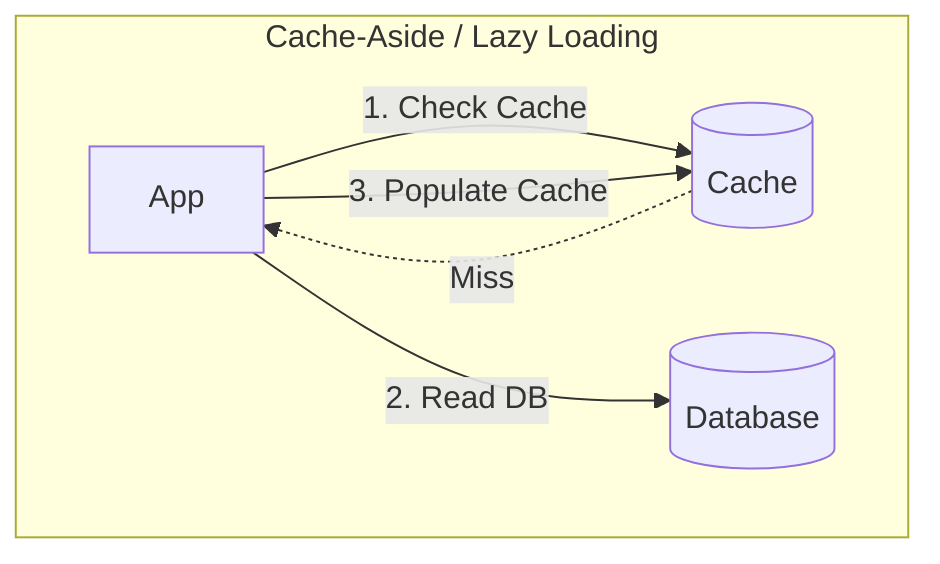
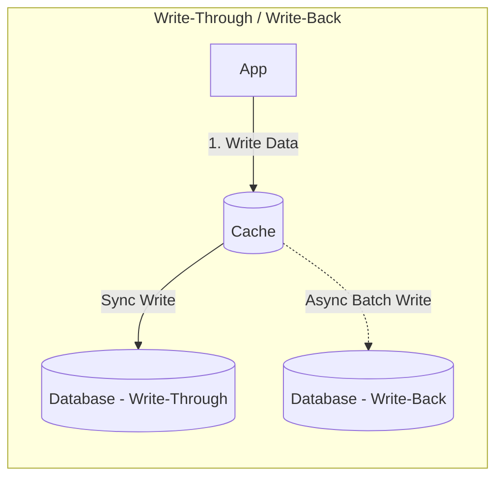

# Performance & Scaling Trade-Offs: Caching vs. DB Tuning & Scale Patterns

> Strategic analysis of caching patterns (Cache-Aside vs. Write-Through vs. Write-Back), vertical vs. horizontal scaling, and pre-computation vs. on-demand rendering.

---

## 1. Caching Strategies: Patterns & Failure Modes

* **Pros**: Only requested data is cached; cache failures do not break writes.
* **Cons**: Cache miss penalty (3 round trips on miss); potential stale data.

* **Write-Through**: High write latency (writes wait on both Cache and DB), but data is never stale.
* **Write-Back (Write-Behind)**: Blazing fast write latency, absorbs massive write spikes, but **catastrophic risk of data loss** if cache node crashes before flushing to persistent disk.

### Caching Pattern Comparison

| Pattern | Write Latency | Read Latency | Data Consistency | Risk of Data Loss | Best Suited For |
| :--- | :--- | :--- | :--- | :--- | :--- |
| **Cache-Aside** | Lowest (writes straight to DB) | Fast on hit ($< 2\text{ms}$); Slower on miss | Eventual (requires TTL or cache eviction) | **Zero** | General purpose web reads, user profiles, catalog browsing. |
| **Write-Through** | Slower (waits for Cache + DB) | **Fastest** (cache always populated) | **Strong** | **Zero** | Read-heavy systems where stale data cannot be tolerated. |
| **Write-Back** | **Fastest** (returns after cache write) | **Fastest** | Eventual | **High** (transient data loss if node dies) | Heavy write logging, IoT telemetry, real-time counters. |

---

## 2. The 3 Classic Cache Failure Catastrophes

### 1. Cache Stampede / Thundering Herd
* **The Problem**: A high-traffic hot key (e.g., world news headline) expires. 10,000 concurrent requests miss the cache simultaneously and all execute the expensive database query at the exact same instant, bringing down the database.
* **Mitigations**:
  * **Mutex Lock (Single-Flight Pattern)**: Only the first thread acquires a lock to query the DB and repopulate the cache; other 9,999 requests wait.
  * **Probabilistic Early Expiration (XFetch)**: Background workers refresh the cache key *before* it strictly expires based on read frequency.

### 2. Cache Avalanche
* **The Problem**: Hundreds of thousands of keys are written with the exact same 24-hour TTL (e.g., at midnight). At 12:00:00 AM, all keys expire at once, routing entire platform traffic to the database.
* **Mitigation**: Add **Jitter** to TTLs ($\text{TTL} = \text{Base TTL} \pm \text{Random}(0, 300\text{ seconds})$).

### 3. Cache Penetration
* **The Problem**: Attackers query non-existent keys (e.g., `GET /user/-999999`). The cache misses, queries the DB, returns NULL, and does not cache the result. Repeated queries saturate the DB.
* **Mitigations**:
  * Cache empty / NULL values with a short TTL (e.g., 60 seconds).
  * Deploy a **Bloom Filter** in front of the cache to instantly reject queries for non-existent entities without hitting cache or DB.

---

## 3. Horizontal vs. Vertical Scaling

| Dimension | Vertical Scaling (Scale Up) | Horizontal Scaling (Scale Out) |
| :--- | :--- | :--- |
| **Execution Complexity** | **Trivial** (upgrade instance size from 8 cores to 64 cores) | Complex (requires load balancers, stateless servers, sharding) |
| **Application Changes** | **Zero** code changes required | Requires stateless architecture, distributed sessions, idempotency |
| **Hardware Ceilings** | Hard physical limit (e.g., AWS EC2 caps out at 128 vCPUs / 4 TB RAM) | **Virtually Unlimited** |
| **High Availability** | **Poor** (single point of failure during hardware crash or reboot) | **High** (traffic automatically redirects around failed nodes) |
| **Financial Cost** | Exponential pricing on top-tier instances | Linear pricing on standard commodity instances |

---

## 4. Cross-References

* **Working Set & RAM Sizing**: [`estimation/compute.md`](file:///d:/company/products/enterprise-architecture-handbook/20-interview-system-design/estimation/compute.md)
* **Database IOPS & Sharding**: [`estimation/database.md`](file:///d:/company/products/enterprise-architecture-handbook/20-interview-system-design/estimation/database.md)
* **Production Incident Outages**: [`scenario-based/production.md`](file:///d:/company/products/enterprise-architecture-handbook/20-interview-system-design/scenario-based/production.md)
