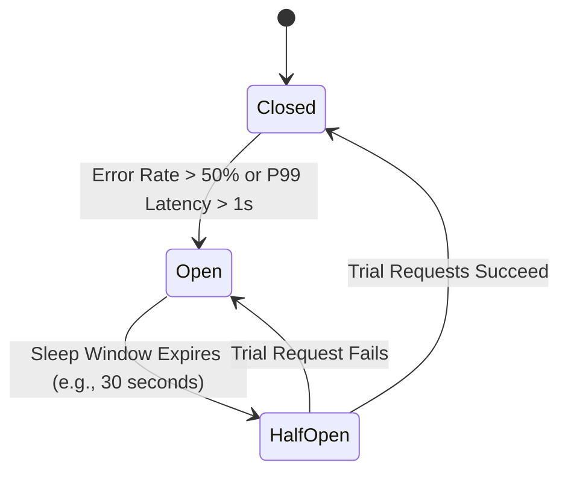
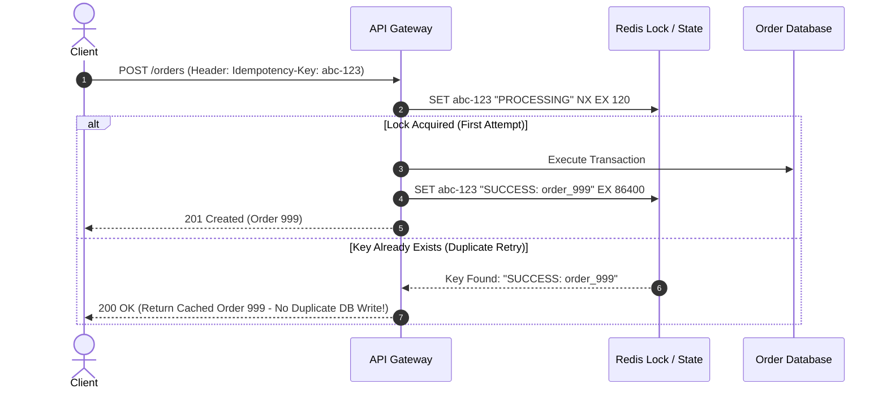

# Reliability & Resilience Trade-Offs: Fault Tolerance Patterns

> Deep analysis of synchronous vs. asynchronous replication, circuit breakers vs. fail-fast, idempotency overhead, retry budgets, and graceful degradation.

---

## 1. Synchronous vs. Asynchronous Replication

```mermaid
flowchart TD
    subgraph SyncReplication [Synchronous Replication]
        Client1([Client]) -->|1. Write| Primary1[(Primary DB)]
        Primary1 -->|2. Sync Commit| Replica1[(Replica DB)]
        Replica1 -->>|3. ACK| Primary1
        Primary1 -->>|4. Commit OK| Client1
    end
```
* **Trade-off**: Zero data loss ($\text{RPO} = 0$), but write latency is bound by the slowest replica node. If the replica hangs or network partitions, writes halt completely.

```mermaid
flowchart TD
    subgraph AsyncReplication [Asynchronous Replication]
        Client2([Client]) -->|1. Write| Primary2[(Primary DB)]
        Primary2 -->>|2. Commit OK| Client2
        Primary2 -.->|3. Async Stream| Replica2[(Replica DB)]
    end
```
* **Trade-off**: Fast, non-blocking write latency, but failover risks data loss ($\text{RPO} > 0$) equal to replication lag.

### Replication Comparison

| Dimension | Synchronous Replication | Asynchronous Replication | Semi-Synchronous (Quorum) |
| :--- | :--- | :--- | :--- |
| **Write Latency** | High (waits for remote node disk commit) | **Low** (returns immediately after primary commit) | Medium (waits for Quorum, e.g., 2 of 3 nodes) |
| **Data Loss Risk (RPO)** | **Zero (0)** | Risk of losing unflushed WAL records ($1–30\text{s}$) | **Zero (0)** as long as quorum is maintained |
| **Availability on Partition**| **Halts writes** if replica becomes unreachable | **High** (primary continues accepting writes) | Continues if majority $(\frac{N}{2} + 1)$ survives |
| **Best Suited For** | Core banking ledgers, critical medical logs | Social feeds, analytics ingestion, high-RPS stores | Modern distributed databases (Spanner, CockroachDB) |

---

## 2. Circuit Breakers vs. Fail-Fast vs. Bulkheads

When a downstream dependency (e.g., Credit Bureau API) degrades from $50\text{ms}$ to $5\text{ seconds}$, calling services will quickly exhaust thread pools and collapse unless protected.



### Pattern Breakdown
1. **Circuit Breaker (Resilience4j / Envoy)**:
   * **Closed**: Requests flow normally; failure metrics tracked.
   * **Open**: Immediately short-circuits calls; returns fallback response with **zero downstream network calls**, saving server threads.
   * **Half-Open**: Allows a canary probe to test downstream recovery.
2. **Bulkheads (Compartmentalization)**:
   * Isolate resources (thread pools, connection pools) so failure in one integration cannot exhaust resources dedicated to other critical integrations.
3. **Retry Budgets & Jitter**:
   * Blind retries create **thundering herds** and self-inflicted DDoS.
   * *Rule*: Never retry without **Exponential Backoff and Full Jitter** ($\text{Sleep} = \text{Random}(0, \min(\text{MaxWait}, \text{Base} \times 2^{\text{Attempt}}))$).
   * Cap retry budgets at max $10\%$ of total service traffic.

---

## 3. Idempotency Overhead vs. At-Least-Once Delivery

In distributed systems, networks drop acknowledgments, causing clients to retry valid requests. Without idempotency, users get charged twice or duplicate orders are created.



### The Cost of Idempotency
* Requires maintaining a distributed state store (Redis or DB unique constraint table) for all mutating operations.
* Adds 1 network round-trip to the write path.
* **Senior Decision Rule**: Always enforce idempotency on financial, ordering, and state-mutation endpoints; skip on read-only or telemetry endpoints where duplication is harmless.

---

## 4. Cross-References

* **NFR Targets & Nines**: [`nfr-discovery.md`](file:///d:/company/products/enterprise-architecture-handbook/20-interview-system-design/nfr-discovery.md)
* **Production Outage Handling**: [`scenario-based/production.md`](file:///d:/company/products/enterprise-architecture-handbook/20-interview-system-design/scenario-based/production.md)
* **Payment Platform Interview**: [`architecture-interviews/payment-platform.md`](file:///d:/company/products/enterprise-architecture-handbook/20-interview-system-design/architecture-interviews/payment-platform.md)
