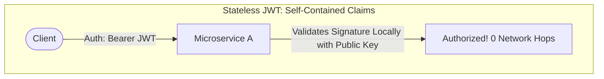
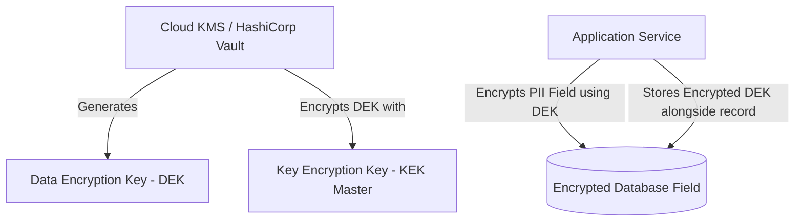

# Security & Trust Boundary Trade-Offs: Zero Trust vs. Perimeter

> Architectural evaluation of Zero Trust service meshes, token passing (JWT) vs. centralized sessions, mTLS overhead, and encryption-at-rest vs. inspection.

---

## 1. Zero Trust Architecture vs. Traditional Perimeter Defense

```
Traditional Castle-and-Moat (Perimeter):
  [Public Internet] ──► [Firewall / VPN] ──► [Inside Network: Fully Trusted / Plaintext]
  * Fatal Flaw: Once an attacker breaches one server or VPN, the entire intranet is wide open.

Zero Trust Architecture (Never Trust, Always Verify):
  [Public Internet] ──► [API Gateway] ──► [Service A] ──► [mTLS / SPIFFE Token] ──► [Service B]
  * Every single network packet, service-to-service call, and datastore query requires cryptographic authentication.
```

### Trade-Off Comparison

| Dimension | Perimeter Security (VPC / VPN) | Zero Trust (Service Mesh / mTLS) |
| :--- | :--- | :--- |
| **Lateral Movement Risk** | **Catastrophic** (attacker pivot across internal VPC) | **Minimal** (compromised pod cannot speak to unauthorized services) |
| **Network & CPU Overhead** | **Zero** (plaintext HTTP/TCP inside VPC) | Moderate ($1–3\text{ms}$ latency per hop for TLS handshake & sidecar proxy) |
| **Operational Complexity**| Low (configure security groups once) | **High** (CA rotation, SPIFFE/SPIRE identities, Istio/Linkerd mesh) |
| **Compliance Readiness** | Weak under modern audits (SOC 2, FedRAMP, PCI-DSS 4.0)| **Gold Standard** |

---

## 2. Token Passing (Stateless JWT) vs. Centralized Session State (Opaque Token)


* **Pros**: Zero database or cache lookup needed by microservices; infinite horizontal scale.
* **Cons**: **Instant Revocation is Impossible** without maintaining a centralized revocation blacklist (which negates the stateless benefit); token size can bloat to 2 KB.

```mermaid
flowchart TD
    subgraph Opaque [Opaque Token / Centralized Session]
        Client2([Client]) -->|Auth: Bearer opaque_token| Svc2[Microservice B]
        Svc2 -->|Token Introspection Query| Redis[(Redis / Auth0 DB)]
        Redis -->>|User Session & Permissions| Svc2
    end
```
* **Pros**: Instant revocation upon logout or password reset; tiny payload size (32-byte UUID).
* **Cons**: Every single API request incurs a network round-trip to the centralized session store.

### The Hybrid Token Recommendation (The Senior Architect Pattern)
Use **Short-Lived JWTs (10–15 minute expiry)** paired with **Long-Lived Opaque Refresh Tokens (Stored in HttpOnly Cookie / Secure DB)**. Microservices validate the JWT signature locally without network hops; the client refreshes the JWT against the centralized auth server every 10 minutes, allowing revocation within a tight 15-minute window.

---

## 3. Envelope Encryption & Key Management (KMS)

In enterprise systems, encrypting an entire database volume at rest (EBS encryption) is insufficient for regulatory compliance. Enterprise architects implement **Application-Level Envelope Encryption**:


* **Performance Gain**: The expensive Cloud KMS API is called only once to decrypt the DEK, which is cached in secure memory. Millions of records are encrypted locally at wire speed using AES-GCM without saturating KMS rate limits.

---

## 4. Cross-References

* **Security Discovery**: [`nfr-discovery.md`](file:///d:/company/products/enterprise-architecture-handbook/20-interview-system-design/nfr-discovery.md)
* **API Gateway & Auth Architecture**: [`architecture-interviews/enterprise-api-platform.md`](file:///d:/company/products/enterprise-architecture-handbook/20-interview-system-design/architecture-interviews/enterprise-api-platform.md)
* **Enterprise Security Principles**: [`10-security/`](file:///d:/company/products/enterprise-architecture-handbook/10-security/)
