# Architectural Calculator: Latency Budget & Hop Sizing

## 1. End-to-End P99 Latency Budget Allocation

For an interactive web request with an end-to-end SLA target of **200ms**:

```mermaid
gantt
    title Latency Budget Breakdown (Target: 200ms)
    dateFormat X
    axisFormat %s ms
    section Network
    DNS & TCP/TLS Handshake   : 0, 40
    section Edge
    API Gateway & Auth Token  : 40, 60
    section Microservices
    BFF Service Logic         : 60, 90
    Internal gRPC Hop         : 90, 105
    section Storage
    Distributed Cache Check   : 105, 115
    Database Query Execution  : 115, 155
    section Serialization
    Response Framing & Wire   : 155, 185
```



---

## 2. Budget Accounting Worksheet

```
+-----------------------------------+-------------------+-------------------+
| System Hop                        | Budgeted Latency  | Cumulative Budget |
+-----------------------------------+-------------------+-------------------+
| Public Internet Transit + TLS     | 40 ms             | 40 ms             |
| Edge Gateway (WAF, Rate Limit, Auth| 20 ms             | 60 ms             |
| Internal Service Orchestration    | 30 ms             | 90 ms             |
| East-West Service Mesh (Envoy/mTLS)| 15 ms             | 105 ms            |
| Redis Cache Miss Check            | 10 ms             | 115 ms            |
| Database Primary Read Query       | 40 ms             | 155 ms            |
| JSON Serialization & Transport Out| 30 ms             | 185 ms            |
| Headroom Safety Buffer            | 15 ms             | 200 ms (SLA Limit)|
+-----------------------------------+-------------------+-------------------+
```

---

## 3. Latency Invariant

If any downstream service dependency exceeds its allocated budget by $> 20\%$, upstream callers must enforce **hard cancellation timeouts** to preserve the user's end-to-end experience.
