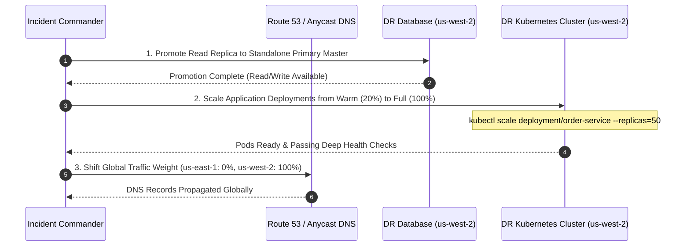

# Disaster Recovery (DR) Operational Runbook: Failover & Failback

> **System Name**: [e.g. Core Enterprise Order Service]  
> **Primary Region**: [e.g. us-east-1]  
> **Secondary DR Region**: [e.g. us-west-2]  
> **Target RTO**: [e.g. 15 minutes]  
> **Target RPO**: [e.g. 1 minute]  
> **Incident Commander / DR Lead**: [Role / PagerDuty Schedule]  

---

## 1. Disaster Declaration Criteria
Disaster failover to the secondary region is authorized **ONLY** when:
1. Primary cloud region is completely unavailable or unreachable for $\ge 15$ continuous minutes.
2. Cloud provider status dashboard confirms widespread outage with no immediate ETA for recovery.
3. Incident Commander and Technical Lead explicitly approve regional failover.

---

## 2. Phase 1: Pre-Failover Assessment Checklist
- [ ] Record current UTC timestamp: `____________________`
- [ ] Verify secondary region database replica health and current replication lag:
  ```bash
  aws rds describe-db-instances --db-instance-identifier "mydb-dr-replica" --query "DBInstances[0].StatusInfos"
  ```
- [ ] Confirm replication lag is within acceptable RPO boundary ($< 60\text{s}$).

---

## 3. Phase 2: Regional Failover Execution Sequence



### Detailed Command Procedures:
1. **Promote Database**:
   ```bash
   aws rds promote-read-replica --db-instance-identifier mydb-dr-replica
   ```
2. **Scale Secondary Compute Cluster**:
   ```bash
   kubectl scale deployment/order-service --replicas=50 -n production
   kubectl rollout status deployment/order-service -n production --timeout=180s
   ```
3. **Shift Global Ingress Traffic**:
   ```bash
   aws route53 change-resource-record-sets --hosted-zone-id Z12345 --change-batch file://failover-dns.json
   ```

---

## 4. Phase 3: Post-Failover Verification & Health Sign-Off
- [ ] Verify HTTP 200 responses from global public edge endpoint:
  ```bash
  curl -I -s https://api.enterprise.com/health/ready | grep "HTTP/2 200"
  ```
- [ ] Verify transactional database write capability (execute synthetic canary transaction).
- [ ] Confirm distributed trace telemetry and Prometheus metrics are flowing into Grafana.
- [ ] Notify executive stakeholders via Emergency Communication Slack Channel `#incident-command`.

---

## 5. Phase 4: Failback Procedure (Restoring Primary Region)
*Never rush failback while primary region is unstable!*
1. **Re-establish Replication**: Reconfigure the repaired primary region as a read replica of the *new* primary in us-west-2.
2. **Wait for Synchronization**: Allow WAL logs to synchronize until replication lag reaches zero.
3. **Scheduled Maintenance Window**: Execute reverse DNS shift during an approved low-traffic window.
