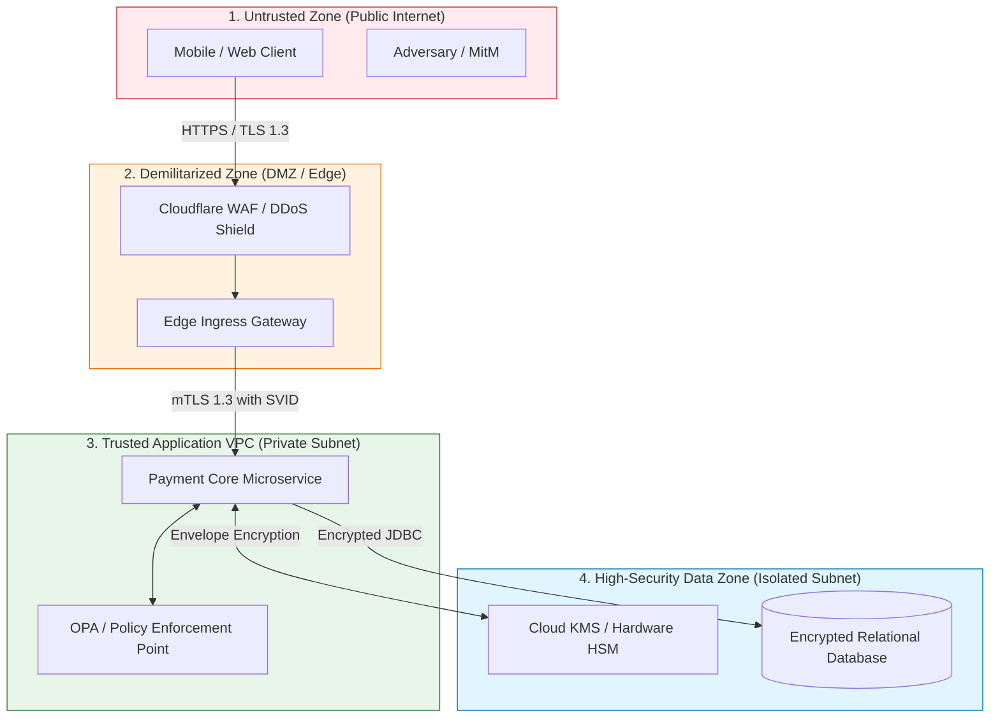

# Threat Model Specification: STRIDE Evaluation & Trust Boundaries

> **System Name**: [e.g. Real-Time Payment Ingestion Service]  
> **Security Classification**: RESTRICTED / CONFIDENTIAL  
> **Lead Architect**: [Name]  
> **Security Reviewer**: [InfoSec Lead Name]  
> **Date**: [YYYY-MM-DD]  
> **Status**: DRAFT | IN_REVIEW | APPROVED  

---

## 1. System Context & Architecture Overview
[Provide a concise architectural overview of the system, data flows, and primary business functions.]

### Data Flow Diagram (DFD) & Trust Boundaries

---

## 2. Identified Trust Boundaries

| Boundary ID | Crossing Description | Transport Security | Authentication & Identity |
|---|---|---|---|
| **TB-01** | Internet Client $\rightarrow$ Edge WAF | Public TLS 1.3 (Signed by trusted public CA) | OAuth 2.0 Bearer JWT (OIDC) |
| **TB-02** | Edge Ingress $\rightarrow$ Private Microservice | Private mTLS 1.3 (Internal PKI / SPIFFE) | Service-to-Service SPIFFE ID |
| **TB-03** | Microservice $\rightarrow$ KMS / Database | Private VPC Endpoint / TLS 1.3 | IAM Role Assumption / Short-Lived Credential |

---

## 3. STRIDE Threat Analysis Matrix

| ID | Threat Category (STRIDE) | Element / Flow | Threat Description & Attack Vector | Impact (H/M/L) | Mitigating Architecture Control | Verification Mechanism |
|---|---|---|---|---|---|---|
| **TH-01** | **S - Spoofing** | Client $\rightarrow$ Edge | Adversary uses stolen JWT or forged identity claims. | High | Enforce cryptographic signature verification and short-lived tokens ($\le 15\text{m}$). | Automated Pen-test |
| **TH-02** | **T - Tampering** | Edge $\rightarrow$ App | Adversary tampers with request payload parameters in transit. | High | mTLS 1.3 with AES-256-GCM AEAD encryption across all hops. | Network Packet Capture Audit |
| **TH-03** | **R - Repudiation** | Core Microservice | Merchant denies initiating a $500,000 refund transaction. | High | Cryptographically signed audit log emitted to write-once WORM storage. | Audit Log Integrity Test |
| **TH-04** | **I - Info Disclosure** | Database Tier | Unencrypted customer PII leaked through database snapshot theft. | High | Envelope encryption via AES-256-GCM using AWS KMS Customer Managed Keys. | Snapshot Restoration Test |
| **TH-05** | **D - Denial of Service** | Public Ingress | Volumetric HTTP flood exhausts application thread pool. | High | Cloudflare Rate Limiting (leaky-bucket) and ingress connection timeouts. | Chaos Load Test |
| **TH-06** | **E - Elevation of Priv** | Admin API | Regular user invokes administrative role mutation endpoints. | High | Attribute-Based Access Control (ABAC) enforced via Open Policy Agent (OPA). | Automated RBAC/ABAC Linter |

---

## 4. Residual Risks & Security Sign-Off
* **Identified Residual Risk 1**: [Describe accepted risk, e.g. 15-minute token revocation latency].
* **Compensating Control**: [Describe control, e.g. Token blacklist stored in low-latency Redis].
* **Next Scheduled Review Date**: [YYYY-MM-DD]
