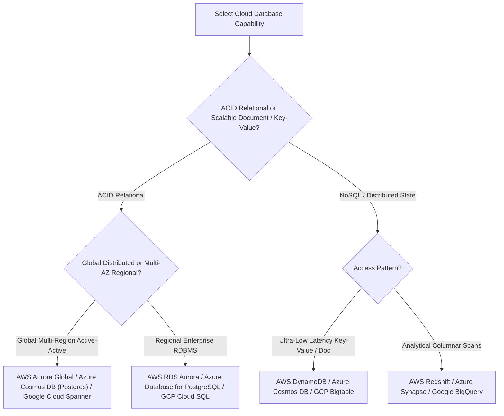

# Cloud Capability Matrix: AWS vs. Azure vs. Google Cloud (GCP)

## 1. Architectural Overview & Context
Enterprise architects must frequently map logical architecture capabilities to specific managed cloud services across the three major hyperscalers: **Amazon Web Services (AWS)**, **Microsoft Azure**, and **Google Cloud Platform (GCP)**.

This reference provides a vendor-neutral capability taxonomy, comparing operational tradeoffs, architectural fit, and anti-patterns.

---

## 2. Core Compute Capabilities

| Logical Capability | AWS Service | Azure Service | GCP Service | Architectural Characteristics & Fit | When NOT to Use |
|---|---|---|---|---|---|
| **Virtual Machines (IaaS)** | EC2 | Azure Virtual Machines | Compute Engine | Direct hardware access, custom kernel extensions, COTS software. | Stateless web apps (prefer containers). |
| **Managed Kubernetes (CaaS)** | Amazon EKS | Azure Kubernetes Service (AKS) | Google Kubernetes Engine (GKE) | Distributed microservice orchestration, service mesh topologies, hybrid portability. | Simple CRUD apps with 1-2 developers (overhead too high). |
| **Serverless Containers** | AWS Fargate (ECS/EKS) | Azure Container Apps | Cloud Run | Pay-per-request or per-second container execution with zero node management. | Hard real-time latency ($< 10\text{ms}$) or sustained $24/7$ multi-node workloads. |
| **Serverless Functions (FaaS)**| AWS Lambda | Azure Functions | Cloud Functions | Event-driven webhooks, async queue consumers, lightweight data transformation. | Long-running batch jobs ($> 15\text{m}$) or heavy stateful memory caches. |

---

## 3. Storage & Persistence Tiers

| Capability | AWS Service | Azure Service | GCP Service | Architecture Notes & Latency Profile |
|---|---|---|---|---|
| **Object Storage** | Amazon S3 | Azure Blob Storage | Cloud Storage (GCS) | Immutable blob storage, $99.999999999\%$ (11 9s) durability, lifecycle tiering. |
| **Block Storage** | Amazon EBS (gp3, io2) | Azure Managed Disks | Persistent Disk (PD) | Low-latency random read/write I/O attached directly to VM instances. |
| **Distributed File (NFS)**| Amazon EFS / FSx | Azure Files / NetApp Files | Filestore | POSIX-compliant multi-writer shared filesystem for legacy applications. |

---

## 4. Database Capabilities (Relational vs. Distributed NoSQL)

| Dimension | AWS DynamoDB | Azure Cosmos DB | Google Cloud Spanner |
|---|---|---|---|
| **Consistency Model** | Eventual or Strongly Consistent (per read) | 5 Tunable Levels (Strong, Bounded, Session, Prefix, Eventual) | Strict External Consistency (Linearizable via TrueTime atomic clocks) |
| **Partitioning** | Automated hash partitioning | Physical partition hashing via Partition Key | Automated dynamic sharding based on load |
| **SLA** | 99.99% (Multi-AZ) | 99.999% (Multi-Region) | 99.999% (Multi-Region) |
| **Anti-Pattern** | Running multi-table joins or relational schemas | Querying without partition key (fan-out query) | Low-budget projects (high minimum hourly cost) |

---

## 5. Messaging & Event Integration

| Capability | AWS | Azure | GCP | Architectural Fit |
|---|---|---|---|---|
| **Distributed Pub/Sub** | Amazon SNS + SQS | Azure Service Bus (Topics) | Cloud Pub/Sub | High-throughput async message fanout with at-least-once delivery. |
| **Managed Kafka Stream** | Amazon MSK | Event Hubs (Kafka endpoint) | Managed Service for Apache Kafka | Long-retention, ordered event streaming and event-carried state transfer. |
| **Serverless Event Router** | EventBridge | Event Grid | Eventarc | SaaS webhook ingestion, CloudEvent routing, content-based message filtering. |

---

## 6. Security, Identity & Secret Governance

| Capability | AWS | Azure | GCP |
|---|---|---|---|
| **Identity & IAM** | AWS IAM / IAM Identity Center | Microsoft Entra ID (Azure AD) | Cloud IAM |
| **Cryptographic KMS** | AWS KMS (Envelope Encryption) | Azure Key Vault | Cloud KMS |
| **Hardware Security Module** | AWS CloudHSM | Azure Dedicated HSM | Cloud HSM |
| **Secret Management** | AWS Secrets Manager | Azure Key Vault (Secrets) | Secret Manager |

---

## 7. Cloud Capability Architectural Checklist
- [ ] Map application requirements to vendor-neutral capabilities before locking into specific cloud services.
- [ ] Utilize managed serverless container runtimes (ECS Fargate / Cloud Run) for stateless APIs to minimize operational toil.
- [ ] Evaluate True Multi-Region databases (Spanner / Aurora Global) only when business requires global write low-latency.
- [ ] Avoid running self-managed databases or message brokers on raw VMs unless specific engine customization is mandatory.
- [ ] Route all internal cloud service traffic through private endpoints (AWS PrivateLink / Azure Private Endpoints).

---

## 8. Related Modules
* [01-architecture/cloud-architecture/](../../01-architecture/cloud-architecture/README.md) — Cloud topology, multi-region failover, and landing zones.
* [08-cloud/cloud-cost-optimization/](../../08-cloud/cloud-cost-optimization/README.md) — Rightsizing, commitments, and egress optimization.
* [22-reference/protocol-reference/](../protocol-reference/README.md) — Network and application communication protocols.
