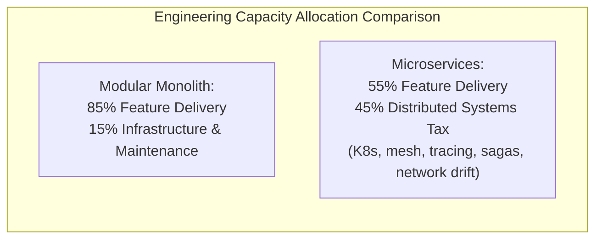
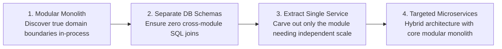

# Architectural Comparison: Modular Monolith vs. Microservices

## Executive Summary

The comparison between **Modular Monolith** and **Microservices** represents the most consequential architectural decision for modern software engineering teams. Both architectures share the exact same high-level objective: **decoupling complex systems into autonomous, bounded business domains**. 

However, they enforce boundaries through fundamentally different mechanisms:
- **Modular Monolith**: Enforces boundaries via **in-process encapsulation, compiler access modifiers, and architecture fitness tests** within a single deployable unit.
- **Microservices**: Enforces boundaries via **physical network perimeters, independent deployment artifacts, and decentralized databases**.

---

## Detailed Comparative Matrix

| Architectural Vector | Modular Monolith Architecture | Microservices Architecture |
|:---|:---|:---|
| **Boundary Mechanism** | In-process interfaces (`internal` / package-private) | Network APIs (REST, gRPC, CloudEvents) |
| **Deployment Unit** | Single deployable artifact (Docker image) | Multiple independently deployed container pods |
| **Invocation Latency** | Nanoseconds (Direct in-memory pointer call) | Milliseconds (TCP/TLS handshake, serialization) |
| **Data Partitioning** | Schema-per-module in single database engine | Database-per-service (Physical engine isolation) |
| **Transactional Consistency**| Local ACID database transactions | Eventual consistency via Distributed Sagas |
| **Operational Complexity** | Low: 1 deployment pipeline, standard logging | Very High: Kubernetes, Service Mesh, OTel, Istio |
| **Refactoring Agility** | Instant: Refactor boundaries via IDE tooling | Painful: Requires cross-repo PRs, API deprecations |
| **Organizational Scaling** | 1 to 4 teams (~10 to ~40 engineers) | 5 to 50+ independent teams (50+ engineers) |
| **Cloud Hosting Cost** | Low ($): High density on shared compute | High ($$$$): Idle container memory & network egress |
| **Failure Blast Radius** | High: Process crash takes down all modules | Low: Contained to single microservice pod |

---

## Boundary Enforcement Comparison

```mermaid
flowchart TD
    subgraph ModMono["Modular Monolith Boundary Enforcement"]
        M1["Order Module"] -->|Direct In-Memory Call (Nanoseconds)| M2["Billing Module"]
        M_Check["Automated CI Fitness Function (ArchUnit)<br/>FAILS build if Order calls internal Billing classes!"]
    end

    subgraph Micro["Microservices Boundary Enforcement"]
        S1["Order Service Pod"] -->|Network Hop: gRPC / TLS 1.3 (5-20ms)| S2["Billing Service Pod"]
        S_Net["Network Firewall & Istio mTLS<br/>Blocks unauthorized network calls"]
    end
```

---

## Total Cost of Ownership (TCO) & Engineering Efficiency



In organizations with fewer than 50 engineers, adopting microservices forces teams to expend nearly half their total engineering bandwidth on "distributed systems plumbing"—managing Helm charts, debugging network timeouts, handling eventual consistency anomalies, and maintaining complex CI/CD matrices.

---

## The Migration Path: Modular Monolith as the Stepping Stone

A well-architected Modular Monolith is **not a dead-end**; it is the ideal architectural stepping stone to microservices:



### The Extraction Rule
Never split the entire system into microservices at once. Keep the core platform as a Modular Monolith, and extract **only specific bounded contexts** that:
1. Require 100x more compute/memory scale than the rest of the application.
2. Are owned by a geographically remote or completely autonomous team.
3. Require unique compliance enclaves (e.g., PCI DSS tokenization vault).
