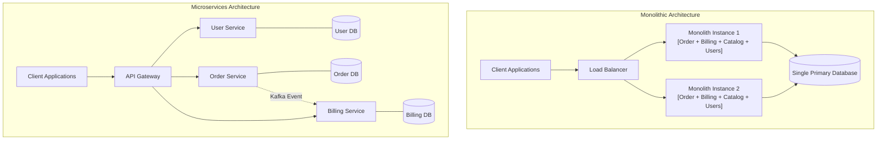
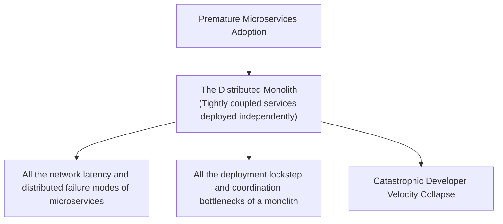

# Architectural Comparison: Monolith vs. Microservices

## Executive Summary

The architectural debate between Monolithic and Microservices architectures is not a contest between "legacy" and "modern" styles, but a profound fundamental trade-off between **Operational Simplicity** and **Organizational / Scaling Autonomy**. 

A Monolith encapsulates all business capabilities into a single deployable unit sharing a unified database. A Microservices architecture decomposes the system into autonomous, independently deployable services modeled around bounded contexts, with decentralized data management.

---

## Detailed Comparative Matrix

| Evaluation Dimension | Monolithic Architecture | Microservices Architecture |
|:---|:---|:---|
| **Deployable Artifacts** | Single executable, WAR/JAR, or container | 10 to 100+ independently deployed containers/pods |
| **Data Persistence Model** | Single shared database instance / schema | Database-per-service (Decentralized storage) |
| **Inter-Module Communication**| In-memory method calls (Nanoseconds) | Network RPC (REST, gRPC, Kafka) (Milliseconds) |
| **ACID Transaction Support** | Native, atomic multi-table database transactions | Eventual consistency via Sagas; 2PC impractical |
| **Deployment Independence** | Unified deployment train; all modules ship together | Completely independent service deployment pipelines |
| **Failure Blast Radius** | Shared: Memory leak / crash in one module can crash entire process | Isolated: Service failure contained behind circuit breakers |
| **Hardware Scaling Efficiency**| Coarse: Must scale entire monolith even if 1 module needs CPU | Granular: Scale only the specific high-load service |
| **Operational / DevOps Tax** | Low: Simple CI/CD, basic logging | Extreme: Kubernetes, service meshes, distributed tracing |
| **Developer Onboarding (DX)** | High: Clone 1 repo, run locally in minutes | Complex: Requires mocking services, Docker Compose |
| **Ideal Team Size** | 1 to 3 teams (Up to ~25 developers) | 5 to 50+ autonomous cross-functional teams |

---

## Architectural Topologies

---

## The Fallacy of Microservices First

Adopting microservices before understanding the domain or establishing operational maturity is the leading cause of modern architectural failure:

---

## Concrete Decision Heuristics

### Choose Monolith When:
1. **Team Size is Small (< 25 engineers)**: Operational overhead of microservices will consume 40%+ of total engineering capacity.
2. **Domain Boundaries are Fluid**: Requirements are evolving rapidly; refactoring code across in-memory packages is 10x faster than refactoring across distributed network APIs.
3. **Core Workflow Demands Strict ACID Transactions**: Accounting, banking ledgers, and complex multi-table transactional invariants.

### Choose Microservices When:
1. **Conway's Law Demands Autonomy**: You have 50+ engineers across multiple autonomous feature squads whose primary delivery bottleneck is merge conflicts and release train delays in a single repository.
2. **Disparate Technology & Resource Profiles**: One component requires specialized GPU compute (ML inference) or unique languages (Go for proxying), while the rest is standard business logic.
3. **Extreme Fault Isolation is Mandated**: An outage in secondary functionality (e.g., product reviews or recommendations) must mathematically never impact the checkout payment flow.
