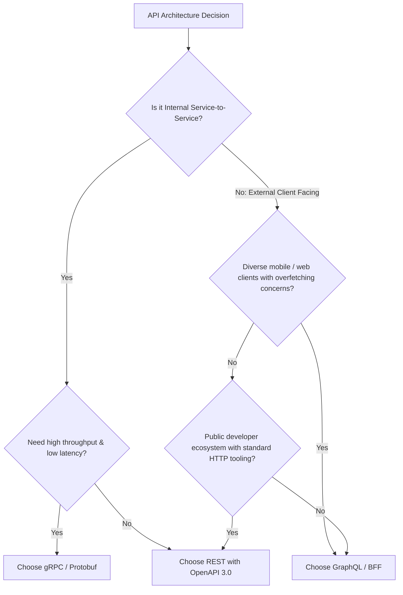

# Architecture Comparison: REST vs gRPC vs GraphQL

## 1. Architectural Trade-Off Matrix

```
+--------------------------+-----------------------+-----------------------+-----------------------+
| Architectural Dimension  | REST (HTTP/1.1 & 2)   | gRPC (HTTP/2 & HTTP/3)| GraphQL (HTTP/POST)   |
+--------------------------+-----------------------+-----------------------+-----------------------+
| Primary Serialization    | JSON / Text           | Protocol Buffers      | JSON / Text           |
| Network Protocol         | HTTP/1.1 or HTTP/2    | HTTP/2 or HTTP/3      | HTTP/1.1 or HTTP/2    |
| Streaming Support        | Chunked / SSE         | Bi-directional Streams| Subscriptions (WS)    |
| Payload Efficiency       | Low (Verbose strings) | Extreme (Binary wire) | High (Client-tailored)|
| Schema Definition        | OpenAPI (Optional)    | Protobuf (Mandatory)  | GraphQL Schema (Mand) |
| Client Coupling          | Loose / Hypermedia    | Tight (Generated code)| Medium (Query spec)   |
| Browser Compatibility    | Universal 100%        | Limited (gRPC-Web)    | Universal 100%        |
| Best Use Case            | Public APIs & Web     | Inter-Service Mesh    | BFF & Mobile Clients  |
+--------------------------+-----------------------+-----------------------+-----------------------+
```

---

## 2. Decision Tree for Architects



---

## 3. Enterprise Production Recommendations

- **Internal Microservices Mesh**: Adopt **gRPC** for internal east-west traffic. Binary Protobuf serialization reduces CPU overhead by 60–80% and cuts network payload sizes by 70% compared to JSON.
- **Frontend / Mobile Ingress (BFF Layer)**: Use **GraphQL** or specialized REST BFFs to prevent mobile network over-fetching and eliminate round-trips over cellular networks.
- **Public & 3rd-Party APIs**: Standardize on **REST with OpenAPI** to maximize developer ergonomics and ecosystem compatibility.
