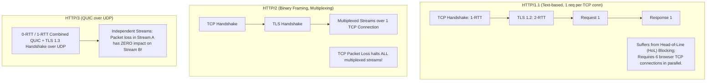
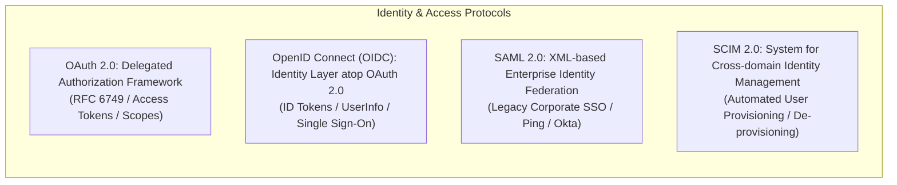

# Network & Application Protocol Architecture: OSI Layers, Semantics, and Trade-offs

## 1. Architectural Overview & Context
Enterprise systems communicate across heterogeneous network layers using standardized protocols. 

Architects must select communication protocols based on **latency budgets, bidirectional streaming needs, binary serialization overhead, firewall traversal, and head-of-line blocking characteristics**.

```
┌─────────────────────────────────────────────────────────────────────────────┐
│                    THE ARCHITECT'S PROTOCOL STACK                           │
├─────────────────────┬───────────────────────────────────────────────────────┤
│ Application Layer   │ HTTP/1.1, HTTP/2, HTTP/3, gRPC, WebSocket, SSE, AMQP │
├─────────────────────┼───────────────────────────────────────────────────────┤
│ Security / Identity │ TLS 1.3, mTLS, OAuth 2.0, OpenID Connect, SAML 2.0   │
├─────────────────────┼───────────────────────────────────────────────────────┤
│ Transport Layer     │ TCP (Reliable byte stream), UDP (Datagrams), QUIC    │
├─────────────────────┼───────────────────────────────────────────────────────┤
│ Internet / Network  │ IPv4, IPv6, BGP Anycast Routing, ICMP                │
└─────────────────────┴───────────────────────────────────────────────────────┘
```

---

## 2. Web Protocols: HTTP/1.1 vs. HTTP/2 vs. HTTP/3 (QUIC)



| Dimension | HTTP/1.1 | HTTP/2 | HTTP/3 (QUIC) |
|---|---|---|---|
| **Transport Layer** | TCP | TCP | **UDP** |
| **Framing** | Plaintext ASCII | Binary Frames | Binary Frames |
| **Multiplexing** | None (Pipelining fragile) | Yes (Multiple streams over 1 TCP conn) | Yes (True independent streams) |
| **Head-of-Line (HoL) Blocking**| Severe (At HTTP level) | At TCP transport level (packet drop stalls all streams) | **Eliminated** (Stream-level recovery in user space) |
| **Connection Migration**| No (IP change resets connection) | No | **Yes** (Connection ID survives Wi-Fi $\leftrightarrow$ 5G handoff!) |
| **Ideal Architectural Fit** | Legacy COTS APIs, simple web hooks | High-throughput web apps, gRPC services | Mobile applications, high-packet-loss cellular networks |

---

## 3. API Communication Paradigms Compared

| Protocol / Style | Transport | Serialization | Communication Model | Preferred Architectural Use Case | When NOT to Use |
|---|---|---|---|---|---|
| **REST (OpenAPI)** | HTTP/1.1 or HTTP/2 | JSON / XML | Request-Reply (Stateless) | Public developer APIs, B2B partner integrations, standard CRUD. | High-frequency binary streaming or bidirectional chats. |
| **gRPC** | HTTP/2 | Protocol Buffers (Binary) | Request-Reply, Bidirectional Streaming | Low-latency internal microservice-to-service communication ($10\times$ faster than JSON).| Public browser clients without gRPC-web proxy. |
| **GraphQL** | HTTP/1.1 or HTTP/2 | JSON | Declarative Query (Client-specified shape) | Aggregating complex graph data for mobile/web frontends; eliminates over-fetching. | High-volume write transactions or file streaming. |
| **WebSocket** | TCP (Upgrade from HTTP) | Text or Binary | Full-Duplex Bidirectional Persistent TCP | Financial trading dashboards, real-time multiplayer games, live chat. | Ephemeral requests or serverless environments (breaks connection state). |
| **Server-Sent Events (SSE)**| HTTP/1.1 or HTTP/2 | UTF-8 Text (`text/event-stream`) | Unidirectional Server $\rightarrow$ Client Streaming | AI LLM token streaming (ChatGPT style), live sports feeds, stock tickers. | Client-to-server upstream streaming (use WebSocket instead). |

---

## 4. Enterprise Messaging & IoT Protocols

```
┌─────────────────────────────────────────────────────────────────────────────┐
│                       MESSAGING PROTOCOL COMPARISON                         │
├─────────────────────┬───────────────────────────────────────────────────────┤
│ AMQP 0-9-1          │ Smart-broker messaging (RabbitMQ). Complex topic      │
│                     │ routing, fine-grained queue bindings, and per-msg ack.│
├─────────────────────┼───────────────────────────────────────────────────────┤
│ AMQP 1.0            │ ISO/IEC standard for enterprise interoperability;     │
│                     │ peer-to-peer transport used by Azure Service Bus.     │
├─────────────────────┼───────────────────────────────────────────────────────┤
│ MQTT (v3.1.1 / v5)  │ Ultra-lightweight pub/sub for constrained IoT devices │
│                     │ over high-latency networks. 2-byte header overhead.   │
├─────────────────────┼───────────────────────────────────────────────────────┤
│ Kafka Binary Wire   │ Proprietary TCP protocol optimized for sequential     │
│                     │ batch reads and zero-copy disk-to-network transfer.   │
└─────────────────────┴───────────────────────────────────────────────────────┘
```

---

## 5. Identity & Security Protocols



| Security Protocol | Primary Purpose | Message Format | Transport | Modern Enterprise Recommendation |
|---|---|---|---|---|
| **OAuth 2.0** | Delegated Authorization (API permissions) | JSON (JWT / Opaque) | HTTPS | **Mandatory standard** for all REST and microservice APIs. |
| **OpenID Connect (OIDC)** | User Authentication (Single Sign-On) | JSON Web Token (JWT) | HTTPS | **Mandatory standard** for modern web/mobile user login. |
| **SAML 2.0** | Enterprise SSO Federation | XML with XML-DSig | HTTP POST / Redirect | Support for legacy enterprise corporate identity providers. |
| **SCIM 2.0** | Automated Employee Lifecycle Provisioning | RESTful JSON | HTTPS | Standard for syncing Okta/Entra users into SaaS platforms. |

---

## 6. Protocol Architecture Checklist
- [ ] Adopt **HTTP/2 or HTTP/3** as the default transport across all edge and public APIs.
- [ ] Standardize internal backend microservice communication on **gRPC / Protobuf** for high throughput.
- [ ] Use **Server-Sent Events (SSE)** instead of WebSocket when communication is purely server-to-client (e.g. LLM streaming).
- [ ] Implement **OAuth 2.0 + OIDC** as the unified enterprise identity and authorization standard.
- [ ] Enforce **TLS 1.3** across all application and transport layer endpoints.
- [ ] Select **MQTT** for battery-constrained IoT devices rather than heavy HTTP polling.

---

## 7. Related Modules
* [01-architecture/integration-architecture/](../../01-architecture/integration-architecture/README.md) — Fundamental integration styles and boundaries.
* [00-foundations/security/](../../00-foundations/security/README.md) — Cryptographic primitives and TLS 1.3 handshakes.
* [07-integration/rest/](../../07-integration/rest/) — REST API design standards, OpenAPI, and status codes.
