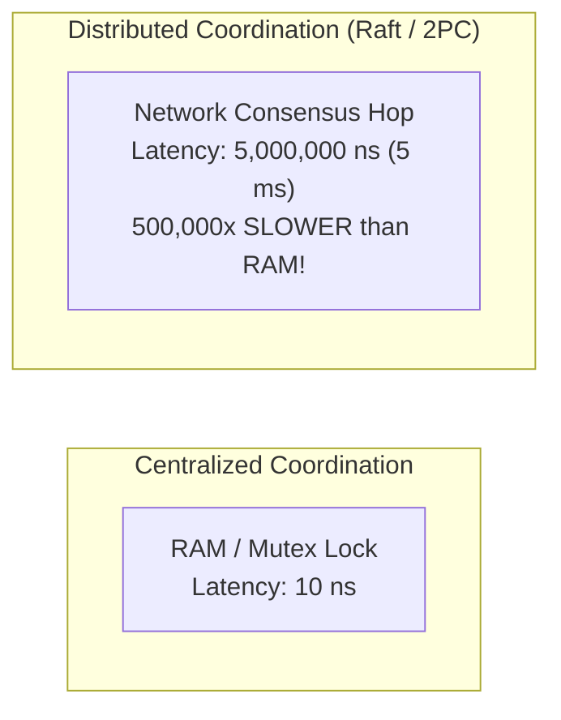
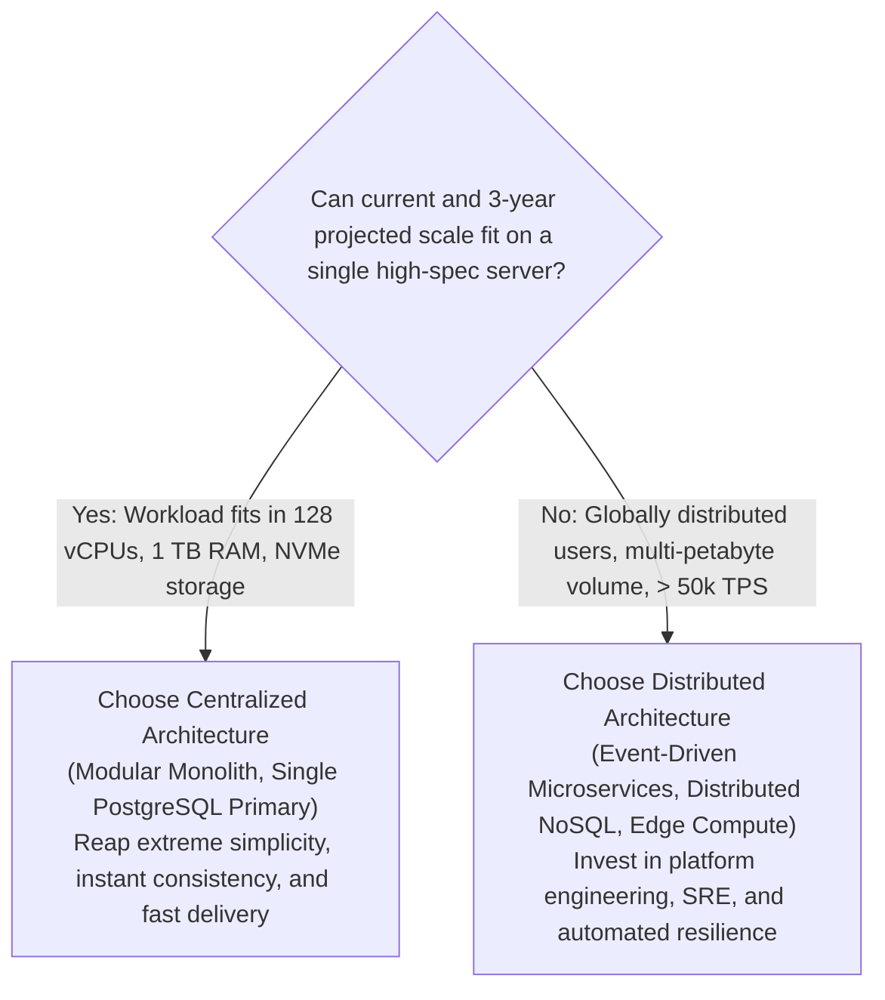

# Technology Comparison: Centralized vs. Distributed Architecture

## Executive Summary

The tension between **Centralized** and **Distributed** architectures is the defining philosophical divide in enterprise systems engineering. Centralized architectures prioritize **simplicity, strong immediate consistency, and single points of coordination**, while Distributed architectures prioritize **unbounded horizontal scalability, high fault tolerance, and independent operational autonomy**.

---

## Detailed Comparative Matrix

| Architectural Vector | Centralized Architecture | Distributed Architecture |
|:---|:---|:---|
| **System State Location** | Single shared database or centralized server | Partitioned, replicated across multiple network nodes |
| **Consistency Guarantees** | Immediate linearizable consistency (ACID) | Eventual consistency; requires consensus (Raft/Paxos) |
| **Failure Modes** | Binary: System is either completely up or completely down | Partial failure: Subsystems degrade while others operate |
| **Coordination Overhead** | Zero network coordination penalty | High: Consensus chatter, heartbeat gossip, latency penalty |
| **Operational Complexity** | Low: Simple deployment, local monitoring | Very High: Distributed tracing, clock skew, network splits |
| **Scaling Vector** | Vertical: Limited by single-box hardware ceilings | Horizontal: Theoretically unbounded commodity scaling |
| **Network Dependency** | Local in-memory calls; impervious to network partitions| Vulnerable to network latency, packet loss, partitions (CAP)|
| **Disaster Recovery** | Active-Passive failover; risk of RTO gap | Multi-datacenter / Multi-region active-active |

---

## The Distributed Systems Fallacies (L. Peter Deutsch)

Engineers transitioning from centralized to distributed architectures frequently fail because they assume:
1. The network is reliable.
2. Latency is zero.
3. Bandwidth is infinite.
4. The network is secure.
5. Topology doesn't change.
6. There is one administrator.
7. Transport cost is zero.
8. The network is homogeneous.

Every distributed architecture must explicitly incorporate defenses against the reality that **all eight of these assumptions are false**.

---

## The Coordination Tax (Amdahl's & Gunther's USL)

In centralized systems, coordination is managed by CPU hardware locks and kernel semaphores ($< 10\text{ nanoseconds}$).

In distributed systems, coordination requires network communication across physical machines ($0.5\text{ms to }50\text{ms}$):

---

## Concrete Architectural Selection Heuristics

