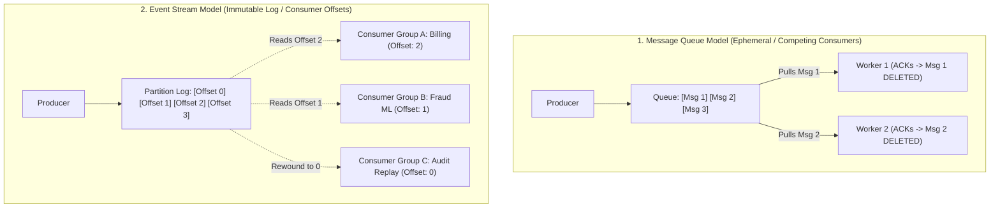
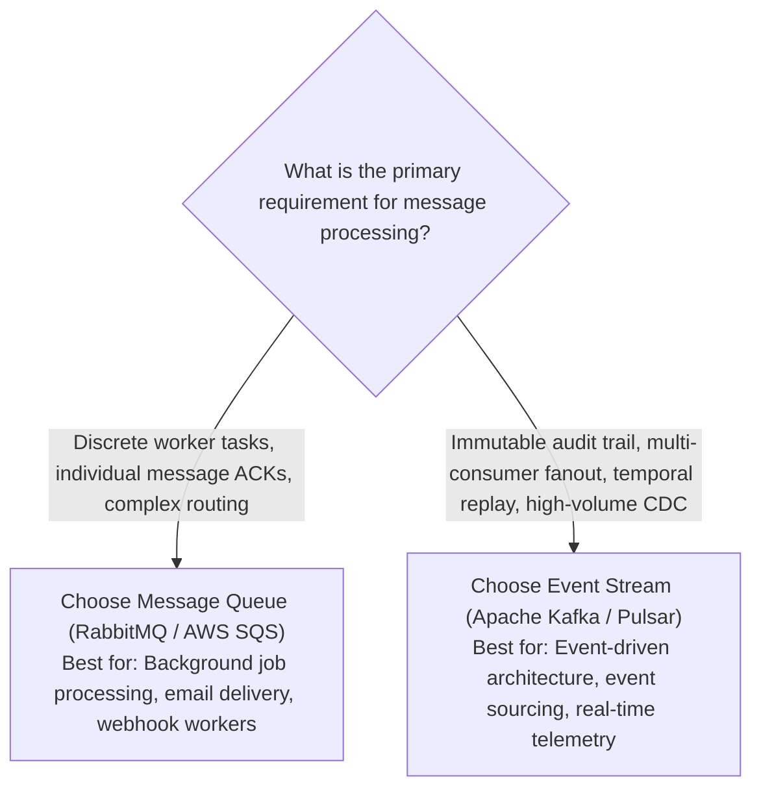

# Technology Comparison: Message Queues vs. Event Streams

## Executive Summary

While often casually grouped together as "messaging systems," **Message Queues** (e.g., RabbitMQ, AWS SQS) and **Event Streams** (e.g., Apache Kafka, Apache Pulsar, AWS Kinesis) are built on fundamentally different architectural foundations and serve contrasting engineering use cases.

A Message Queue treats messages as **ephemeral units of work** to be processed and deleted. An Event Stream treats messages as an **append-only, immutable historical log** of events that can be retained, replayed, and consumed independently by multiple systems.

---

## Detailed Comparative Matrix

| Architectural Vector | Message Queue (RabbitMQ / AWS SQS) | Event Stream (Apache Kafka / Pulsar) |
|:---|:---|:---|
| **Core Abstraction** | FIFO Queue with individual message ACKs | Append-only distributed commit log |
| **Message Lifecycle** | **Ephemeral**: Message is deleted once ACKed | **Durable**: Message persists for days, weeks, or forever |
| **Consumption Model** | **Destructive Pull**: Workers compete for messages | **Non-Destructive Read**: Consumers track private offsets |
| **Historical Replay** | Impossible (Deleted upon processing) | Native: Rewind consumer offset to replay historical data |
| **Ordering Guarantees** | Global ordering hard across multiple concurrent workers | Strict partition-level ordering guaranteed by partition key |
| **Fanout Capabilities** | Requires separate exchange/queue per consumer | Native: Unlimited independent consumer groups read 1 topic |
| **Routing Flexibility** | Complex: Topic exchanges, headers, direct routing | Simple: Route strictly by topic name and partition key |
| **Throughput Capacity** | 10k to 50k messages/sec per broker | Millions of messages/sec (Sequential disk I/O / Zero-copy)|
| **Ideal Architectural Fit** | Task worker distribution, job queues, push notifications | Event sourcing, CDC streams, real-time analytics, audits |

---

## Architectural Mechanics: Queue vs. Stream

---

## The Power of Event Replayability

In a Message Queue, if a downstream billing worker contains a software bug that corrupts customer balances, the processed messages are already gone. Recovering state requires complex database forensics.

In an Event Stream (Kafka):
1. Fix the bug in the billing consumer source code.
2. Deploy the fixed service to production.
3. Reset the consumer group's offset back 48 hours:
   $$\text{Current Offset: } 540,000 \longrightarrow \text{Rewind to: } 120,000$$
4. The service replays every event from the log, reconstructing perfect, bug-free business state automatically.

---

## Architectural Decision Framework

