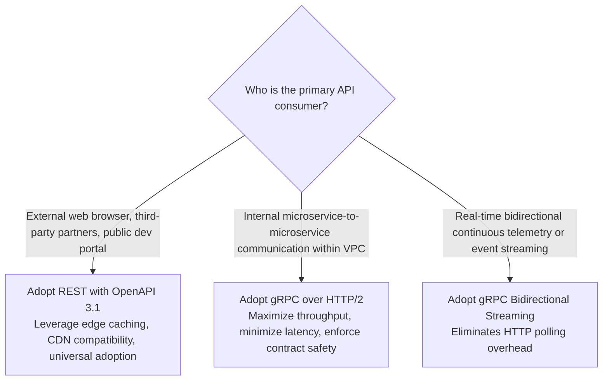

# Technology Comparison: REST vs. gRPC

## Executive Summary

REST (Representational State Transfer) and gRPC (Google Remote Procedure Call) represent the two dominant API communication paradigms in enterprise software engineering. While REST is the universal standard for client-to-server and public web integrations, gRPC has become the dominant technology for internal high-throughput inter-service communication across microservices.

---

## Detailed Comparative Matrix

| Evaluation Dimension | REST (JSON over HTTP/1.1 or HTTP/2) | gRPC (Protocol Buffers over HTTP/2) |
|:---|:---|:---|
| **Protocol Baseline** | HTTP/1.1 (Standard) or HTTP/2 | Strictly HTTP/2 (Multiplexed) |
| **Payload Serialization** | Human-readable text (JSON / XML) | Strongly typed binary (Protocol Buffers) |
| **Schema Governance** | Optional / Contract-after (OpenAPI) | Mandatory / Contract-first (`.proto` files) |
| **Code Generation** | Optional third-party tooling (openapi-generator)| Native compiler (`protoc`) generates multi-language SDKs |
| **Throughput & Speed** | Moderate; high CPU serialization overhead | Ultra-High: 5x to 10x faster serialization than JSON |
| **Payload Size** | Bulky text with repeated key names | Extremely compact binary byte stream |
| **Streaming Capabilities** | Limited (Server-Sent Events, chunked transfer)| Native Bidirectional Streaming (Client, Server, Duplex)|
| **Browser Compatibility** | Native in 100% of browsers | Limited (Requires grpc-web or proxy translation) |
| **Developer Ergonomics** | High: Direct testing via `curl`, Postman | Moderate: Requires `grpcurl` and schema files |
| **Typical Architectural Fit** | Public APIs, Web Frontends, Mobile Apps | Internal Microservices, Service Meshes, IoT Telemetry |

---

## Technical Mechanism Comparison

```mermaid
flowchart TD
    subgraph RESTFlow["REST / JSON Architecture"]
        R_Client["Client"] -->|1. Opens new TCP connection per stream| R_Net["HTTP/1.1 Transport"]
        R_Net -->|2. Transmits verbose JSON text payload| R_Server["Server"]
        R_Server -->|3. CPU parses string characters into memory objects| R_Core["App Logic"]
    end

    subgraph gRPCFlow["gRPC / Protobuf Architecture"]
        G_Client["Client"] -->|1. Single multiplexed persistent TCP connection| G_Net["HTTP/2 Transport"]
        G_Net -->|2. Transmits compact binary byte array| G_Server["Server"]
        G_Server -->|3. Blazing fast binary deserialization directly into memory| G_Core["App Logic"]
    end
```



---

## Payload Size & Latency Benchmarks

In typical enterprise benchmarking of identical domain objects (e.g., a customer profile with order history):

```
+------------------+------------------+---------------------+
| Metric           | REST (JSON)      | gRPC (Protobuf)     |
+------------------+------------------+---------------------+
| Payload Size     | 1,024 bytes      | 240 bytes (-76%)    |
| Serialization    | 120 microseconds | 18 microseconds     |
| p99 Hop Latency  | 45 ms            | 6 ms                |
+------------------+------------------+---------------------+
```

---

## Architectural Decision Framework


