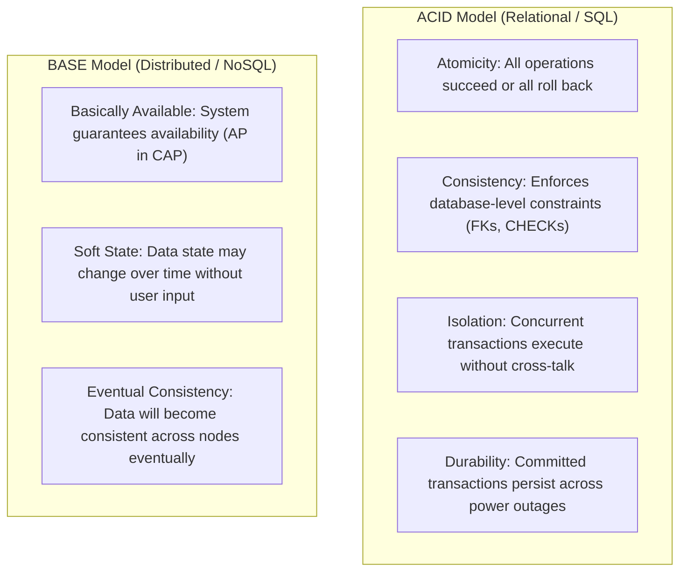
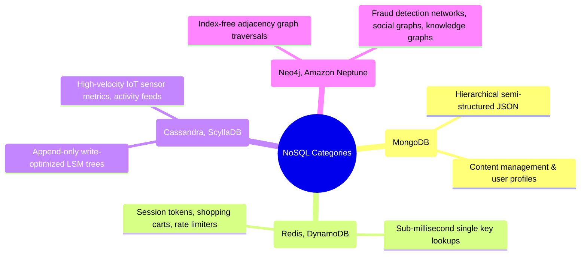

# Technology Comparison: SQL vs. NoSQL Databases

## Executive Summary

The database selection landscape has evolved from a simplistic binary contest between SQL and NoSQL into a sophisticated spectrum of specialized storage engines. Relational (SQL) databases optimize for **data integrity, multi-table relationships, and strict ACID guarantees**, while NoSQL databases optimize for **horizontal scalability, flexible denormalized data models, and high-throughput point lookups**.

Architects must evaluate systems based on empirical access patterns, consistency requirements, and workload concurrency rather than dogmatic preferences.

---

## Detailed Comparative Matrix

| Evaluation Dimension | Relational Databases (SQL) | NoSQL Databases (Document / KV / Wide-Column) |
|:---|:---|:---|
| **Examples** | PostgreSQL, MySQL, Oracle, SQL Server | MongoDB, DynamoDB, Cassandra, Redis |
| **Data Model** | Fixed schemas; normalized tables (3NF); relations | Schemaless / Flexible documents, key-values, column families |
| **Transaction Model** | Strict **ACID** (Atomicity, Consistency, Isolation, Durability) | **BASE** (Basically Available, Soft state, Eventual consistency) |
| **Query Mechanism** | Standard ANSI SQL with complex dynamic `JOIN`s | API / Key lookups; specialized query languages (CQL, MQL) |
| **Scaling Vector** | Primarily **Vertical (Scale-Up)** + Read-Replicas | Native **Horizontal (Scale-Out)** via sharding & partitioning |
| **Consistency Guarantees** | Strong immediate consistency (Serializable / Read Committed)| Configurable: Tunable eventual consistency (Quorum reads/writes) |
| **Join Performance** | Exceptional on normalized relational entities | Non-existent or poor; requires denormalizing data upfront |
| **Write Throughput** | Moderate (Constrained by WAL disk I/O and index locks)| Extreme (LSM trees, append-only commit logs, in-memory) |
| **Ideal Architectural Fit** | Financial ledgers, ERP, CRM, relational transactional cores | Session state, real-time analytics, user feeds, IoT time-series |

---

## The Fundamental Divide: ACID vs. BASE



---

## NoSQL Sub-Categories & Primary Use Cases



---

## Architectural Decision Framework

```mermaid
graph TD
    DataNeed{What are the primary data characteristics and query patterns?}
    
    DataNeed -->|Complex relationships, financial accounting, ACID invariants, ad-hoc BI| SQL_Choice["Choose Relational (PostgreSQL)<br/>Default choice for 80% of business domains"]
    
    DataNeed -->|Massive horizontal write scale (> 50k TPS), partitioned by entity ID| NoSQL_Choice["Choose Distributed NoSQL (Cassandra / DynamoDB)<br/>Denormalize data; design queries first"]
    
    DataNeed -->|Sub-millisecond transient reads & writes, caching, rate limiting| Cache_Choice["Choose In-Memory Key-Value (Redis)<br/>Pure RAM performance"]
```
